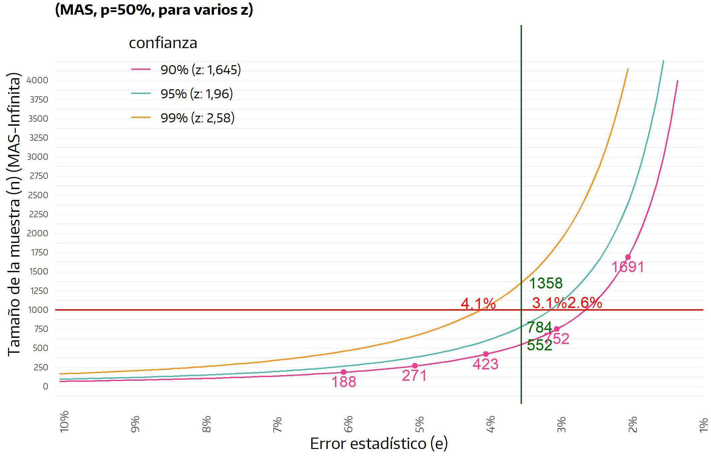
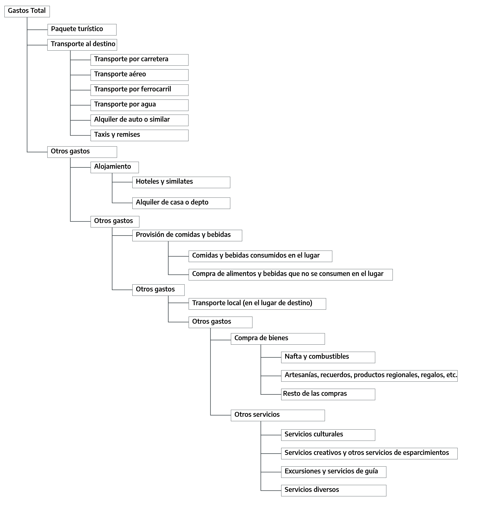

# **Propuestas metodológicas** {#propuestas-metodologicas}

## Los objetivos

En este capítulo se presenta una serie de propuestas metodológicas en torno a las encuestas de perfil del visitante y de cuáles son los pasos que deberían seguirse en el desarrollo de una investigación de este tipo. Estos pasos son, en mayor o menor medida (y más allá de las particularidades del objeto aquí abordado), los mismos que deben darse en cualquier investigación basada en encuestas, pero a su vez ponen énfasis en los aspectos más controversiales, comentados anteriormente.

Como se mencionó, si bien se presentan las etapas de una investigación como una secuencia lógica, en la práctica estas etapas tienen ciertos niveles de retorno y revisión. No obstante, el hito principal del proceso es la realización del trabajo de campo de la encuesta (es decir, el momento de recolección de la información propiamente dicho), dado que, lógicamente, una vez recabados los datos poco es lo que podrá modificarse del diseño original.

Por otra parte, en general suele existir la inquietud por relevar de modo continuo cierta información que se considera relevante, de forma tal de analizar su evolución y de contar con series históricas. Esto implica la necesidad de un esfuerzo inicial por definir de modo adecuado la estructura del formulario, con sus preguntas y categorías de respuesta, de modo tal de realizar la menor cantidad posible de modificaciones a futuro, dado que de lo contrario los indicadores resultantes cambiarían y perderían comparabilidad respecto a mediciones anteriores.

Una investigación surge por la inquietud o por la necesidad de conocer una parte de la realidad, y se materializa por medio de un proceso que, basado en el estado del arte[\^propuestas_metodologicas-1], plantea un conjunto de definiciones conceptuales y reglas metodológicas que permiten recortar con claridad el objeto de estudio y su modo de abordaje, con el fin de dar respuesta a una serie de aspectos concretos del tema en cuestión.

Por ello, un primer paso fundamental en una investigación radica en definir con claridad sus objetivos. Plasmar los objetivos de una investigación constituye el momento en que se recorta el objeto de estudio y se formulan concretamente los propósitos de la investigación y su alcance (explorar, describir, explicar, etc.). Estos objetivos deben ser acordes al marco conceptual y posibles de abordar, desde el punto de vista lógico, a partir de la metodología propuesta.

Los objetivos suelen dividirse jerárquicamente en dos tipos: generales y específicos. El objetivo general de la investigación remite al tipo de conocimiento que se espera producir con la investigación, mientras que los objetivos específicos son aquellos que deben lograrse para dar cuenta del objetivo general y, por tanto, se derivan de aquel, con lo cual resulta evidente la interrelación entre ambos tipos de objetivos.

Por ejemplo, para una encuesta de perfil podrían plantearse los siguientes objetivos:

**Objetivo General:** Describir las principales características de los visitantes de la provincia Azul en los meses de temporada alta.

Este objetivo plantea el recorte del universo bajo estudio, en términos de definir la unidad de análisis (visitantes) y su ubicación espacial (provincia Azul) y temporal (meses de temporada alta), indicando que lo que se pretende es describir sus principales características. Este último punto mantiene un nivel de generalidad que adquirirá un carácter más concreto en los objetivos específicos.

[**Objetivos Específicos:**]{.ul}

-   Describir las características sociodemográficas básicas de los visitantes (lugar de residencia habitual, sexo, edad, nivel educativo, composición del grupo de viaje, etc.)

-   Describir las características generales de sus viajes (medio de transporte, alojamiento, motivo, uso de paquete turístico, recorrido, duración, etc.).

-   Conocer las percepciones de los visitantes acerca del destino.

-   Estimar el gasto turístico que realizan los visitantes en el destino, y su desagregación en diferentes rubros.

-   Analizar la relación entre distintas variables (tipo de alojamiento por edad, gasto promedio por lugar de residencia o por duración de la estadía, etc.).

-   Monitorear la evolución de estas variables a lo largo del tiempo.

Como puede observarse, estos objetivos circunscriben claramente lo que se pretende abordar con la investigación, aun cuando no resulten exhaustivos en cuanto a toda la información que se producirá en la misma.

Aunque los objetivos de este ejemplo pueden parecer sencillos, su cumplimiento es sumamente exigente desde el punto de vista metodológico.

Más aún, un error común en el diseño de este tipo de estudios es la falta de claridad en torno a qué se busca describir y/o explicar, tanto en términos del recorte del universo bajo estudio como de las dimensiones del problema que se procura abordar, lo que lleva a realizar "barridos" de una gran cantidad de información (sobreabundante, aunque en otros casos se observa la situación contraria) a una población no bien delimitada, que luego muestran escasa utilidad, pues no se conoce sobre qué universo se realizan las inferencias.

Cabe señalar que siempre, en todo proceso de investigación, existen objetivos. Sobre lo que aquí se procura llamar la atención es la necesidad de que esos objetivos no queden implícitos o se den por sobreentendidos, pues su explicitación, a partir de una reflexión rigurosa sobre lo que se pretende conocer (y sobre los recursos con los que se cuenta para ello), ayudará al diseño y definición de las siguientes etapas de la investigación, conllevando beneficios en términos de la economía (en un sentido amplio) del procedimiento. Si bien estas etapas serán abordadas en detalle más adelante, es necesario detenerse brevemente en su relación con los objetivos.

Como se adelantó en el ejemplo, el planteo de los objetivos lleva implícito un primer recorte del universo, es decir, de la porción de la realidad que se pretende conocer. Este recorte debe definir concretamente las unidades de análisis y su ubicación en el espacio y tiempo.

Siguiendo el ejemplo anterior, si en la etapa de campo la encuesta se relevara realiza sólo a los turistas que residen en otras provincias, se alojan en hoteles y visitan la localidad más importante de la provincia durante un evento específico que tiene lugar durante la temporada alta, es evidente que el alcance de la investigación resultará más acotado que el pretendido en los objetivos. En este punto, las alternativas son, o bien ampliar el alcance del marco muestral y del trabajo de campo (de modo tal que queden incluidos todos los visitantes, independientemente de si son turistas o excursionistas, de su lugar de residencia, del tipo de alojamiento utilizado, de la localidad de la provincia que visiten y del momento de la temporada alta en que arriben) o bien acotar los objetivos a lo que realmente se dará cuenta a partir de la investigación que puede llevarse a cabo[^propuestas_metodologicas-1].

[^propuestas_metodologicas-1]: Acotar los objetivos no se limita únicamente a recortarlos. El proceso de reflexión necesario conlleva analizar, en base al conocimiento experto, las características y particularidades de los visitantes que arriban al destino, a partir de lo cual podría ser posible a identificar aquellos segmentos más relevantes y/o donde es menor el costo de llevar a cabo la investigación.

En otro orden, el ejemplo citado planteaba entre sus objetivos realizar cruces entre variables y analizar la evolución histórica de ciertos indicadores, lo que implica comparar resultados de diferentes relevamientos a lo largo del tiempo. Asumiendo que sea posible construir una muestra probabilística y representativa, el tamaño de la misma debe ser lo suficientemente robusto para permitir obtener resultados con un margen de error estadístico razonablemente pequeño, de modo que las diferencias en los resultados (entre distintos subgrupos en un mismo estudio -corte transversal- o bien en la comparación a lo largo del tiempo -corte longitudinal-) sean estadísticamente significativas y no induzcan a errores en la interpretación de los resultados[^propuestas_metodologicas-2].

[^propuestas_metodologicas-2]: Los conceptos citados, referidos al diseño muestral y sus implicancias son definidos y analizados en la sección correspondiente.

Lógicamente, las variables que el estudio se proponga estudiar deben ser contempladas en las preguntas incluidas en el formulario. Por ejemplo, si uno de los objetivos del estudio es conocer la distribución etaria de los visitantes y el formulario no incluye preguntas relativas a la edad del encuestado, es claro que no se podrá obtener esta información y, por tanto, no se podrá dar cuenta del objetivo planteado.

## Las definiciones

**Universo, unidades de análisis, unidades de relevamiento e informantes**

En cualquier investigación es clave la definición clara y unívoca de un conjunto de unidades metodológicas (universo teórico, unidades de análisis, unidades de relevamiento e informantes), que deben reflejarse en todas las etapas de la investigación.

El **universo teórico** es el conjunto de elementos que se procura estudiar. La **población objetivo** o **universo** en sentido estricto es la definición operacional del universo teórico, pues ubica a estos elementos en un espacio y tiempo concretos. La población objetivo es aquella sobre la que se realizarán inferencias en base a una **muestra**.

Las **unidades de análisis** son los elementos (objetos o sujetos) que conforman el universo.

Las **unidades de relevamiento** son aquellas sobre quién se obtendrá la información. Pueden coincidir o no con las unidades de análisis, o bien incluir a un conjunto de ellas.

El **informante**, por su parte, es quién en concreto brindará la información que se propone obtener de la investigación. En definitiva, es a quien se entrevistará[^propuestas_metodologicas-3].\

[^propuestas_metodologicas-3]: El informante puede o no coincidir con la unidad de relevamiento. Por ejemplo, en una encuesta de intención de voto, la unidad de análisis, la unidad de relevamiento y el informante coinciden. Pero en una encuesta económica esto no será así: la unidad de relevamiento será la empresa o negocio, pero, obviamente, el informante será una persona en condiciones de brindar la información solicitada.

::: {.note}
Antes de avanzar en la complejidad que plantean las encuestas de perfil, se planteará un ejemplo sencillo y usual de la definición de estos conceptos. En Argentina desde hace muchos años se releva la Encuesta Permanente de Hogares (EPH), con el objetivo de contar con un monitoreo continuo y sistemático de la situación del mercado de trabajo y de las condiciones de vida. El universo teórico de la EPH está constituido por la población argentina, pero su universo concreto se limita a la población residente en los grandes aglomerados urbanos del país (donde residen aproximadamente dos tercios de la población total). Esta investigación tiene múltiples unidades de análisis: las viviendas, los hogares (aunque generalmente coinciden, en una vivienda puede encontrarse más de un hogar, pues éste se define como el conjunto de personas que habitan en la misma vivienda y que, además, tienen un presupuesto común) y las personas. Entre las personas, un subconjunto de particular interés lo constituyen aquellas que son económicamente activas (ocupados o desocupados), que pueden ser definidas como otra unidad de análisis, claro que derivada de la anterior. El marco muestral (el listado de unidades sobre el que se seleccionará la muestra) está compuesto por viviendas. En las viviendas seleccionadas se encuestan todos los hogares existentes: los hogares constituyen la unidad de relevamiento de la EPH. Lógicamente, no es el hogar (entidad definida conceptualmente) quien responde la encuesta, sino que el informante es una persona integrante del mismo, en condiciones de brindar información sobre el mismo, el resto de los integrantes del hogar y las características físicas de la vivienda (por ello se solicita que el informante sea una persona mayor de una determinada edad).
:::

La definición del universo, tanto teórico como concreto, y de las diferentes unidades en las encuestas de perfil suelen prestarse a confusión: la complejidad del objeto de estudio exige un esfuerzo extra para evitar errores que luego invaliden los resultados obtenidos.

En lo que hace a la delimitación del universo, en particular, es usual encontrar investigaciones en las que la cobertura del trabajo de campo no se condice con la definición concreta de aquel. Por ejemplo, como se mencionó en párrafos anteriores, si se plantea un trabajo de campo acotado a determinados segmentos de visitantes y los resultados se expresan como representativos de todo el universo. Este punto es subsanable a partir de la reflexión crítica de los alcances reales de la investigación (el universo cubierto, en términos geográficos, temporales y de las características de los visitantes) y un planteo en el que los objetivos y el diseño muestral sean acordes.

Adicionalmente, en este tipo de estudios, la definición de unidades de análisis, de las unidades de relevamiento y de los informantes resulta compleja y crucial a la vez. La unidad de análisis en las encuestas de perfil la constituyen los visitantes (todos o un subconjunto), pero estos visitantes suelen emprender sus viajes turísticos junto con otros visitantes, dando lugar a grupos de viaje. Por otro lado, el hecho de que la información la brinde un integrante del grupo de viaje no significa necesariamente que la misma sirva sólo o exclusivamente para caracterizarlo a él.

En este punto, es posible plantear una analogía entre el diseño de la EPH y los requerimientos de una encuesta de perfil: el papel del hogar lo ocuparía el grupo de viaje y el de los integrantes del hogar cada visitante que compone el grupo de viaje. Claro que existe una diferencia para nada menor: los hogares son (en términos relativos) fácilmente listables y observables a partir de un marco muestral compuesto por viviendas (con la dirección exacta de cada una de estas); en cambio, los grupos de viaje están compuestos por un subconjunto de viajeros (aquellos que cumplen con los preceptos establecidos en la definición del visitante) que se trasladan por el espacio y por una cantidad de tiempo variable: por tanto, son, por definición, imposibles de identificar y listar previamente. Además, en el caso de los hogares es mucho más sencillo cuantificarlos y segmentarlos de acuerdo a distintas variables (ubicación geográfica, condiciones materiales, tamaño, etc.).

En los apartados que siguen se tratarán dos aspectos cruciales: la operacionalización del concepto de visitante en las encuestas de perfil y las relaciones que pueden establecerse entre visitantes y grupos de viaje y sus implicancias para el correcto diseño muestral de una investigación como la planteada.

\
**Definición del universo teórico: el concepto de visitante y su operacionalización**

De acuerdo a las pautas internacionalmente aceptadas para la medición del turismo, el concepto básico para la producción de las estadísticas de turismo es el de visitante (el turismo se define como el conjunto de actividades realizadas por los visitantes). En el caso particular de las encuestas de perfil, el universo teórico estará siempre compuesto por visitantes, y la definición de la población objetivo corresponderá con una definición concreta del segmento de visitantes que arriban al destino y que se procura estudiar. Por tanto, no huelga repetirlo, el visitante es la unidad de análisis básica[^propuestas_metodologicas-4] de cualquier encuesta de perfil.

[^propuestas_metodologicas-4]: En las encuestas de viajes y turismo de los hogares, el visitante constituye una de las posibles unidades de análisis. Por ejemplo, allí es posible caracterizar a la población de acuerdo a su comportamiento turístico (por caso, si han realizado o no viajes turísticos dentro de un determinado periodo temporal de referencia) y por tanto, las unidades de análisis pasarían a ser las personas. Bajo, la misma lógica, los hogares también pueden ocupar el lugar de unidades de análisis.

    Tanto en las encuestas a hogares como en las encuestas realizadas en destino, los grupos de viajes pueden también pueden ser tomados como unidad de análisis.

Definir correctamente lo que es un visitante implica poder distinguirlo de otros viajeros que no son visitantes (y que, por tanto, no hacen al turismo) y de otras personas residentes en el destino que pueden realizar actividades típicamente turísticas (visitar atractivos naturales, asistir a eventos artísticos o culturales e incluso, alojarse en hoteles).

1.  La definición conceptual del visitante implica que:

    1.  A diferencia de otros viajeros, un visitante viaja a un **destino distinto de su** **entorno habitual.** El entorno habitual es la zona geográfica donde se ubica su residencia habitual y, además de ésta, las zonas geográficas en las que se desenvuelve cotidianamente (ya sea por trabajo, estudio u otras actividades regulares).

    2.  En segundo lugar, además de viajar fuera de su entorno habitual, el viaje debe ser de una **duración inferior a un año** (un viaje de duración superior a un año supondría un movimiento migratorio, no un viaje turístico).

    3.  En tercer, y último lugar, el viaje debe responder a **cualquier finalidad principal que sea distinta de ser empleado laboralmente por una entidad residente** en el lugar visitado[^propuestas_metodologicas-5].

[^propuestas_metodologicas-5]: Existen algunas pocas excepciones que, aun cumpliendo estos requisitos no deben considerarse visitantes: tripulaciones de transporte regular de pasajeros y de transporte de carga, diplomáticos o militares en misión, nómadas y refugiados, pasajeros en tránsito que no ingresan al territorio de referencia.

Sólo si un viajero cumple estas tres condiciones será considerado como visitante y, su desplazamiento como un viaje turístico. Sin embargo, la definición del entorno habitual requiere un esfuerzo por lograr una definición concreta y operativa, esto es, medible, que permita distinguir fehacientemente quién traspone y quién no su entorno habitual. Por ejemplo, puede plantearse que no está dentro de su entorno habitual quien resida a una distancia mayor a una determinada cantidad de kilómetros (20 km, por caso) del destino en el que se releva la encuesta de perfil y que, además, no viaje al destino con una frecuencia semanal o mayor (diaria, día por medio, etc.); en este punto, el cruce de fronteras administrativas constituye otra alternativa para definir el entorno habitual. En el caso de la frecuencia de visita, a nivel internacional existe coincidencia en remarcar como punto de corte la frecuencia semanal (es decir, todos los lugares que una persona visita una o más veces a la semana forman parte de su entorno habitual, independientemente de dónde se (ubiquen)[^propuestas_metodologicas-6].

[^propuestas_metodologicas-6]: Cómo toda definición, la del entorno habitual contiene elementos arbitrarios. No obstante, en este caso se trata de una cuestión muy sensible a la medición del turismo y donde, además, no se cuenta con criterios estandarizados a nivel internacional. Aquí no se ingresa en tal discusión sino sólo en la importancia de su definición y su operacionalización en el instrumento de medición. **En el Documento Técnico \#1: Conceptos y elementos básicos para la medición provincial de los turistas, se aborda en detalle esta discusión, así como la necesidad de arribar a una definición común aplicable en todo el país y los desafíos que ello implica**.

Atento a esto, el instrumento de medición debe contener una batería de preguntas que permitan determinar si el encuestado es o no un visitante. Idealmente, estas preguntas se deberían ubicar al inicio del formulario, de modo de no continuar con la entrevista cuando el entrevistado no sea un visitante. Estas preguntas deberían obtener información acerca de:

-   El lugar de residencia habitual[^propuestas_metodologicas-7].

-   La frecuencia con la que visita el destino.

-   Si el motivo del viaje es o no ser empleado por una unidad económica del destino.

-   La duración del viaje.

[^propuestas_metodologicas-7]: Es importante en este punto no confundir el lugar de residencia habitual con el lugar de origen o de nacimiento. Un argentino residente en otro país que visite Argentina debe ser considerado como un visitante no residente. Del mismo modo, una persona que nació en una provincia y que actualmente reside en otra, cuando viaja a su provincia natal es un visitante de la misma.

El último ítem, la duración del viaje, no sólo brinda información para determinar si se trata de un visitante (es decir, si el viaje dura menos de un año) sino también para determinar si se trata de un turista (si el viaje incluye al menos un pernocte fuera del entorno habitual) o de un excursionista (si el viaje se realiza en el día). Dado que desde la óptica del destino interesa conocer el tiempo de permanencia allí, esta pregunta puede formularse por el tiempo que piensa estar en el lugar (un turista -es decir una persona que sale de su entorno habitual por al menos una noche- puede ser contabilizado como un excursionista en el destino que se releva la encuesta). Esto obedece a que un viaje turístico, tanto de un turista como de un excursionista, se puede componer de una o varias visitas turísticas[^propuestas_metodologicas-8], es decir, llegadas a/o paradas en diferentes destinos.

[^propuestas_metodologicas-8]: El sólo pasar por un área geográfica o localidad no constituye una visita turística: es necesario definir algún tipo de duración o consumo turístico para ser definida en cuanto tal, aunque las recomendaciones internacionales no plantean un criterio estricto al respecto.

::: {.note}
Un aspecto a destacar es que en el caso de las segundas viviendas (todas aquellas viviendas en propiedad o en alquiler de las que dispone un hogar, que no constituyen su vivienda principal --que es aquella donde pasa la mayor cantidad de tiempo- y que no son ocupadas en forma permanente por otro hogar) no rige el concepto de entorno habitual: por definición, **los viajes a segundas viviendas son viajes turísticos**, independientemente del lugar en que se ubiquen y de la frecuencia con la que sean visitadas. Se trata de un aspecto no menor, pues en gran parte del país, fundamentalmente en los alrededores de las grandes ciudades, es común observar un gran número de viviendas no habitadas en forma permanente pero con una alta frecuencia de uso (todos los fines de semana, por ejemplo) con motivos recreacionales. Por tanto, los estudios de perfil deberían incluir preguntas que permitan identificar estos casos[^propuestas_metodologicas-9].
:::

[^propuestas_metodologicas-9]: Más allá que no cabe discusión respecto a esta cuestión, pues se corresponde con las definiciones taxativas determinadas por la OMT al respecto, es sumamente recomendable poder diferenciar analíticamente a aquellos visitantes que utilizan segundas viviendas.

De acuerdo a lo expuesto, la siguiente figura esquematiza las preguntas necesarias para la correcta identificación de los visitantes.


```{r identificacióndelosvisitantes, echo=FALSE, fig.cap="Figura1", out.width='100%' }

```
Adicionalmente, cuando el estudio esté dirigido a un segmento de los visitantes, en este bloque inicial de preguntas deberían incluirse aquellas que permitan conocer si el entrevistado forma o no parte del universo bajo estudio. Por ejemplo, si éste se define como los turistas alojados en hoteles, una vez determinado si se trata o no de un visitante y específicamente de un turista (condición que se identificaría al indagar por la duración del viaje) debe indagarse por el tipo de alojamiento utilizado en el destino.

**Visitantes y grupos de viaje**

Como se mencionó, es usual encontrar confusiones en torno a las unidades involucradas en el diseño metodológico de una encuesta de perfil.

Por citar un ejemplo bastante extendido en la práctica, en las instrucciones para el trabajo de campo se solicita identificar y seleccionar grupos de viaje. Dentro de los grupos de viaje escogidos se selecciona a uno de sus integrantes como informante siendo el encuestado una persona que cumple determinados requisitos (ser mayor de edad, ser el líder del grupo, etc.), y este informante será a la vez la unidad de análisis del estudio.

El problema no está aquí en seleccionar grupos de viaje, ni escoger a una determinada persona que lo conforma como informante (dado que cumple ciertas condiciones que permiten presuponer que contará con los elementos para brindar la información requerida). El problema radica en que el informante no es la unidad de análisis, como plantea este diseño, sino simplemente quien brindará la información requerida. En efecto, las unidades de análisis son todos los visitantes que forman parte del grupo de viaje seleccionado (que constituye, a su vez, la unidad de relevamiento, y puede estar compuesto por uno o más visitantes). ¿Por qué? Si lo que se seleccionan son grupos de viajes y dentro de estos a uno de sus integrantes, asumiendo que la probabilidad de selección de todos los grupos de viaje sea la misma, la probabilidad de selección de cada visitante será inversamente proporcional al tamaño del grupo de viaje que integra. En otras palabras, si el grupo de viaje "A" está integrado por dos personas, cuando se selecciona ese grupo de viaje cada uno de sus integrantes tendrá un $50\%$ de chances de ser encuestado (1 de 2), en cambio, en un grupo de viaje de ocho visitantes ("B") cada integrante tendrá una probabilidad de ser seleccionado del $12,5\%$ (1 de 8).

Esto tiene profundas implicancias en los resultados. Siguiendo el ejemplo anterior, si el grupo A se aloja en un hotel y el grupo B en la casa de un familiar, la distribución por tipo de alojamiento cambiaría en forma notoria de acuerdo a cuáles se consideren las unidades de análisis.

Si se considera que sólo el integrante del grupo escogido como informante es la unidad de análisis, independientemente del tamaño del grupo, los resultados indicarán que el $50\%$ de los visitantes utilizan hoteles (1 de 2) y el otro $50\%$ casa de familiares. En cambio, si se consideran como unidades de análisis a todos los integrantes de cada grupo de viaje, más allá de que sólo uno de ellos cumpla el rol de informante, la distribución por tipo de alojamiento indicará que el $20\%$ (2 de 10) utilizan hoteles y el otro $80\%$ (8 de 10) se alojan en casa de familiares. Como se observa, sólo del segundo modo puede estimarse el resultado real[^propuestas_metodologicas-10].\

[^propuestas_metodologicas-10]: Estas diferencias en los resultados se producen por la introducción de sesgos: la sobrerrepresentación de encuestados de grupos pequeños sesgará (es decir, le dará mayor peso del que en la realidad tienen) los resultados hacia las características que asumen los viajes de los integrantes de grupos pequeños. En la sección correspondiente al tema del gasto turístico se analiza en detalle estos efectos sobre la estimación del gasto diario promedio.

Si a esto se le agrega el hecho que la selección del informante implica que éste debe poseer ciertas cualidades, en el primer caso no se podrán realizar inferencias sobre la composición demográfica de los visitantes, pues la selección de la persona a encuestar estará sesgada por las cualidades que, según exige la instrucción al encuestador, debe cumplir. Por ejemplo, asumiendo que un destino es visitado exclusivamente por familias tipo (padre y madre de unos 35 años y dos hijos menores de edad) y que el informante debe ser el líder del grupo, donde en la mayoría de los casos, se asume que este es el varón, los resultados (que tomarán en cuenta únicamente las características del informante ya que este constituye la unidad de análisis) arrojarán que los visitantes que arriban al destino son sólo personas de cerca de 35 años y mayoritariamente varones, lo cual es, a todas luces, incorrecto.

::: {.note}
Debido a que los resultados a los que se arribará resultarán matemáticamente erróneos, debe descartarse un diseño que parta de la selección de grupos de viajes y que luego tome como unidad de análisis a uno sólo de los visitantes que lo integran.
:::

A continuación se presentan dos formas válidas de generar diseños muestrales con coherencia entre las unidades metodológicas y, por tanto, a partir de los cuales extraer resultados correctos.

::: {.note}
La primera propuesta consiste en **considerar individualmente a todos los visitantes**. Aquí coinciden unidad de análisis, unidad de relevamiento e informante.
:::

En este caso, deberá garantizarse que todos los visitantes tengan la misma probabilidad de ser seleccionados, independientemente del tamaño del grupo de viaje del que formen parte. En otras palabras, el grupo de viaje no debe intervenir de ningún modo en la selección de los casos a encuestar, lo que implica, incluso, que dos o más integrantes de un mismo grupo de viajes pueden ser teóricamente encuestados si son seleccionados mediante el método dispuesto para la selección aleatoria de los casos. Por otro lado, debe garantizarse que todos los visitantes tienen la misma probabilidad de ser seleccionados (mejor dicho, la asignada por el diseño muestral), más allá de sus características individuales (por ejemplo, la selección podría determinar que se debe encuestar a un bebé, caso en el cual alguno de sus padres podría responder en su nombre).

Más allá que resulta un diseño perfectamente coherente desde el punto de vista lógico, en la realidad, salvo alguna excepción, resulta impracticable para la aplicación de encuestas de perfil del visitante. Y esto es así, fundamentalmente, porque en la práctica (durante el trabajo de campo) se carece de los elementos necesarios para garantizar laprobabilidad de selección definida teóricamente, y por tanto, para evitar los sesgos en los resultados que una selección no aleatoria traería aparejada.

::: {.note}
En este marco, la segunda propuesta consiste en **considerar como unidad de relevamiento (y de selección) a los grupos de viaje y como unidad de análisis a todos los visitantes que lo conformen**. Esta propuesta, que ya fue esbozada en el ejemplo anteriormente citado, resulta más fácilmente aplicable (aunque no exenta de rigurosidad en los principios que guíen el trabajo de campo) y se encuentra en línea con las recomendaciones internacionales en la materia. El informante, por su parte, puede ser cualquier integrante del grupo de viaje en condiciones de brindar la información requerida[^propuestas_metodologicas-11].
:::

[^propuestas_metodologicas-11]: Este criterio se utiliza en la ETI y también en la EVyTH, con la particularidad que en este último caso, por definición, los integrantes de un grupo de viaje son contabilizados únicamente entre los integrantes del hogar, dejando fuera de análisis a aquellas personas que, no siendo miembros del hogar, hayan también sido parte del grupo de viaje (por ejemplo, una pareja de novios que no conviven).

Antes de continuar con el desarrollo de esta propuesta, es preciso detenerse en un concepto que hasta aquí ha sido mencionado reiteradamente apelando a cierta comprensión intuitiva pero que en este punto es preciso abordar en detalle: ¿qué es un **grupo de viaje**? A continuación se realiza su definición conceptual y se plantean criterios para su aplicación efectiva en el relevamiento de encuestas de perfil en destino.

Así como las estadísticas del turismo se basan en individuos (visitantes) como unidad de análisis fundamental, es clara la relevancia del grupo de viaje como unidad de consumo turístico. La OMT, en sus Recomendaciones Internacionales para Estadística de Turismo del año 2008, sostiene que

-   **Los visitantes son el núcleo de la observación del turismo**. No obstante, los visitantes no siempre viajan solos; podrían **viajar en grupo y compartir**, parcial o totalmente, **las actividades, visitas y gastos** asociados con el viaje.

-   **Un grupo de viaje se define como visitantes que realizan juntos un viaje y comparten los gastos vinculados con el mismo.**

-   Aunque muchas características de los visitantes pueden identificarse por separado para cada miembro de un grupo de viaje, **algunas de ellas no pueden identificarse de este modo, como sucede en el caso de las variables económicas**.

-   Por este motivo, se recomienda identificar la pertenencia de un visitante a un grupo de viaje, al igual que el **tamaño de dicho grupo**.

-   Los visitantes también podrían realizar un viaje en un grupo integrado por personas o por grupos de viaje que viajan juntos: por ejemplo, personas que realizan el mismo paquete turístico, o jóvenes que van a un campamento de verano.\

El último párrafo introduce la cuestión de lo que en Argentina se conoce como contingente y que podría ser definido como un grupo de grupos de viaje. Ejemplos de contingentes son quienes comparten un paquete turístico comprado por medio de agencias de viajes (familias que viajan de vacaciones a un destino junto con otras que adquieren el mismo paquete, viajes de egresados de estudiantes) u otras instituciones que actúen como tales (centros de jubilados, organizaciones religiosas en vistas de la visita a un sitio de veneración, etc.). En estos casos, más allá de realizar el mismo recorrido en forma conjunta, cada grupo de visitantes (formado por una o más personas) paga en definitiva un servicio individualmente, y el precio del servicio viene dado además por su tipo de oferta. Por lo tanto, el contingente no debe ser tratado como una unidad metodológica relevante en el diseño de una encuesta de perfil, donde el foco debe centrarse sobre los grupos de viaje. No obstante, en determinadas coyunturas puede ser necesario contemplar a los contingentes como una etapa necesaria en el diseño muestral.

Hasta aquí se mencionan dos criterios para la identificación de los grupos de viaje y de los visitantes que lo integran. En primer lugar, la necesidad de que viajen juntos, cuestión que, salvo excepciones no presenta mayores problemas[^propuestas_metodologicas-12]. En cambio, el segundo elemento, relativo a compartir los gastos, requiere una definición más estricta: compartir los gastos implica consumir en común uno o más bienes o servicios que impliquen, al menos una porción destacada del gasto total, es decir, compartir un presupuesto común[^propuestas_metodologicas-13]: lo que subyace en la definición de grupo de viaje de la OMT es la existencia de economías de escala o escalas de equivalencia, lo que implica, como tendencia, que a mayor tamaño del grupo de viaje, menor será el gasto per cápita. Esto se relaciona, fundamentalmente, con la reducción del gasto per cápita en transporte (el gasto total de viajar en un automóvil particular es el mismo cuando viajan una o tres personas, pero el costo per cápita cae a un tercio en el segundo caso) y en alojamiento (el costo per cápita de una unidad o habitación disminuye a medida que aumenta la cantidad de ocupantes), pero también con pautas de consumo que pueden verse modificadas de acuerdo al tamaño y a la composición del grupo: por ejemplo, una persona que viaje sola o una pareja tendrán mayor propensión a alimentarse en restaurantes que una familia compuesta por una pareja de adultos y dos o tres hijos. Un aspecto no menor es que este criterio de presupuesto común prescinde de la necesidad de conocer el origen de los ingresos con los que solventan los gastos del viaje[^propuestas_metodologicas-14].

[^propuestas_metodologicas-12]: Un ejemplo podrían ser dos personas que, desde lugares de residencia distintos, estén realizando viajes y se junten para visitar un destino, compartiendo, en esa etapa de sus viajes turísticos, los gastos. Dado que las encuestas de perfil se realizan desde la óptica del destino, en ese caso, el criterio que cabría relevar es si, al menos, la parte del viaje que involucra a ese destino, la realizan juntos.

[^propuestas_metodologicas-13]: Lógicamente, lo que implica una porción destacada requiere una definición de mayor precisión.

[^propuestas_metodologicas-14]: Por ejemplo, tres amigos que se trasladan juntos, que se alojan en una habitación de hotel y que comparten parcial o totalmente sus gastos de alimentación constituyen un grupo de viaje, aunque cada uno de ellos financie su parte correspondiente de los gastos con ingresos propios.

::: {.note}
De lo expuesto se deriva entonces que un **grupo de viaje puede ser definido como una persona o un grupo de personas que viajan juntos y comparten gastos**. Adicionalmente, cabe señalar un elemento ad-hoc que debe añadirse para las encuestas de perfil realizadas en el destino: además de viajar juntos y compartir los gastos del viaje, **deben encontrarse juntos al momento de ser seleccionados para ser encuestados**.
:::

Este último agregado está ligado a garantizar que, teóricamente, dos personas no sean contabilizadas más de una vez. Por ejemplo, si un grupo de cuatro visitantes que viajan juntos y comparten gastos, se encontrara momentáneamente disperso en dos parejas (por ejemplo, los padres por un lado y los hijos por otro), bajo una selección aleatoria podrían ser ambas parejas encuestadas y si, en ese caso, respondieran sobre la totalidad del grupo, se estaría contemplando dos veces a los mismos visitantes[^propuestas_metodologicas-15] [^propuestas_metodologicas-16].

[^propuestas_metodologicas-15]: Cabe señalar que no interesa la posibilidad de que esto suceda en la práctica sino que sea teóricamente posible.

[^propuestas_metodologicas-16]: Este criterio implica que, no obstante, podría ser necesario relevar el tamaño del grupo original, fundamentalmente para luego poder proceder a la reconstrucción del gasto individual y del gasto correspondiente a los dos visitantes encuestados (siguiendo con el ejemplo anterior), que será el contemplado en la estimación de los resultados.

En contrapartida, si se selecciona un conjunto de visitantes que luego no resultan constituir un único grupo de viaje (es decir, no realizan el mismo viaje y/o no comparten los gastos del viaje) todos los grupos de viaje (aun cuando sean unipersonales) conformados dentro de ese conjunto de visitantes deberían ser encuestados (considerando que cada grupo de viaje equivale a una unidad de relevamiento[^propuestas_metodologicas-17]). La persona entrevistada oficiará como portavoz de todo el grupo y, por tanto, debe ser un integrante del grupo en condiciones de responder sobre las características del viaje (incluyendo aquí especialmente a los gastos) y de los visitantes (por dicha razón, en general, se suele pedir que sea un adulto quien responda).

[^propuestas_metodologicas-17]: En este caso, la lógica es similar a la aplicada en las encuestas a hogares, donde se selecciona una vivienda y luego se encuesta allí a todos los hogares que residen en ella. Cabe señalar que aquí no debe asimilar la idea de un conjunto de visitantes que luego no resultan constituir un único grupo de viaje a la de contingente.

Un aspecto fundamental para garantizar la validez de un diseño de este tipo es que se haga explícito que, tanto desde el enfoque conceptual como desde las instrucciones que se imparten para el trabajo de campo, la selección de los casos implica la selección de grupos de viaje y, por tanto, que se arbitren todos los medios de control[^propuestas_metodologicas-18] para garantizar que todos los grupos de viaje, independientemente de su tamaño, tengan una probabilidad de ser encuestados.

[^propuestas_metodologicas-18]: La palabra control hace referencia aquí a la claridad en las pautas del trabajo de campo, esencialmente a lo referido a los criterios utilizados para la selección de los casos. Cuanto más detalladas y estrictas éstas sean, menos espacios quedarán para que sea la subjetividad del encuestador la que determine qué casos seleccionar (en este tipo de encuestas, es prácticamente imposible eliminar este componente subjetivo, por lo que se debe procurar reducir al máximo posible su incidencia).

    Cabe señalar que en caso de mediar sesgos en la selección de los grupos de viaje a encuestar, los resultados obtenidos corren el riesgo de ser metodológicamente inválidos. Por ejemplo, si se seleccionan proporcionalmente (de acuerdo a su participación en el universo) menos grupos chicos (de una o dos personas, por ejemplo) dado que su visibilidad en algunos casos puede ser menor que la de grupos numerosos, se estaría incurriendo en un tipo de sesgo con el efecto contrario al mencionado en el caso de los diseños que seleccionan grupos pero luego toman a sólo uno de los visitantes que lo integran como unidad de análisis, ya que en este caso, los visitantes que viajan en grupos de viaje numerosos quedarían sobrerrepresentados, alterando los resultados obtenidos.

Una ventaja adicional del enfoque propuesto es que el gasto turístico siempre debe ser medido, de acuerdo a las recomendaciones de la OMT, a nivel de grupo de viaje, lo cual simplifica la indagación, pues la misma se centrará en el gasto incurrido para la adquisición de bienes y servicios por parte de todos los integrantes del hogar. Claro que luego, a partir de esta información, podrá ser estimado el gasto individual y el gasto diario[^propuestas_metodologicas-19].

[^propuestas_metodologicas-19]: En el apartado 2.5.5 se discute y ejemplifica el efecto de no considerar el tamaño del grupo del viaje (y la duración de la estadía) en la estimación del gasto promedio diario.

Acorde a lo mencionado acerca de la necesidad de concordancia en el diseño de una investigación, las particularidades de la propuesta aquí planteada deben reflejarse en el modo en que se realizan las preguntas en el formulario. En un conjunto de preguntas no se presentan inconvenientes: son aquellas referidas a cuestiones objetivas, como la composición del grupo de viaje, la duración del viaje, el tipo de transporte o de alojamiento, etc.; aquí, resulta indistinto qué integrante del grupo de viaje se constituye en informante, pues puede presumirse que las respuestas no variarán si ese lugar lo ocupa otra persona del mismo grupo. En cambio, en otras dimensiones se involucran cuestiones de carácter más subjetivo que deben ser abordadas con cuidado. Por ejemplo, si interesa conocer la opinión respecto a determinados aspectos (la calidad del alojamiento, por ejemplo), la pregunta debe ser realizada de modo tal que el informante comprenda que lo que se procura es una respuesta que involucre la opinión de todos los integrantes del grupo (¿Cómo calificarían ustedes el servicio de alojamiento?) y no sólo la opinión del informante (¿Qué piensa usted...?)[^propuestas_metodologicas-20].

[^propuestas_metodologicas-20]: No obstante, si se define que una o más preguntas tienen un carácter cuya respuesta involucra rasgos personales (por ejemplo, la edad, el sexo o el nivel educativo), los informantes pueden ser considerados como una submuestra y sus respuestas procesadas a título individual. Sin embargo, para que ello sea posible, es preciso identificar qué integrantes del grupo de viaje cumplen con los requisitos establecidos para formar parte de la submuestra (por ejemplo, mayores de 18 años) y luego procurar que la selección del informante sea realizada con el mayor grado de aleatoriedad posible. Un ejemplo (quizás impracticable en la situación de entrevista en una encuesta de perfil en destino) es la aplicación de tablas de números aleatorios: los visitantes que cumplen con los requisitos son ordenados de acuerdo un criterio relevante -la edad, en el ejemplo- y luego se selecciona a aquel que ocupe la posición que corresponde al número aleatorio contenido en una tabla, de formato matricial, donde las filas representan la cantidades posibles de integrantes de los grupos de viaje (1, 2,..., 10) y las columnas algún criterio aleatorio (por ejemplo, el último dígito del teléfono fijo del hogar al que pertenece la mayor parte de los integrantes del grupo de viaje).

## La muestra

Dentro de las distintas áreas de la metodología de investigación social, el diseño para la obtención de la muestra (el muestreo) se destaca como un área particularmente compleja. No obstante, si bien es condición necesaria el manejo de ciertas herramientas relativas al diseño de la muestra, es preciso además tener un profundo conocimiento de la realidad que se intenta medir, puesto que esto será lo que guíe la aplicación de las herramientas que brinda la teoría del muestreo.

Hasta aquí, en el marco del desarrollo de las etapas secuencialmente anteriores en el diseño de una investigación (el planteo de los objetivos, el recorte del universo bajo estudio, la identificación y la definición de la unidad de análisis, es decir, del visitante), se han mencionado tangencialmente aspectos relativos a ciertos requerimientos imprescindibles para que la investigación sea abordada mediante el estudio de una muestra que permita inferir resultados estadísticamente válidos. Entre estas menciones pueden destacarse la necesidad de que la muestra sea extraída de una población que se corresponda con los objetivos, en términos del recorte del universo bajo estudio, así como que su tamaño sea acorde con los niveles de precisión con que se pretende analizar la información recabada, la necesidad de aportar claridad conceptual a la hora de definir unidades de relevamiento, unidades de análisis e informantes y la necesidad de guiar la selección de los casos sin introducir sesgos que distorsionen los resultados obtenidos.

Esta sección está centrada específicamente en presentar elementos relativos a la muestra: marco muestral, diseño muestral y tamaño de la muestra. Por razones expositivas, no se seguirá estrictamente este orden en el texto. Así, se desarrollarán algunos elementos teóricos básicos y luego se profundizará en cuestiones específicas relativas a las encuestas de perfil del visitante, en donde los aspectos involucrados en el proceso de selección de la muestra, de acuerdo a las experiencias relevadas, se presentan como una de las principales falencias y, a la vez, como el mayor desafío.

Desde el sentido común se tiende a creer que cuanto más grande sea una muestra, mejores serán los resultados. Esto es así parcialmente, ya que, más que el tamaño, lo central es que la muestra sea representativa de la población bajo estudio. Garantizar esta representatividad implica cumplir una serie de preceptos del modo más riguroso posible en el desarrollo del diseño muestral. Sólo una vez que se haya garantizado la representatividad, tiene sentido plantearse la cuestión del tamaño adecuado de la muestra.

Los insumos teóricos y prácticos que aquí se brindan pueden aportar información útil para la definición y el diseño de las muestras que los equipos técnicos de provincias y municipios requieran para la implementación de sus estudios, pero también brindan herramientas para que desde estos equipos se pueda evaluar la rigurosidad y el alcance de los estudios encargados a otras instituciones o empresas.

### Tipos de muestreo

Las muestras pueden clasificarse en probabilísticas y no probabilísticas: sólo las primeras permiten realizar inferencias a la población o universo bajo estudio.

Si bien es común referirse a una muestra tomada, por ejemplo, en lugares públicos en forma accidental o coincidental y mediando criterios de selección variados (incluyendo la intuición de los encuestadores) como muestra al azar, una muestra aleatoria (probabilística), en sentido estricto, debe cumplir con un conjunto de requisitos que son difíciles de lograr en cualquier ámbito y, más aún, en lo que refiere a la medición del turismo. El requisito básico (no por eso sencillo) es que todas las unidades de análisis que integran la población bajo estudio deben contar con alguna probabilidad conocida de ser seleccionadas.

Una muestra aleatoria simple (MAS) es la forma más básica de muestreo probabilístico y de la que se derivan todos los demás tipos de muestreo[^propuestas_metodologicas-21]. En la misma, para poder cumplir con los requisitos del muestreo, es necesario asegurar que todos los casos que conforman la población tengan exactamente la misma probabilidad de ser seleccionados para integrar la muestra. Por ejemplo, si se seleccionan 10 elementos de un universo de 50, cada uno de ellos debe tener una probabilidad del $20\%$ de ser seleccionado (10/50). No obstante, en ciertas ocasiones, por la naturaleza del objeto de estudio en un determinado contexto o por insuficiencia de recursos técnicos o económicos, no es posible realizar encuestas sobre muestras probabilísticas. En esos casos, los estudios basados en muestras no probabilísticas pueden ser una opción válida, siempre que exista claridad respecto a sus limitaciones[^propuestas_metodologicas-22].

[^propuestas_metodologicas-21]: Por esta misma razón, el desarrollo acerca de los elementos que intervienen en la determinación del tamaño de la muestra toma como referencia al MAS.

[^propuestas_metodologicas-22]: Existen muchos tipos de investigaciones que no sólo no procuran ser probabilísticas sino que tampoco se basan en la metodología típica de lo que implica una encuesta, esto es, la aplicación de un formulario estandarizado o semiestandarizado a un número elevado de casos.

    Estas investigaciones se enmarcan en lo que en las ciencias sociales se denomina metodología cualitativa, y las técnicas más conocidas son las entrevistas en profundidad y los grupos focales. En ambos casos, se trabaja con muestras cualitativas, es decir, pocos casos seleccionados bajo criterios teóricos. Estas técnicas pueden ser útiles cuando se pretende ahondar en sentidos, subjetividades y elaboraciones conceptuales complejas. En ellas, los criterios de validez y confiabilidad son diferentes a los que rigen en las técnicas cuantitativas.

Por definición, a diferencia de las basadas en muestras probabilísticas, los resultados de las investigaciones que utilizan muestras no probabilísticas son representativos sólo de la población encuestada, es decir de quienes responden la encuesta (y, por tanto, no cabe estimar un margen de error para los resultados). En otras palabras, no es posible generalizar los resultados a toda la población. Más allá de esta limitación formal, estos estudios pueden resultar útiles para explorar el universo y, eventualmente, podrían plantearse ciertas comparaciones entre grupos de encuestados con distintas características e incluso entre distintas tomas de tiempo, siempre con un carácter exploratorio. En este marco, al igual que en los estudios probabilísticos, es preciso que se cumplan del modo más rígido posible las pautas referidas al trabajo de campo.

**En los siguientes apartados, el foco estará puesto en las muestras probabilísticas.**

[**Marcos muestrales**]{.ul}

Para conocer la probabilidad de selección de las unidades de una población es preciso disponer de un marco muestral, que consiste en un marco de referencia que aporta información, situada en tiempo y espacio, sobre las unidades de las cuales se extraerá la muestra[^propuestas_metodologicas-23]. Por tanto, la existencia de un marco muestral es condición necesaria (mas no suficiente) para el diseño de muestras estadísticamente representativas.

[^propuestas_metodologicas-23]: Cómo se ha dicho, un marco muestral contiene a la población objetivo de la investigación.

En algunos tipos de estudios por encuesta, este marco es una lista a partir de la cual se puede sortear previamente los casos que compondrán la muestra, sin mediar ningún tipo de subjetividad. Un ejemplo práctico de marco muestral es un directorio telefónico, desde donde se pueden seleccionar aleatoriamente números de teléfono a los que se llamará para encuestar a todos o algunos de los residentes en la vivienda.

En el caso de encuestas de perfil del visitante es difícil contar con un listado de los visitantes que arribarán al destino en donde se propone realizar el estudio, como ya fue señalado previamente. Por lo tanto, contar con un marco muestral en sentido estricto no es, en la práctica, una posibilidad. Ante esto, el uso de información proveniente de otras fuentes (primarias o secundarias) puede aportar a la construcción de una aproximación a un marco muestral, como por ejemplo, la distribución de los visitantes (en cantidades o en estructura, es decir, porcentualmente) de acuerdo a una o más variables, como ser: medio de transporte a través del cual arriban al destino; tipo de alojamiento utilizado; temporada o momento del año; distribución geográfica, en el caso de estudios encarados con pretensión de cobertura provincial; etc[^propuestas_metodologicas-24].\

[^propuestas_metodologicas-24]: Es preciso notar que las variables que intervienen en la confección de aproximaciones al marco muestral no deberían ser sujeto de estimaciones a partir de la encuesta. En realidad, nada lo impide, pero sólo se estaría reproduciendo un valor que se conoce (certera o aproximadamente) y que se utiliza para determinar el peso relativo de un segmento en la muestra, lo que implica, por tanto, una tautología. Por ejemplo, si se dispone de información fehaciente que indica que la mitad de los turistas que arriban a un destino determinado se alojan en hoteles y la otra mitad en campings, y a partir de esa información se decide realizar la mitad de las encuestas en hoteles y la mitad en campings, evidentemente el resultado sobre la distribución de los turistas por tipo de alojamiento estará determinado de antemano por el diseño muestral implementado.

Esta información servirá de guía para determinar cuántos casos seleccionar en cada segmento definido por la variable o el conjunto de variables sobre el que se cuenta con información, o bien para ajustar los pesos relativos de los casos de modo que, al momento de procesar los resultados, la participación de cada grupo en la estimación que surge de la muestra sea equivalente a su participación en la población bajo estudio (calibración).

Por otro lado, ante la imposibilidad de seleccionar de antemano las unidades a encuestar en estudios de perfil, es preciso que se utilice la mayor cantidad de información posible (idealmente, relativa a aquellas variables que contribuyen a la aproximación a un marco muestral) para el diseño de las diferentes etapas del muestreo (puntos de toma de la encuesta, definición de días y horarios en que se debe revelar, etc.) de modo de garantizar en la mayor medida posible la aleatoriedad de la selección de los casos, procurando dar cuenta de la variabilidad o dispersión que existe dentro de la población objetivo.

Relacionado con este punto, las instrucciones para la selección de los casos que se brinden a los encuestadores deben ser lo más exhaustivas posibles, de modo de reducir al mínimo la intervención de su subjetividad (dado que es imposible evitar su presencia, al menos en la última etapa del muestreo, que es aquella donde se efectiviza la selección de los casos (grupos) en un punto muestral definido geográfica y especialmente).

En el apartado 2.3.4 se presenta una serie de ejemplos de aproximación a la construcción de marcos muestrales para encuestas de perfil[^propuestas_metodologicas-25]. No obstante, es importante no perder de vista desde el principio que la construcción de aproximaciones a marcos muestrales debe ser objeto del mayor de los esfuerzos para alcanzar una respuesta satisfactoria a los objetivos de la investigación. Adelantando conclusiones, la mayoría de las veces (cuando no se cuenta con información sobre todo el universo de visitantes) es preferible dejar fuera del estudio ciertos grupos de visitantes sobre los que no se conoce su volumen y composición, y centrar la investigación sobre aquellos grupos para los que sí sea posible construir una correcta aproximación a un marco muestral (turistas alojados en hoteles y parahoteles, visitantes que utilizan medios de transporte público que operan desde terminales, puertos o aeropuertos, visitantes que concurren a centros de información turística, etc.).

[^propuestas_metodologicas-25]: Cabe indicar que estos ejemplos no se desarrollan en el apartado actual pues para su desarrollo (y entendimiento por parte del lector) es preciso introducir previamente una serie de elementos teóricos y prácticos, que serán desarrollados en los apartados siguientes.

### Tamaño de la muestra

Colocando entre paréntesis la cuestión del diseño muestral, esta sección se centra, por un lado, en presentar los elementos y las fórmulas que determinan el tamaño de una muestra probabilística, y, en otra instancia, en discutir los diversos aspectos necesarios para establecer si dicho tamaño se ajusta o no a los objetivos planteados en un estudio.

Cabe reiterar que el cálculo del tamaño de la muestra y las propiedades a él asociadas (nivel de error, de confianza, etc.) tienen validez únicamente cuando se trata de muestras probabilísticas, lo que puede hacerse extensivo a aquellos diseños que, sin contar con los elementos necesarios para construir muestras probabilísticas puras, realizan los máximos esfuerzos en garantizar los criterios probabilísticos en todas las etapas donde ello sea posible, dando lugar a lo que aquí se denominará muestras probabilísticas impuras.

Una muestra probabilística se construye con arreglo a un conjunto de criterios lógico-matemáticos.

-   **Nivel de confianza**. Una muestra probabilística tendrá asociado un nivel de confianza, en general, del $90\%$ o $95\%$. En términos simples, esto significa que los valores arrojados por la muestra con un $90\%$ de confianza, tienen un $10\%$ de probabilidad de ser simplemente un desacierto y la realidad ser otra[^propuestas_metodologicas-26]. El nivel de confianza es un aspecto definido por el investigador previo a la selección de la muestra. Cuanto más alto el nivel de confianza pretendido, más grande será el tamaño de la muestra a seleccionar. En este punto, **se recomienda contemplar un nivel de confianza del 90%** (que es, por ejemplo, el nivel establecido en la EPH, la principal encuesta por muestreo del país).

-   **Margen de error estadístico**[^propuestas_metodologicas-27]. Un valor estimado a partir de una muestra (por ejemplo, "el $50\%$ de los visitantes reside en otro país") no indica que ese es el valor verdadero (es decir, el que corresponde a la población objetivo) sino que el valor verdadero se encuentra en un rango (intervalo de confianza) que oscila entre la estimación obtenida a partir de la muestra menos el margen de error y dicha estimación más el margen de error. Por ejemplo, si se pretende realizar la estimación del porcentaje de no residentes de un país sobre el total de visitantes y a partir de una muestra se determina que dicho valor es $50\%$ con un margen de error de $3\%$, entonces, sería válido afirmar que entre el $47\%$ y el $53\%$ por ciento de los visitantes son no residentes en el país (y esto, a su vez, afirmarlo, por ejemplo, con un $90\%$ de confianza). Como el nivel de confianza, el margen de error también es determinado por quien realiza la investigación, presentando una relación inversamente proporcional con el tamaño de la muestra: a menor margen de error pretendido, más grande deberá ser la muestra a seleccionar. En este punto, es preciso notar que el margen de error que lleva implícito una muestra debe ser acorde a la profundidad analítica que plantean los objetivos de la investigación, de modo de dar respuestas estadísticamente significativas a las diferentes dimensiones analizadas y a los cruces entre variables. Lo mismo aplica a aquellos objetivos ligados a las comparaciones longitudinales.

-   **Dispersión en la variable a estimar**. El tamaño muestral requerido para estimar un valor con un determinado nivel de precisión y confianza se relaciona con el grado de dispersión que asuma la población en relación a la variable bajo estudio: a mayor dispersión, mayor tamaño de muestra. En estimaciones de proporciones o porcentajes[^propuestas_metodologicas-28], la dispersión está dada por la probabilidad (p) del suceso: cuanto más cercana sea esta probabilidad a $50%$ (por encima o por debajo) mayor es la dispersión o heterogeneidad de la variable y por tanto, mayor será el tamaño de muestra necesario. Dado que muchas veces se desconoce el valor que se pretende estimar y/o que una investigación incluye un conjunto de variables con diferentes niveles de dispersión, **se recomienda siempre asumir la máxima dispersión (**$p=50%=0,5$). Cuando se pretende estimar medias o totales, en cambio, la dispersión está dada por la varianza de la variable, es decir, por la media elevada al cuadrado de la distancia entre los valores de toda la población y el promedio (la raíz cuadrada de la varianza es el desvío estándar)[^propuestas_metodologicas-29].

-   **Tamaño de la población**. Habiendo definido un determinado nivel de confianza y margen de error, y determinada la dispersión de la población en torno a la/s variables bajo estudio, el tamaño de muestra necesario para obtener información de acuerdo a estos parámetros aumenta a medida que se incrementa el tamaño del universo o población bajo estudio. No obstante, ello ocurre hasta cierto nivel, pues a partir de universos de unos diez mil casos y hasta el infinito, el tamaño de la muestra presenta diferencias insignificantes (es decir, el tamaño de la muestra depende cada vez menos del tamaño de la población). Por ello, a un universo de menos de diez mil unidades se lo suele denominar **población finita,** mientras que si supera este umbral se lo considera como **población infinita**, lo que, entre otras cuestiones, permite la simplificación de los cálculos. Además, en el caso del turismo en general y de las encuestas de perfil en particular, su unidad de análisis, el visitante, resulta esquiva y compleja de cuantificar, por eso, salvo en casos donde exista plena certeza que la población objetivo es relativamente pequeña y puede ser cuantificada (por ejemplo, un festival al que acuden dos mil personas), **siempre se recomienda utilizar el supuesto de población infinita**.

[^propuestas_metodologicas-26]: En términos más exactos, un $90\%$ de confianza indica que hay un $90\%$ de probabilidades de que el valor real se encuentre comprendido en el intervalo o rango estimado (valor estimado +/- error-concepto que será tratado seguidamente-) y, complementariamente, un $10\%$ que suceda lo contrario, esto es, que el valor real se encuentre por fuera de dicho rango. En otras palabras, de cada 10 muestras que se extraigan, en 9 de ellas el intervalo de confianza incluirá el valor verdadero.

[^propuestas_metodologicas-27]: Nuevamente, el concepto de error aquí asume una connotación técnica diferente a la que registra esta palabra en el sentido común. El margen de error estadístico no surge de una equivocación, sino que indica la máxima distancia a la que se ubica, con un determinado nivel de confianza, el valor verdadero (es decir, del conjunto de la población bajo estudio) respecto a la estimación que brindará la muestra.

[^propuestas_metodologicas-28]: Una proporción es un valor que oscila entre 0 y 1 (donde 0 indica que ningún elemento de la población asume una determinada característica y 1 indica que esa característica es común a todos los elementos que conforman la población), mientras que el porcentaje simplemente surge de multiplicar por 100 una proporción, con el fin primordial de simplificar la lectura de la información. Por ejemplo, una proporción de $0,15$ se corresponde a un porcentaje del $15\%$.

[^propuestas_metodologicas-29]: Como regla general, para alcanzar una estimación con un mismo nivel de confianza y error, el tamaño de la muestra, en comparación con la estimación de una proporción, aumenta cuando se pretende estimar promedios y más aún cuando se procura conocer totales. Además, a diferencia de la estimación de proporciones (donde el problema se soluciona considerando $p=50\%$), en el caso de la estimación de promedios y totales, es preciso siempre definir un determinado valor para la varianza. En estos casos, la información puede estar dada por los resultados de un estudio anterior, por una prueba piloto, o por supuestos basados en la analogía con casos similares.

Por razones de simplicidad, aquí se aborda el cálculo del tamaño de una muestra asumiendo un MAS (del cual se derivan todos los demás tipos de muestreo) bajo el supuesto de población infinita y cuando el valor a estimar es una proporción o porcentaje.

::: {.note}
Cabe indicar que la determinación del tamaño de la muestra implica en, primer término, identificar las variables más relevantes y considerar el tamaño mínimo necesario para dar respuesta a ellas. Cuando se trata de analizar únicamente porcentajes o proporciones, nuevamente, asumir $p=50\%$ garantiza que el tamaño de muestra permitirá obtener resultados con el nivel de precisión deseada. En cambio, si se procura estimar cantidades, la situación es más compleja y exige un análisis profundo de la dispersión (varianza) de las variables involucradas[^propuestas_metodologicas-30].
:::

[^propuestas_metodologicas-30]: El margen de error que se toma en cuenta para el cálculo del tamaño de la muestra se referencia en una estimación puntual, real o hipotética (como el caso de $p=50\%$). Pero una vez definido el tamaño de la muestra, cada resultado tendrá asociado un nivel de error propio.

    Esta apreciación es relevante porque es común que la ficha técnica de un estudio informe un determinado nivel de error estadístico: en realidad, ese error indica el margen de error máximo que cabría esperarse para un valor del 50% (es decir, máxima heterogeneidad) en la variable más importante de las que se relevan (por ejemplo, intención de voto en las encuestas de coyuntura política).

En este marco la fórmula para calcular un tamaño muestral es la siguiente:

$$n = \frac{z^2pq}{e^2}$$

donde, $n=$ tamaño de la muestra (valor a obtener). $z=$ valor estandarizado para el nivel de confianza deseado. **Para una confianza del 90%,** $z$ **es igual a** $1.645$[^propuestas_metodologicas-31].

[^propuestas_metodologicas-31]: Cuanto mayor sea el nivel de confianza, mayor será el valor de z. Por ejemplo, para una confianza del $95\%$ (otro nivel usualmente utilizado en investigaciones sociales), z equivale a 1,96, mientras que para una confianza del $99\%$, z es igual a $2,58$.

$p=$ La proporción estimada (o la probabilidad del suceso). **Se recomienda** $p=0.5$ $q=$ El complemento de la proporción estimada (o la probabilidad del suceso), o sea, 1$-p$ (dado que se recomienda un valor de $p$ igual a $0,5$, $q$ equivaldría a ese mismo valor)\
$e$= El margen de error porcentual deseado dividido por 100 (por ejemplo, $0,03$ para un error igual a $3\%$).

\
En la fórmula puede apreciarse por qué el tamaño de la muestra aumenta a medida que se incrementa el nivel de confianza (z) y la variabilidad ($p^*q$) --elementos que se ubican en el numerador- y cuando se procura obtener estimaciones de mayor precisión (es decir, con menor error estadístico). Además esta relación no es lineal sino exponencial (al estar estos elementos elevados al cuadrado).

El primer componente del numerador es el nivel de confianza elevado al cuadrado ($z^2=1,645^2=2,706$), mientras que el segundo componente está dado por la dispersión o heterogeneidad de la variable ($p^*q=0,5^*0,5=0,25$). El producto de ambos componentes arroja el valor del denominador ($2,706^*0,25=0,6765$).

Dadas las recomendaciones generales acerca de considerar el supuesto de población infinita, de utilizar un nivel de confianza del $90\%$ ($z=1,645$) y de asumir el máximo nivel de heterogeneidad ($p=50\%$), puede considerarse que el numerador de esta ecuación ($0,6765$) es un valor constante (al menos cuando el objetivo del estudio sea la estimación de proporciones). Por tanto, en términos prácticos, **el tamaño de la muestra estará determinado por el nivel de error estadístico deseado**, con lo que la fórmula puede resumirse a los siguientes términos: $n = \frac{0.6765}{e^2}$

Siguiendo el ejemplo, el tamaño de una muestra necesario para un error máximo del $3\%$, será de 752 casos: $n = \frac{0.6765}{0.03^2} = \frac{0.6765}{0.0009} = 752$

Suponiendo que en un caso hipotético, finalmente, el resultado obtenido a partir de esta muestra sea del $48\%$ (porcentaje de varones entre los visitantes a la provincia X), ¿Cómo debería interpretarse estrictamente esta estimación? Con un $90\%$ de confianza, la participación de los visitantes varones a la provincia X se ubica entre el $45\%$ y el $51\%$. Esto, es, el valor verdadero de la población bajo estudio se encontrará comprendido en el intervalo de confianza cuyos extremos son $45\%$ (estimación muestral de $48\%$ menos el error de $3\%$) y $51\%$ (estimación muestral más el error).

Nuevamente, cuanto menor sea el nivel de error pretendido, mayor será la muestra requerida. Siguiendo con nuestro ejemplo, para realizar estimaciones con un error de $4\%$ el tamaño de la muestra será de 423 casos, mientras que si se pretende obtener estimaciones con un $2\%$ de margen de error, el número de casos necesarios se eleva hasta 1.691 y llega a 6.795 si la precisión deseada es del $1\%$ (es decir, para aumentar cuatro veces el nivel de precisión es preciso incrementar más de 15 veces el tamaño de la muestra). Como se observa en los casos mencionados, la intensidad de la relación entre margen de error y tamaño de la muestra es decreciente; a partir de cierto punto, cada caso agregado a la muestra genera una reducción en el margen de error cada vez menor en relación al caso agregado previamente[^propuestas_metodologicas-32].

[^propuestas_metodologicas-32]: En los casos en que se conoce el tamaño de la muestra (y se asume un MAS) es posible conocer el nivel de error, a partir de la siguiente fórmula: $e=√z2pqn=√0,6765752=0,03=3%$.

La figura siguiente muestra de manera clara la relación entre el tamaño de la muestra y el error estadístico, incorporando además lo que implica la utilización de diferentes niveles de confianza. Los puntos violetas indican la cantidad de casos necesaria para diferentes niveles de precisión, mientras que también se indica (en verde) la cantidad de casos requeridos para un error de $3,5\%$ tomando distintos niveles de confianza e, inversamente, se señala cuál será el nivel de error para una muestra de mil casos para cada nivel de confianza (en rojo).

```{r Margenesdeerrorseguntamaño, echo=FALSE, fig.cap="Grafico 2", out.width='100%' }

```

Simplificando esta información al asumir, como se propone, un nivel de confianza del $90\%$, a continuación se indican los tamaños muestrales necesarios para obtener resultados con distintos niveles de error. Por ejemplo, el tamaño de una muestra para un error del $1,5\%$ asciende a 3.007 casos, frente a sólo 106 casos si lo que se pretende es obtener resultados con un margen de error de $8\%$.

```{r Tamañodelamuestra, echo=FALSE, fig.cap="Gradico 3", out.width='100%' }

```

Como se señaló, el margen de error habitualmente reportado es de hecho el máximo margen de error, es decir, el esperado para una estimación del $50\%$. Sin embargo, en realidad y como puede observarse en la figura siguiente, cada estimación contiene un margen de error específico: la escala del error se reduce en términos absolutos si la proporción se aleja del $50\%$.

Así, manteniendo constantes los otros elementos (tamaño de la muestra y nivel de confianza; 752 casos y $90\%$, respectivamente, en el ejemplo), tanto para una estimación del $20\%$ (30 puntos porcentuales por debajo del $50\%$) como para una del $80\%$ (30 puntos por encima) el margen de error es de $2,4\%$ (menor al $3,0\%$ que corresponde al $50\%$), lo que indica que el valor real en el universo bajo estudio se ubica en el intervalo de confianza situado entre $17,6\%$ y $22,4\%$ en el primer caso y entre $77,6\%$ y $82,4\%$ en el segundo[^propuestas_metodologicas-33].\

[^propuestas_metodologicas-33]: Esto sucede porque el producto de $p^*q$ disminuye a medida que el valor estimado se aleja del $50\%$, donde el componente dispersión asume el máximo valor, es decir $0,25$ ($0,5^*0,5$). En los casos mencionados ($p=20\%$ y $p=80\%$) $p^*q$ asume el mismo valor, que es inferior a $0,25\%$ (lógicamente, $0,8^*0,2$ es equivalente a $0,2^*0,8$, y el producto de ambos términos asciende a $0,16$). \$ e=z\^2pqn = (1,6452\^*(0,2\^*0,8)752 = (2,706\^\*0,16)752 = 0,432964752 = 0,024 = 2,4% \$

No obstante, debe notarse que el nivel de error relativo disminuye significativamente en forma inversamente proporcional al valor de la estimación. Así, el intervalo de confianza de una estimación del $3\%$ muestra una gran variabilidad (oscila entre el $2\%$ y el $4\%$), brindando realmente poca precisión para la estimación obtenida (es decir, los elementos del universo que cumplen con la condición estimada pueden ser o bien uno de cada 50 o bien uno de cada 25); en cambio, el intervalo de confianza de una estimación del $97\%$ se ubica entre $96\%$ y $98\%$: si bien el rango entre el límite inferior y el superior para ambas estimaciones es de dos puntos porcentuales (lo que equivale a un margen de error de $1\%$), en este caso sí permite obtener una conclusión fuerte: la gran mayoría de los elementos del universo cumplen con la condición estimada (es decir, son varones, o extranjeros, o adquirieron paquetes turístico, etc.).

Una manera usual en que se expresa el error relativo es en términos de coeficientes de variación (CV). El CV surge de la división del error típico (el nivel de error -en porcentaje, que es la unidad del resultado obtenido - sobre la estimación dividido por el valor de z para el nivel de confianza utilizado) sobre el valor de la estimación. Por tanto, aún cuando en ambos casos el nivel de error sea del $1\%$, mientras que la estimación del $3\%$ tendrá asociado un CV de $20,7\%$ (($1\%/1,645)/3\%$), a la estimación del $97\%$ le corresponderá un CV sustancialmente menor, de sólo $0,6\%$ (($1\%/1,645)/97\%$). Lógicamente, cuanto menor sea el CV, más precisa será la estimación obtenida[^propuestas_metodologicas-34].

[^propuestas_metodologicas-34]: Si bien no constituye una regla formal y la evaluación acerca de si es conveniente un determinado CV depende de los objetivos de cada estudio, existe cierto consenso en considerar como robustas a las estimaciones con CV menores a $10\%$, como aceptables a aquellas estimaciones con CV de entre $10\%$ y $20\%$ y como precarias a las estimaciones con CV de entre $20\%$ y $30\%$. A partir del $30\%$, los resultados deben tomarse sólo a modo indicativo o exploratorio.

```{r Intervalodeconfianza, echo=FALSE, fig.cap="Grafico4", out.width='100%' }

```

Es importante remarcar que, adicionalmente a dar cuenta de la precisión de la estimación, sólo considerando los intervalos de confianza pueden realizarse comparaciones y conocer si las diferencias encontradas son o no estadísticamente significativas.

Como se puede observar en la figura anterior, un valor estimado de un $50\%$ indica que el valor verdadero se ubica entre $47,0\%$ y $53,0\%$. Si se lo compara con un valor del $40\%$ (intervalo $37,1\%$-$42,9\%$), sería válido afirmar con un $90\%$ de confianza que existe una diferencia estadísticamente significativa entre ambas proporciones, dado que los intervalos de confianza no se solapan[^propuestas_metodologicas-35].

[^propuestas_metodologicas-35]: El concepto de diferencia estadísticamente significativa, a contramano de lo que podría presuponerse, no procura dar cuenta de la magnitud de las diferencias sino que sólo indica que las diferencias observadas entre dos estimaciones trascienden sus intervalos de confianza. Es decir, si una estimación implica un intervalo de confianza de entre $20\%$ y $26\%$ y para otra estimación dicho intervalo se ubica entre $28\%$ y $34\%$ puede concluirse que existen diferencias estadísticamente significativas entre ambos valores, del mismo modo que si estos intervalos adquirieran distancias muy superiores (por ejemplo entre $20\%$ y $24\%$ y entre $60\%$ y $64\%$).

Siguiendo el ejemplo anterior, el intervalo de confianza de una estimación del $3\%$ (por ejemplo, visitantes brasileros) oscila entre $2\%$ y $4\%$, mientras que el intervalo de una estimación del $5\%$ (visitantes chilenos) fluctúa entre $3,7\%$ y $6,3\%$. Aunque las estimaciones muestrales indiquen que hay 5 visitantes chilenos por cada 3 brasileros, lo que a priori podría parecer una diferencia destacada, al solaparse los intervalos de confianza de ambas estimaciones, no es posible establecer la existencia de una diferencia estadísticamente significativa. ¿Por qué? Porque dado que el valor verdadero puede ubicarse en cualquier punto del intervalo de confianza (que es el dato que realmente brinda una investigación mediante muestras probabilísticas), los visitantes chilenos podrían representar en la realidad el $3,7\%$ del total de los visitantes (límite inferior de la estimación del $5\%$) y los brasileros el $4\%$, es decir, una proporción mayor (límite superior de la estimación del $3\%$); claro que podría darse el caso de que la diferencia a favor de los visitantes chilenos sea aún más marcada que lo que indica la estimación muestral (en el caso extremo, los chilenos podrían representar un $6,3\%$ de los visitantes --límite superior de la estimación del $5\%$- frente a sólo un $2\%$ de participación de los brasileros --límite inferior de la estimación del $3\%$-).

En razón de estos elementos, cabe volver aquí sobre la relación que existe entre los objetivos, la muestra y las preguntas del formulario. Por ejemplo, si uno de los objetivos fundamentales del estudio fuera conocer con gran precisión el origen de los visitantes internacionales, aún cuando determinados grupos representen pequeñas porciones del universo, la muestra hipotética del ejemplo sería, claramente, insuficiente. Del mismo modo, si se asume que interesa estimar con precisión grupos que representen partes sustantivas del universo (por ejemplo, mayores al $10\%$), aunque sin pretensión de rankear las categorías de valores similares (por ejemplo, $11\%$ y $12\%$), esta muestra sí sería suficiente para tal fin. Ahora bien, si en este último escenario, en un caso extremo, el formulario aplicado incluyera como opciones de respuesta a la pregunta sobre el lugar de residencia a los más de 200 países del mundo, indudablemente, se obtendría un nivel de detalle que no sólo resultaría irrelevante desde el punto de vista del análisis de la información (por ejemplo, si se encuentra un albanés en una muestra de 752 casos, sería absurdo sostener que el $0,13\%$ de los visitantes provienen de ese país), sino que sería antieconómico, en un sentido amplio, pues implicaría complejizar la tarea de quien realiza la encuesta, de quien la codifica y de quien la carga en la base de datos, además de hacer más engorroso el procesamiento de los datos. Por esto se vuelve a remarcar la necesidad de integrar eficiente y armoniosamente los elementos que componen una investigación[^propuestas_metodologicas-36].

[^propuestas_metodologicas-36]: En el ejemplo citado, esto no necesariamente requeriría que figuren en el formulario sólo las categorías sobre las que luego se dará a conocer la información sobre el lugar de residencia (por ejemplo, los resultados de un estudio puntual podrían presentarse agregados por continente, mientras que la acumulación de varias muestras correspondientes a distintas versiones del estudio, permitiría desagregar con mayor detalle la información obtenida, señalando la participación de los países más relevantes), sino buscar el equilibrio entre ambas cuestiones. En otros apartados se volverá sobre estos tópicos.

Por lo expuesto, es importante considerar además que, conjuntamente al problema del margen de error, existe el problema de que una muestra pequeña no puede analizarse en función de muchas categorías de una variable, dado que la cantidad de casos en cada combinación de categorías puede terminar siendo demasiado pequeña como para hacer inferencias. Con el fin de brindar un criterio simple y claro, no se recomienda realizar inferencias cuando, en la muestra, la cantidad de casos con un determinado atributo (chilenos, brasileros, varones, alojados en hoteles, etc.) sea inferior a 25. En esos casos, se sugiere agrupar la cantidad de categorías hasta que todas ellas superen dicho umbral (cuando queden pocas categorías no vinculables conceptualmente entre sí, puede englobarse a todas ellas en un otros).

Vinculado a estas cuestiones, en gran cantidad de ocasiones se encuentran cruces de dos o más variables; por ejemplo, la distribución de los visitantes por medio de transporte según tipo de alojamiento utilizado, lo que implica, analizar cómo se distribuyen los visitantes que arriban en automóvil por tipo de alojamiento (hotel, camping, casa de familiares, etc.), cómo lo hacen los que arriban en ómnibus, etc. En estos casos, cada grupo de encuestados clasificados por la variable tipo de transporte (que cumple el rol de variable independiente) constituyen una muestra independiente.

En otras palabras, el margen de error máximo que suele informarse remite a la descripción de las variables en forma individual (distribución de frecuencia o análisis univariado). Si se pretende realizar análisis multivariado (considerando dos o más variables), debe recalcularse el margen de error considerando el agregado de casos que cumple con dicho atributo. Así, si el margen de error máximo para una muestra de 752 casos y $90\%$ de confianza es de $3\%$, pero sólo un tercio de los visitantes arribaron mediante automóvil (es decir, 250 casos), la distribución de estos últimos por tipo de alojamiento tendrá un error máximo de $5,2\%$, magnitud sustancialmente superior al $3\%$ que corresponde a la muestra total[^propuestas_metodologicas-37].

[^propuestas_metodologicas-37]: En el ejemplo, si la estimación hubiera arrojado un $50\%$ para el total de los casos, implicaría un intervalo de confianza de $47\%$-$53\%$, mientras que si esa misma proporción correspondiese a quienes arribaron al lugar de destino en automóvil el intervalo de confianza representaría un rango más amplio ($44,8\%$-$55,2\%$).

Por estas razones, las muestras pequeñas deben ser utilizadas sólo para describir variables en forma individual,ya que no son aptas para el análisis multivariado (tablas de contingencia), debido a que las muestras independientes que surgirían de los cruces de variables que pretende realizarse contarán con muy pocos casos. Adicionalmente, a la recomendación general de no realizar inferencias sobre atributos presentes en menos de 25 casos, cabe indicar la necesidad de no analizar cruces de variables en los que los casos totales de las muestras independientes (es decir, los marginales o subtotales de una tabla de doble entrada o tabla de contingencia) sea inferior a 100.

Una última conclusión referida a esta problemática retoma la importancia de considerar los objetivos de la investigación al diseñar la muestra. Así, si un objetivo fundamental del estudio es comparar características (motivo de viaje, alojamiento, etc.) de diferentes subpoblaciones (residentes y no residentes en el país, por ejemplo) la muestra construida debe ser lo suficientemente robusta no sólo para los resultados totales (distribución de frecuencias) sino también para permitir realizar análisis multivariado con niveles de precisión razonables[^propuestas_metodologicas-38].\

[^propuestas_metodologicas-38]: Cabe señalar que pueden implementarse diferentes estrategias para realizar cruces y obtener resultados estadísticamente robustos. Una alternativa básica es agrupar categorías, tanto en las variables independientes (muestras independientes) como en las dependientes (es decir, aquellas en la que se pretende conocer cómo se comportan diferentes subpoblaciones), de modo de evitar tanto realizar inferencias sobre pocos casos, como que las estimaciones sean porcentajes demasiado pequeños y sometidos a altos niveles de error relativo.

Del mismo modo, si en los objetivos se señala el interés por realizar comparaciones longitudinales (por ejemplo, porcentaje de turistas que utilizaron hoteles en el año A y en el año B), debe considerarse que el tamaño de la muestra determinará a partir de qué nivel de variaciones podrá señalarse la presencia de diferencias estadísticamente significativas. Por ejemplo, suponiendo que la muestra se diseña del mismo modo en ambos años y que presenta un margen de error del $3\%$, si en el año A se estima que el $40\%$ de los turistas utilizaron hoteles, mientras que en el año B ese valor es del $38\%$, no puede concluirse que entre ambos años desciende el porcentaje de turistas que se hospedaron en hoteles, pues los intervalos de confianza de ambas estimaciones se solapan ($37\%$-$43\%$ en el año A y $35\%$-$41\%$ en el año B). En otras palabras, de acuerdo a las características de la muestra del ejemplo, sólo se podrá concluir la existencia de diferencias interanuales estadísticamente significativas cuando la distancia entre las estimaciones supere los 6 puntos porcentuales. Por tanto, **si el objetivo es captar diferencias más sensibles, deberá elevarse el tamaño de la muestra**.

Por estas razones, y partiendo de la premisa básica que indica que los recursos (económicos, técnicos, tiempo disponible) son escasos, y más allá que siempre es preferible un margen de error estadístico bajo a uno alto, la evaluación de la adecuación del nivel de error de una muestra no debe realizarse en abstracto, sino en el marco de los objetivos que se propone el estudio.

Hasta aquí se han analizado las implicancias de los tamaños muestrales en función de diferentes niveles de confianza y, fundamentalmente, de los distintos umbrales de error estadístico, asumiendo la utilización de la fórmula correspondiente a poblaciones infinitas, a partir de la recomendación de utilizar siempre, salvo excepciones puntuales, esta forma de cálculo.

La figura siguiente muestra el por qué de esta recomendación: a partir de los 10 mil casos, la diferencia entre utilizar la fórmula para poblaciones infinitas y finitas[^propuestas_metodologicas-39] resulta apenas leve y adquiere un carácter marginal a partir de 50 mil casos.

[^propuestas_metodologicas-39]: Una alternativa para estimar el tamaño de la muestra para poblaciones finitas es aplicar un factor de ajuste que toma en cuenta el tamaño calculado bajo el supuesto de población infinita y el volumen total de la población o universo: npf=noNno+(N-1), donde: npf es el tamaño de la muestra corregida para población finita; no el tamaño de la muestra para población infinita y N la población total.

    Así, por ejemplo, si de la fórmula de población infinita se deriva que para un nivel de confianza del 90% y un error máximo del 3% es necesaria una muestra de 752 casos, en el caso de un universo de 25 mil unidades, el tamaño de la muestra resulta de 730 casos ($752×25000752+(25000-1)=1880000025751=730$).

```{r Tamañodemuestra, echo=FALSE, fig.cap="Grafico5" , out.width='100%'}

```

Es decir, en caso de universos relativamente grandes o de tamaño desconocido (como suele suceder en el caso de las encuestas de perfil o caracterización de la demanda) resulta conveniente determinar el tamaño a partir de la fórmula que surge para poblaciones infinitas, pues el ahorro que supone relevar una pequeña cantidad de casos menos (tal como surge de las fórmulas de poblaciones finitas) es ínfimo y no compensa de ningún modo el riesgo de no asumir como infinita a la población.

En cambio, en determinados contextos la aplicación de la fórmula de poblaciones finitas sí puede implicar un ahorro sustantivo de recursos y energía: por ejemplo, si existe plena certeza de que a un festival folclórico asistieron 2.000 personas (dato que podría surgir de las entradas vendidas a no residentes en la localidad, más caras que las destinadas a los residentes), y se desea obtener estimaciones con un error del $3\%$ (y $90\%$ de confianza) el tamaño de la muestra para poblaciones infinitas asciende a 752 casos, frente a los 547 casos (una cuarta parte menos) que surgen al considerar un universo del tamaño mencionado.

### Muestra estratificada

En secciones precedentes se han abordado los elementos que intervienen en el diseño y en el tamaño de la muestra asumiendo un MAS, con el fin de simplificar la exposición. No obstante, en la práctica el MAS en su forma pura prácticamente no es utilizado, primando diseños muestrales complejos. Esta complejidad no implica una valoración superior: en general, los requisitos del MAS son de tan difícil cumplimiento que, en la práctica, para garantizar la representatividad estadística de la muestra es preciso elaborar otro tipo de diseños, de mayor complejidad que el MAS, como único modo posible de garantizar la selección aleatoria de casos, o, lo que constituye su contraparte, evitar la introducción de sesgos que invaliden el carácter probabilístico de una muestra.

En este marco, la construcción de muestras estratificadas implica segmentar en grupos o estratos a las unidades de análisis del universo, a partir de determinadas características relevantes según el tema bajo estudio: la función principal de la estratificación es aumentar la eficiencia (precisión) de la muestra, pero también permite garantizar que estos estratos estén representados en la muestra (y contar con una muestra suficiente cuando ciertos grupos son definidos como dominios de análisis en la investigación), replicando, con la aplicación de los ponderadores, la estructura poblacional. Por ejemplo, si los visitantes residentes en el exterior constituyen un $40\%$ del total, su peso o participación en los resultados obtenidos a partir de la muestra debería ser también del $40\%$.

Los estratos deberían estar conformados por unidades similares entre sí (homogeneidad interna) y diferentes a las que componen otros estratos (heterogeneidad externa), en relación a la variable de estratificación. Por definición, se asume que dado que esto sucede con la o las variables de estratificación, es esperable que las unidades al interior del estrato tengan un comportamiento similar según la variable bajo análisis (que se asume correlacionada con la variable utilizada en la estratificación).

Para poder estratificar a la población es necesario tener un conocimiento previo de la misma, lo que implica que la información auxiliar que se utilice para segmentar a la población (variables de estratificación) debería estar presente en el marco muestral: si se asume que el marco muestral es un listado exhaustivo de las unidades, entonces este requerimiento es de (casi) imposible cumplimiento en la medición estadística del perfil de la demanda; si, en cambio, se acepta que conocer la estructura de la población de acuerdo a ciertas variables relevantes constituye una aproximación razonable a un marco muestral, aún sin contar con el listado de unidades, entonces el panorama se aclara, aunque no queda exento de desafíos.

Así, si se toma a la variable medio de transporte de arribo al destino como variable estratificadora, y si se conoce que el $60\%$ de los visitantes arriba al destino mediante automóvil particular, que el $25\%$ lo hace mediante ómnibus y que el $15\%$ llega en avión, la estratificación permitirá que cada uno de estos grupos constituya una submuestra cuyo peso en el total se corresponda con su peso poblacional (aunque, como se verá, no necesariamente debe existir proporcionalidad entre el tamaño de la muestra de los estratos y su participación en el universo). De este modo, se estará evitando introducir sesgos en las estimaciones, no sólo en cuanto a lo específico de esta variable sino también en relación a otras características del viaje que pueden estar asociadas al medio de transporte utilizado.

Por esta razón, en las encuestas de perfil del visitante, la relación entre la existencia de información acerca de la distribución (absoluta y/o porcentual) de la población de acuerdo a variables relevantes y la calidad de la muestra que será posible construir es directa y poco menos que exponencial. Y, en este sentido, la estratificación de la muestra a partir de esta información constituye un hito fundamental.

Luego de definir los estratos se debe determinar el tamaño de cada uno de ellos, es decir, la cantidad de casos que serán encuestados dentro de cada estrato (en definitiva, los estratos son submuestras dentro de la muestra total). La forma más sencilla es la **asignación proporcional con MAS al interior del estrato**: si el tamaño de la muestra total asciende a 752 casos y un estrato concentra la mitad de los visitantes, entonces le corresponderá la mitad de los casos totales a encuestar en la muestra (376).

No obstante, **pueden determinarse tamaños no proporcionales de estratos**: esto implica que la participación de los casos de un estrato en la muestra total será inferior o superior a su participación en la población. Esto no es inválido ni constituye un problema: en un sentido estricto, desde el punto de vista técnico, el tamaño de cada estrato debería calcularse considerando su grado de dispersión o varianza. Adicionalmente, en muchas ocasiones puede resultar necesario sobremuestrear determinados estratos cuando estos constituyan dominios de análisis de la investigación, por ejemplo, cuando se pretenda analizar la información para un subgrupo específico de gran relevancia económica pero de relativamente baja participación en el universo bajo análisis (por ejemplo, turistas internacionales).

Esta cuestión permite introducir un elemento relevante en cualquier encuesta por muestreo: la necesidad de contar con **ponderadores o factores de expansión**. Básicamente, esto obedece a que no todos los casos relevados valen uno.

Por ejemplo, se conoce que el $10\%$ de la población de turistas de un destino está conformada por residentes en otros países y se decide que, dada su relevancia, es preciso aumentar su participación en la muestra total de modo tal de tener una cantidad de casos que permita realizar inferencias válidas sobre este grupo, razón por la cual su peso en la muestra llega al $50\%$ del total de casos relevados. Si en el procesamiento de los resultados se considerara que todos los casos (de residentes y no residentes) tienen la misma participación en la población, las características del grupo de turistas no residentes tendrían un impacto mayor al que en realidad tiene en la población, y, por tanto, se estaría sesgando los resultados. Así, si el uso de hoteles entre no residentes alcanzaría al $60\%$ y entre los residentes al $30\%$, el procesamiento directo de la información indicaría que el $45\%$ de los visitantes se alojan en hoteles ($60\%^*50\%+30\%^*50\%=45\%$). En cambio, si a los resultados de cada grupo se los multiplicara por su participación en la población bajo estudio (independientemente de la cantidad de casos asignados en la muestra), se obtendría que el $33%$ de los turistas se alojan en hoteles ($60\%^*10\%+30\%^*90\%=33\%$). Este último valor es el que realmente da cuenta de la estimación correspondiente al total de turistas del destino, mientras que el $45\%$ que surge del procesamiento directo de la información corresponde a una estimación sesgada, debido a que a un grupo de turistas (los no residentes) se le otorga un peso mayor al que se corresponde con su participación en la población bajo estudio.

El ponderador, entonces, tiene por función garantizar que en el procesamiento de los resultados cada caso tenga un peso acorde a su participación en la población bajo estudio. En términos teóricos, el ponderador resulta ser la inversa de la probabilidad de selección de cada caso, y esa es una de las razones fundamentales acerca de por qué en las muestras probabilísticas es preciso que cada elemento del universo bajo estudio tenga una probabilidad conocida de ser seleccionado.

Siguiendo con el ejemplo anterior, el ponderador para cada uno de los turistas no residentes incluidos en la muestra estará dado por la razón entre el porcentaje que este estrato representa en la población ($10\%$) y el porcentaje que representa en la muestra ($50\%$), es decir $0,2$ ($10\%/50\%=0,2$). En contrapartida, el ponderador de cada turista residente será de $1,8$ ($90\%/50\%=1,8$) De este modo, el ponderador permite reconstruir la estructura poblacional en términos de la o las variables sobre las que se conoce su distribución en el universo (en el ejemplo, el lugar de residencia de los turistas) y que usualmente serán utilizadas como variables de estratificación.

Por otro lado, si no sólo se conoce la estructura (distribución porcentual) de los turistas por lugar de residencia, sino que además la fuente externa[^propuestas_metodologicas-40] brinda información sobre la cantidad total de turistas residentes y no residentes en la población, es posible determinar a cuántos casos de la población representa cada caso relevado en la muestra.

[^propuestas_metodologicas-40]: Por ejemplo, este dato podría surgir a partir de un registro que la policía lleva de un control que realiza al ingreso a la localidad (considerada aquí como destino), donde registra para cada grupo que ingresa la cantidad de personas que lo conforman, el lugar de residencia y pernoctarán o no en el destino (lo que permitiría discriminar quiénes son turistas y quiénes son excursionistas).

Si en la muestra del ejemplo se hubieran relevado mil casos, de los cuales 500 (el $50\%$) correspondían a no residentes en el país y 500 a turistas residentes, mientras que la fuente externa indica que al destino arribaron 60 mil turistas, de los cuales 6 mil son no residentes en el país (el $10\%$) y 54 mil son residentes en Argentina (el $90\%$), cada caso muestral correspondiente a un no residente representará a 12 turistas no residentes ($6.000/500=12$), mientras que cada caso incluido en la muestra correspondiente a un turista residente representará a 108 turistas residentes en el país ($54.000/500=108$). Cuando el ponderador no sólo permite reconstruir la estructura poblacional de acuerdo a una o más variables relevantes sino que además permite conocer a cuántos casos del universo representa cada caso incluido en la muestra, este ponderador constituye un factor de expansión, a partir del cual se puede estimar cuántos casos comparten una determinada característica.

Siguiendo con el ejemplo, si cada turista no residente en la muestra representa 12 casos y los resultados indican que el $60\%$ de los 500 turistas no residentes encuestados (es decir, 300) usaron hoteles, el factor de expansión permite estimar que 3.600 turistas no residentes se alojaron en hoteles ($300^*12=3.600$). En cuanto a los turistas residentes, la estimación muestral indica que el $30\%$ de los 500 turistas (150) usaron hoteles, por lo que el factor de expansión permite estimar que en total 16.200 turistas residentes ($150^*108$) se hospedaron en hoteles. La suma de los turistas residentes y no residentes alojados en hoteles arroja un total de 19.800 turistas que usaron este tipo de alojamiento ($3.600+16.200=19.800$), los que, lógicamente, representan el $33\%$ del total de turistas ($19.800/60.000=33\%$)[^propuestas_metodologicas-41].

[^propuestas_metodologicas-41]: Los programas informáticos para el procesamiento estadístico de información (SPSS, STATA, SAS, R) contienen comandos sencillos para ponderar los casos de una muestra, a partir de la identificación de la variable de la base de datos que cumple esta función.

    El programa Excel, cuyo uso es mucho más difundido, no cuenta con esta opción, aunque a través de algunos pasos sencillos y cuidados básicos en el procesamiento, puede lograrse la obtención de resultados ponderados.

Ahora bien, en ciertos casos, las variables sobre las que se dispone de información acerca de cómo se distribuye la población bajo estudio permiten conocer de antemano dónde encontrar los casos que cumplan con una determinada condición. Allí la distribución de la muestra puede realizarse a priori, definiendo la cantidad de casos a encuestar de cada grupo; en este marco, puede hablarse específicamente de muestras estratificadas, donde el valor del ponderador (o factor de expansión) se conocerá previo a la recolección de la información. Por ejemplo, si a partir de diferentes registros administrativos se conoce la distribución de los turistas según transporte utilizado, arribando al lugar de destino un $50\%$ en automóvil particular, un $30\%$ en ómnibus y un $20\%$ en avión, los casos a encuestar pueden distribuirse a priori entre puntos de ingreso o egreso de automóviles, la terminal de ómnibus y el aeropuerto. Y esta distribución puede ser proporcional al tamaño de cada estrato (por ejemplo, si se relevaran mil casos, 500 se tomarían en puntos de ingreso o egreso de automóviles, 300 en la terminal de ómnibus y 200 en el aeropuerto) o no proporcional (por ejemplo, sobremuestreando la cantidad de turistas que arriban en avión), reconstruyendo luego el peso en la población a partir del uso de ponderadores.

Sin embargo, en otros casos, si bien es posible conocer cómo se distribuye la población bajo estudio de acuerdo a una o más variables, en la práctica podría resultar difícil establecer los puntos en que los diferentes grupos que se desprenden de estas variables pueden ser ubicados. Por ejemplo, en los límites de una provincia se realiza un control a todos los ingresantes y del registro de esta actividad surge la cantidad de turistas por lugar de residencia que visitan cada localidad: por ejemplo, se desprende que a la localidad A arriban 5.000 turistas no residentes en el país y 10.000 turistas residentes en otras provincias del país[^propuestas_metodologicas-42]. Así, si bien se conoce la distribución de los turistas que llegan a la localidad A por lugar de residencia no resulta posible establecer en dónde encontrar a los turistas de cada grupo (no residentes y residentes). En estos casos, lo recomendable es recurrir a la construcción de ponderadores a partir de la **calibración** del peso de los casos incluidos en la muestra.

[^propuestas_metodologicas-42]: Debe notarse que en este ejemplo hipotético no se considera a los turistas que arriban a la localidad A provenientes de otras localidades de la misma provincia. Esto no implica que éstos no sean turistas sino únicamente que no forman parte de la población bajo estudio.

La calibración implica una suerte de corrección ex post de los pesos de los casos de la muestra y se realiza (al igual que cuando se realiza una estratificación convencional con asignación no proporcional de los casos) a partir de reconstruir el peso que cada elemento de la muestra seleccionada tiene en la población, de acuerdo a la variable con que se cuenta información. En el ejemplo, si en la muestra relevada se han encuestado 500 turistas residentes en otras provincias y 500 turistas no residentes en el país, el peso calibrado de cada residente en otra provincia encuestado será de 20 ($10.000/500=20$) mientras que será de 10 ($5.000/500=10$) en el caso de los turistas encuestados no residentes en el país.

Cabe señalar que la utilización de los ponderadores (o factores de expansión) y la calibración no son excluyentes, sino todo lo contrario[^propuestas_metodologicas-43]. Puede darse el caso en que se apliquen ambas herramientas, por ejemplo, si se cuenta con información de una variable que permita estratificar previamente la muestra (por caso, el medio de transporte en el que los turistas arriban al destino) y también con información de otra variable que dé cuenta de la distribución de la población pero que no pueda utilizarse para una estratificación previa de la muestra (como en el ejemplo anterior, los datos de los turistas por lugar de residencia).\

[^propuestas_metodologicas-43]: La EPH, por ejemplo, como casi todas las encuestas a hogares, incluye un ponderador (o factor de expansión, ya que permite expandir los resultados a la población total) que se compone de un factor de expansión inicial (que está dado por la inversa de la probabilidad teórica de selección del hogar --simplificando, la cantidad de hogares total que residen en un aglomerado dividido por la cantidad de hogares encuestados-) corregido o calibrado por la distribución por sexo y edad de la población (dato que surge de los censos de población y de las proyecciones demográficas).

::: {.note}
Siempre que la información externa sea robusta y confiable (y en base a la cual se construya una aproximación a un marco muestral) es deseable incluir en el diseño muestral todas las variables que permitan estratificar y/o calibrar los pesos muestrales[^propuestas_metodologicas-44].
:::

[^propuestas_metodologicas-44]: Como se mencionó, en el ejemplo referido a la distribución de los turistas de la localidad A por lugar de residencia a partir de un registro provincial, quedaban afuera los turistas residentes en otras localidades de la provincia. Sin embargo, a partir de la triangulación de esta información y la estratificación por punto de acceso a la localidad, es posible estimar qué participación tiene este segmento e incluirlo en el estudio. Así, si de los resultados de una muestra que garantiza la ausencia de sesgos (o, al menos los minimiza) en la selección de casos se obtiene que de los mil casos encuestados se registra que 400 corresponden a turistas de otras localidades de la misma provincia, puede deducirse que si los 600 encuestados no residentes en la provincia (sea en otra provincia o en el exterior) representan a 15.000 turistas, los 400 turistas encuestados que residen en la provincia representarán a 10.000 ($15.000/600^*400$), y por tanto su peso muestral será de 25 ($10.000/400=25$).

La importancia de las variables que intervienen en la estratificación y/o calibración de la muestra es central en las encuestas de perfil del visitante, porque la información que aportan (es decir, la distribución de la población bajo estudio), constituye una razonable aproximación al rol que desempeñan los marcos muestrales. Así, aunque en este tipo de estudios no se dispone de un listado desde donde seleccionar aleatoriamente los casos a incluir en la muestra, la segmentación de la población bajo estudio de acuerdo a variables cuya distribución en la población es conocida permite no sólo evitar o corregir sesgos en la estimación de los resultados sino que también brinda elementos relevantes para construir estrategias de selección de los casos que maximicen la presencia del factor aleatorio.

### Construcción del marco

**Buscando aproximaciones posibles a la construcción de marcos muestrales para encuestas de perfil del visitante**

De lo expuesto hasta aquí se desprende la importancia que revisten los marcos muestrales para el diseño de muestras probabilísticas, y cómo en las encuestas de perfil este lugar puede ser ocupado por información secundaria que describa la composición de la población de acuerdo a variables o características relevantes.

Es decir, formalmente, un marco muestral es un listado de unidades desde el cual se seleccionan aleatoriamente los casos que componen la muestra. Como se mencionó, contar con un listado de unidades en los estudios de perfil del visitante es, por definición, improbable. Lo que se plantea como posibilidad entonces es utilizar la información secundaria de modo tal que indique cómo se distribuye la población y en base a esa información determinar el mejor diseño muestral posible, diluyendo la presencia de sesgos que invaliden los resultados. Por ejemplo, no es lo mismo diseñar una muestra sin conocer absolutamente nada acerca de los visitantes que hacerlo a partir de conocer cuántos arriban en ómnibus, cuántos en automóvil y cuántos en avión, o bien, cuántos turistas se alojan en hoteles, cuántos en camping y cuántos en viviendas de familiares o amigos; del mismo modo, es importante la información acerca de la distribución temporal del flujo de visitantes (en qué semanas hay más afluencia, si hay o no diferencias entre el fin de semana y el resto de los días de la semana, etc.). Claro que construir buenas aproximaciones a marcos muestrales no garantiza de por sí la calidad de una encuesta, pues el cuidado y las garantías de aleatoriedad deben estar presentes en cada una de las etapas del diseño muestral.

Es preciso señalar que la información secundaria que puede ser utilizada con este fin es sumamente disímil en varios sentidos. En ciertos casos pueden ser datos de cantidades, pero en otros sólo estructuras porcentuales. En otro orden, su cobertura puede presentar una gran variabilidad respecto a la porción de visitantes del destino que contempla, encontrándose un abanico que va desde una caracterización muy general de toda la población a información sobre un segmento concreto, con un alto nivel de detalle o especificidad para el mismo, pero sin aportar nada sobre los segmentos que quedan por fuera. También varía el origen o fuente de esta información: los datos sobre el ingreso o egreso de automóviles pueden provenir de puestos de peajes y ser brindados por la empresa concesionaria, pero también puede provenir del registro que sistematiza la acción de controles policiales o de otro tipo; en cambio, información sobre quienes viajen en medios de transporte público (ómnibus, aviones, trenes, embarcaciones) puede obtenerse a partir del registro de las empresas prestadoras o de las respectivas terminales, sea en cantidad de servicios, sea en cantidad de pasajeros transportados; entes públicos o empresas privadas a cargo de la gestión y explotación de atractivos turísticos del destino (parques nacionales, festivales folclóricos, excursiones típicas, etc.) pueden brindar también información crucial de personas que ingresan o asisten a los mismos. Además, la información que puede utilizarse con este fin puede originarse en datos estadísticos producidos por la propia jurisdicción (como estudios de ocupación hotelera) o por otros organismos. Claramente, también es disímil la cobertura geográfica (localidad, zona, provincia, etc.) y temporal (periodo mínimo para el cual se brindan los datos, pero también momentos del año para los que existe información).

Así, resulta evidente que un primer y fundamental paso para la aproximación a la construcción de marcos muestrales es la búsqueda[^propuestas_metodologicas-45] y el análisis crítico (desde el punto de vista metodológico) de la información existente y disponible que pueda ser utilizada a modo de marco muestral (directamente o tras ser sometida a algún proceso de conversión), para proceder luego al diseño de la muestra. En este punto debe tenerse presente que es posible utilizar información combinada, es decir, proveniente de más de una fuente.

[^propuestas_metodologicas-45]: Esta búsqueda no siempre resulta sencilla, pues en ocasiones el camino para conseguir información existente que está en manos de otra institución o de una empresa puede encontrar múltiples obstáculos.

La evaluación de las fuentes de información existentes y disponibles que se realice en cada destino (sea una localidad, un conjunto de localidades o una provincia entera), y su posible utilización en el diseño muestral, tendrá un sinnúmero de especificidades y complejidades que deben ser consideradas y que, por tanto, plantea dificultades al momento de desarrollar estrategias de carácter general[^propuestas_metodologicas-46].

[^propuestas_metodologicas-46]: Por esta razón, vale reiterar, para la construcción de una buena muestra es tan importante conocer aspectos conceptuales básicos sobre estadística como conocer las características y la dinámica del comportamiento de los visitantes en el destino.

Por ello, a continuación se presentarán algunos casos simplificados, a mero título de ejemplo, de forma de plasmar algunas cuestiones lógicas que podrían tenerse en cuenta. Cabe señalar que estas cuestiones no son privativas de cada ejemplo, sino que se las desarrolla en ellos por la especial relevancia que allí encuentran.

Previamente, cabe consignar que la identificación, construcción y utilización de un determinado marco muestral puede conllevar, casi con certeza, la necesidad de circunscribir el universo de análisis a un subconjunto de los visitantes que arriban a un determinado destino en un momento específico. Esta definición puede relacionarse con el tipo de visitante (usualmente, la captación y medición de los turistas resulta más sencilla que la de los excursionistas), con el alojamiento utilizado (hoteles y/u otros alojamientos pagos en detrimento de quienes se alojan en casas de familiares), con el medio de transporte (medios públicos como avión u ómnibus frente al automóvil particular), con las actividades realizadas (quienes visitan atractivos o realizan actividades típicas frente a los que no), etc., e incluso con los elementos ubicados en la conjunción de distintas categorías de estas y otras variables. **Aún cuando pareciera que optar por una estrategia de este tipo implicaría perder información, en casi todos los casos la ganancia en términos de calidad de la información recolectada (mediante una muestra probabilística, la única que permite obtener resultados estadísticamente representativos) será muy superior a aquella posible perdida, más aún, cuando por lo general el subuniverso sobre el que se aplicará el estudio es el más significativo en términos, por ejemplo, de gasto turístico.** Además,eventualmente, con la base de los resultados recolectados y la utilización de otras fuentes secundarias (o de estudios específicos) podrán construirse indicadores básicos (a partir de la síntesis de la información de múltiples fuentes) que permitan estimar el flujo turístico total de una provincia o localidad (visitantes, pernoctes, gastos, etc.). La única (y gran) **precaución** a considerar es no interpretar y/o difundir la información obtenida comorepresentativa detodos los visitantes que arriban a un destino.

**Información sobre distribución de los turistas por medio de transporte**

La información sobre los turistas que arriban en diferentes medios de transporte es una excelente fuente para el fin aquí perseguido, más aún en los casos donde se trata de información fiable y continua.

Supóngase que se cuenta con información acerca de la cantidad de visitantes que arriban a un destino por avión, ómnibus y vehículos particulares (lo cual permite conocer, obviamente, qué porcentaje corresponde a cada medio de transporte).

En este caso, entonces, sería posible estratificar la muestra por medio de transporte, en forma proporcional o no, dado que posteriormente se pueden calcular los ponderadores de cada caso (el ponderador surgirá de la división del total de visitantes encuestados sobre el total de visitantes que arriban por cada medio).

Al respecto es importante remarcar dos cuestiones.

Por un lado, la necesidad de distribuir los casos a seleccionar de un modo lo más cercano posible al comportamiento del flujo de visitantes por cada medio de transporte. Por ejemplo, sI se conoce que en una localidad egresan en ómnibus mil personas (en su mayoría personas que pasan el fin de semana en la localidad de destino), mientras que el resto de los días el número se reduce a cien (siendo la mayor proporción visitantes que pasan una semana en el destino), sería incorrecto asignar a cada día de la semana similar cantidad de encuestas realizadas, pues a quienes egresan el día lunes (que tienen un comportamiento diferente al resto de los visitantes -se quedan el fin de semana en lugar de una semana-) estarán subrepresentados en la muestra, conduciendo a resultados sesgados y no representativos.

Desde el punto de vista lógico, habría dos maneras de solucionar este problema: (i) seguir con el mismo trabajo de campo (misma cantidad de encuestas todos los días) y corregir el peso de cada grupo a partir de ponderadores (esto es, los encuestados del lunes tendrán un mayor ponderador que los del resto de la semana) o (ii) diseñar el trabajo de campo de modo tal de que la cantidad de encuestas diarias no sea siempre la misma sino una proporción (por ej. $10\%$) de los visitantes que egresan cada día (asignación proporcional). Normalmente, la solución más eficiente será un punto intermedio entre ambos polos, es decir, realizar mayor cantidad de encuestas los días de mayor movimiento y, a la vez, utilizar factores de expansión que eleven el peso de estos casos a la participación que tienen en la población.

::: {.note}
Por otro lado, es preciso señalar que en este caso, y **siempre que sea posible, es conveniente que las encuestas se realicen al momento de la finalización del viaje en el destino, es decir, en el momento en que el visitante abandona el destino, puesto que en ese momento estará en una mejor situación para brindar la información requerida (especialmente la referida al gasto)**. En el caso de los medios de transporte público (aviones, ómnibus) esto es relativamente sencillo; en cambio, con los vehículos particulares esto reviste una complejidad exponencialmente mayor, lo que requerirá diseñar estrategias en función de las particularidades del destino (por ejemplo, ubicar los puntos de realización de las encuestas en estaciones de servicio en los que habitualmente se carga combustible antes de emprender el viaje de regreso).
:::

**Viajeros alojados en hoteles y parahoteles**

En ciertas ocasiones, no es posible conocer en detalle todo el universo de visitantes, con lo que, al menos primeramente, resulta conveniente centrarse en un subgrupo de ellos. En este sentido, aquellos turistas que se alojan en hoteles y parahoteles constituyen una porción de los visitantes relativamente más sencilla de ser captada y mesurada que la de quienes, por ejemplo, se alojan en viviendas de familiares y amigos.

Más aún, en muchos destinos se realizan encuestas de ocupación de este tipo de establecimientos, con lo cual es posible determinar cómo se distribuyen los viajeros y/o los pernoctes en diferentes subgrupos o estratos (por ejemplo, hoteles de 4 ó 5 estrellas, hoteles de 1 a 3 estrellas, parahoteles, e incluso campings), dato que constituye un excelente insumo como proxy de un marco muestral.

Tanto si el estudio para medir la ocupación del sector se realiza censalmente (a todos los establecimientos) o por muestra, es posible seleccionar los hoteles donde se realizarán las encuestas de perfil asignando cuotas de acuerdo a su participación en el total[^propuestas_metodologicas-47].

[^propuestas_metodologicas-47]: A los efectos prácticos, una estrategia sencilla y válida es basarse en los datos del estudio de ocupación del mismo momento del año precedente.

En este caso se debe prestar especial atención a tres cuestiones.

-   **A.** Por un lado, no todos los viajeros hospedados son turistas (viajeros frecuentes, residentes en el destino, empleados en el destino, etc.), por lo tanto la encuesta de perfil debe incluir preguntas con el fin de detectar estas situaciones y su participación en el total, de modo de corregir el dato del marco.

-   **B.** Por otro lado, habitualmente suele ocurrir que se cuenta con información sobre la participación de los establecimientos (o de los estratos) en el total de pernoctaciones, pero no en el de viajeros hospedados: si la estadía promedio de los viajeros muestra diferencias entre los usuarios de los distintos tipos de establecimiento, este valor deberá ser utilizado para corregir el marco, en lo que refiere a la transformación del dato original brindado por el estudio de ocupación (cantidad de pernoctes o plazas ocupadas) en viajeros hospedados.

-   **C.** Finalmente, ligado al anterior, es recomendable que la toma de las encuestas se realice a los viajeros hospedados cuando éstos se estén retirando definitivamente del hotel (es decir, al momento del check out). Además de los beneficios ligados a poder indagar sobre la totalidad (o casi) de la estadía en el destino, de esta forma se garantiza que todos los viajeros hospedados tengan igual probabilidad de ser seleccionados. ¿Por qué? Suponiendo que se envíe todos los días a un encuestador a realizar encuestas a cualquier persona que entre o salga a un hotel (dejando de lado la repetición con la que los viajeros pudieran ingresar o salir del establecimiento durante el día), aquellos viajeros que se hospeden por más tiempo tendrán más chances de ser seleccionados para la entrevista que quienes se queden por menos tiempo en el mismo hotel. Por ejemplo, una persona que se aloje en un hotel durante cinco noches tendrá, siguiendo las reglas de las probabilidades, más posibilidades de ser seleccionada para la encuesta que una persona que permanezca en el establecimiento por 2 noches. Aunque parezca menor, desestimar estos factores puede conducir a resultados sesgados: por ejemplo, si en un operativo se encuestasen proporcionalmente más viajeros hospedados por estadías largas, se sobreestimará la duración de la estadía promedio[^propuestas_metodologicas-48] y todos los resultados obtenidos estarán sesgados hacia las características de ese grupo de visitantes. Adicionalmente, realizar las encuestas al momento del check out facilita la organización del trabajo de campo, pues normalmente, las salidas se suceden en horarios acotados (por ejemplo, entre 8 y 11 de la mañana). Lógicamente, debe tenerse en cuenta la distribución temporal de los check out: como en el caso del ejemplo anterior, es posible que el flujo del egreso de viajeros hospedados fluctué entre los diferentes días de la semana, lo cual deberá ser contemplado en el diseño de la muestra (para las diferentes asignaciones de casos a encuestar y/o para la construcción de los ponderadores).

[^propuestas_metodologicas-48]: Puede suponerse que este es uno de los factores principales que explican las diferencias que usualmente se observan cuando, en un mismo destino, la estadía promedio es calculada a partir de la información que brindan los establecimientos (plazas ocupadas / viajeros ingresados en un determinado periodo) y la que se calcula, para quienes se alojaron en hoteles o similares, a partir de la información que brindan los visitantes en estudios de perfil (donde la estadía promedio suele asumir un valor sustancialmente mayor que en el primer caso).

Excepcionalmente, si no se cuenta con datos de ocupación, puede diseñarse una muestra a partir del tamaño de los distintos tipos de hoteles y parahoteles, es decir, de la cantidad de plazas disponibles. Claro que en este caso se estaría partiendo de un supuesto fuerte: el nivel de ocupación de los distintos establecimientos sería homogéneo, al igual que la estadía de quienes se alojan en ellos.

\

**Atractivo específico**

En algunos destinos, suele existir un atractivo (natural, histórico, cultural) que es visitado por casi todos o por lo menos por una parte sustancial de los visitantes[^propuestas_metodologicas-49].

[^propuestas_metodologicas-49]: Por analogía, parte de las reflexiones de este apartado aplican a cuando el desafío consiste en realizar estudios de caracterización de los asistentes a eventos connotadamente turísticos (eventos deportivos, festivales artísticos, etc.), situados en un tiempo y un espacio concretos y claramente delimitados.

Como en el caso del ejemplo anterior, en ciertas ocasiones suele ser preferible centrarse en los visitantes a un atractivo que a todo el universo, pues en el primer caso será mucho más factible garantizar requisitos que acerquen a que el estudio pueda contar con una muestra probabilística. No obstante, en ambos casos se debe ser especialmente cuidadoso con la interpretación de la información, pues el estudio permite realizar inferencias sobre el segmento específico (quienes visitan un atractivo, quienes se alojan en hoteles) pero no sobre el conjunto de visitantes del destino.

Las ventajas que presenta centrarse en quienes visitan un destino relevante son fundamentalmente dos. Por un lado, aunque no siempre, suele existir información sobre la cantidad de personas que visitan el atractivo, por ejemplo, a partir de las entradas vendidas (que en ciertos casos pueden ofrecer información que caracterice a los asistentes: lugar de residencia -provincia, resto del país, exterior-, edad -menores, adultos, jubilados-, etc.). Por otro lado, habitualmente es más sencillo diseñar el trabajo de campo en espacios cerrados (con uno o con un número limitado de accesos y horarios de funcionamiento acotados) que en el espacio abierto de la ciudad o localidad de referencia, donde, más allá de ciertos comportamientos habituales de los visitantes, es mucho más complejo determinar su identificación y fijar criterios para su selección aleatoria. En este último punto, si las condiciones específicas del atractivo lo permiten, puede establecerse algún tipo de selección sistemática de los casos[^propuestas_metodologicas-50] (por ejemplo, encuestar a una personas o grupos de personas que atraviesen el ingreso/egreso al atractivo, dejar pasar a 10 personas o grupos y encuestar al siguiente, etc.), lo que permitiría reducir al mínimo la subjetividad del encuestador en la selección final de los encuestados y, por tanto, garantizar la no presencia de sesgos en la muestra.\

[^propuestas_metodologicas-50]: Conceptualmente, el muestreo sistemático es una variante del azar simple y consiste en ordenar los casos de acuerdo a una variable relevante conocida y luego seleccionar aleatoriamente el valor correspondiente al primer caso, mientras que el segundo caso será aquel que ocupe la posición determinada por la posición del primer elemento y la adición de un intervalo de selección, y así sucesivamente.

    El valor del intervalo de selección estará dado por la relación entre el tamaño de la población y el tamaño de la muestra: si se pretende encuestar a 100 unidades de una población de 1.000, el intervalo será de 10 ($1.000/100=10$). El valor aleatorio inicial debe estar comprendido dentro del intervalo (es decir, 1 a 10). Si se escoge el número 7, el primer caso será el caso que ocupe la posición 7, el segundo el que ocupe la posición 17 ($7+10$), el tercero la posición 27 ($7+10+10=27$), etc.

    Esta forma de selección es muy útil por ejemplo en el diseño de selección de muestras de establecimientos de alojamiento, con el fin de conocer el nivel de ocupación, ordenando a los mismos, por ejemplo, de acuerdo a su tamaño (cantidad de plazas).

    En este caso, dado que no sólo se desconocen las características de la población bajo estudio sino que es imposible listarla y menos aún, ordenarla, no se plantea la construcción de muestreo sistemático estrictamente hablando, sino tener en cuenta la lógica que propone para establecer criterios de selección insesgados.

Finalmente, un aspecto que debe tenerse en cuenta es el de controlar que la probabilidad de selección de los casos no se vea afectada por la cantidad de veces que los asistentes concurren a un atractivo durante su estadía en el destino. Esto es, quienes asistan más de una vez al atractivo tendrán mayor probabilidad de ser seleccionados para formar parte de la muestra. Para evitar este sesgo, la solución práctica consiste en indagar cuántas veces visitó o visitará el atractivo durante el viaje que está realizando, información que se tendrá en cuenta para el cálculo de los ponderadores[^propuestas_metodologicas-51], para así ajustar los datos del marco. Por ejemplo, si el $25\%$ de los entrevistados visitan dos veces el atractivo durante su viaje y se conoce que en un periodo dado se vendieron 50 mil entradas a no residentes en la localidad, puede deducirse que esas 50 mil entradas correspondieron a 40 mil no residentes -30 mil que fueron por única vez durante el viaje y 10 mil que lo hicieron dos veces -y que, por tanto, adquirieron 20 mil entradas-).

[^propuestas_metodologicas-51]: En esta etapa del diseño muestral, la probabilidad de selección está dada por la relación inversa a la cantidad de veces que visite/visitará el atractivo: si lo hace 2 veces, entonces el ponderador será de $1/2=0,5$, frente a un valor de $1/1=1$ de quienes asisten sólo una vez.

\
**Centros de Información Turística**

La realización de encuestas de perfil en Centros de Información Turística (CIT) constituye una práctica extendida a lo largo del territorio nacional. Y aun cuando no se releven encuestas por muestreo en un sentido estricto, se suele contar con registros de información básica que completan las personas que brindan información a quienes se acercan a las oficinas.

Partiendo, nuevamente, del hecho de que realizar estudios sobre la población que concurre a los CIT permitirá realizar inferencias válidas para este subconjunto de visitantes y no para el universo completo de visitantes que arriban a un destino, la realización de encuestas de perfil en los CIT tiene **dos grandes ventajas**.

La primera ventaja es su **relativamente bajo costo**. Realizar las encuestas es muchas veces una tarea posible de emprender con los recursos humanos disponibles (las mismas personas que brindan la información turística), siempre que pueda garantizarse la eficacia de las pautas estipuladas para el trabajo de campo. Por otro lado, cabe señalar que en gran parte de las provincias y/o municipios se releva actualmente en los CIT parte de la información necesaria para llevar a cabo este tipo de estudios de caracterización de la demanda.

La segunda ventaja es que es **posible construir marcos muestrales de excelente calidad** para el diseño de muestras estadísticamente representativas.

En este punto, la estrategia tendría **dos etapas**, la primera ligada a la recopilación de información para la construcción del marco, y la segunda para la aplicación de la encuesta propiamente dicha, a una muestra de los casos.

La **primera etapa** consistiría en que se lleve a cabo un registro censal de todas las consultas recibidas en el CIT solicitando información. Este registro debería contemplar algunas variables imprescindibles, como mínimo:

-   Tamaño del grupo de viaje.

-   Lugar de residencia (por ejemplo, con las categorías: misma localidad[^propuestas_metodologicas-52], otras localidades de la provincia, otras provincias argentinas y exterior).

-   Si pernoctarán o no en el destino.\

[^propuestas_metodologicas-52]: Aquí entra en juego la dimensión distancia del entorno habitual. Por tanto, si se define que quienes viven en localidades ubicadas a poca distancia (por ej. 20 km.) están dentro de su entorno habitual, esto debería reflejarse en la pregunta.

Esta información se debería volcar en una planilla estandarizada, donde cada persona que solicite información ocupe una fila. Es necesario que todas las personas que ingresan al CIT a solicitar información sean registradas.

A partir del procesamiento de esta información se puede conocer: la cantidad de personas que solicitaron información en el CIT (en un periodo dado), la cantidad total de personas que acompañaban al solicitante (a partir de la suma del tamaño de cada grupo) y su distribución de acuerdo a las variables relevadas.

\
La tabla siguiente muestra un ejemplo de un marco muestral construido a partir de la información relevada en las planillas.

```{r Lugarderesidencia, echo=FALSE, fig.cap="Figura2" , out.width='100%'}

```

Lógicamente, a partir de esta información será posible conocer la cantidad de personas que asistieron al CIT en búsqueda de información, contando no sólo a la persona que se acercó a demandar información turística, sino también a quienes viajaban con ella (en el ejemplo, 795 personas).

Al diferenciar por origen y por haber realizado o no pernocte en el destino, se puede establecer qué porción corresponde a residentes que por alguna razón fueron a solicitar información turística (180 personas, el $22,6\%$ del total) y que, por definición, no deben considerarse visitantes.

El resto de quienes solicitaron información, dado que no residen en el destino, pueden considerarse visitantes[^propuestas_metodologicas-53]. En el ejemplo se observa (filas violeta) que 455 personas pernoctaron en el destino (y, por tanto, son turistas), en tanto que 160 (filas verdes) no lo hicieron (excursionistas).\

[^propuestas_metodologicas-53]: En realidad, parte de estos supuestos visitantes podrían no serlo, siguiendo los criterios de la definición de visitante: si la estadía duró más de un año, si visitan el destino frecuentemente (por ejemplo, cuatro o más veces por mes) o si durante el viaje fueron empleados por una empresa del destino.

    Por otro lado, es posible que algunas personas asistan más de una vez al CIT durante su estadía en el destino (en un mismo viaje), por lo que serían contabilizadas dos veces.

    Si bien, en aras de no complejizar el ejemplo, se parte del supuesto que todas las personas no residentes en el destino son visitantes y que concurren sólo una vez al CIT durante su estadía en el destino, cabe señalar que a partir de los datos que se obtendrán en la etapa 2, es decir, la encuesta propiamente dicha, es posible corregir estas cantidades.

Resulta evidente que, más allá de su importancia como marco muestral para la encuesta de perfil a realizarse, los datos de esta etapa son sumamente valiosos, pues tener una serie de datos en el tiempo permitirá conocer como varía la cantidad de visitantes que solicitan información a los CIT en los distintos momentos del año o bien como varía interanualmente dicha cantidad. Y este análisis no sólo podrá realizarse para el total de los visitantes sino con aperturas por tipo de visitante (turista y excursionista) y por lugar de residencia[^propuestas_metodologicas-54].

[^propuestas_metodologicas-54]: No obstante, deben tenerse ciertas precauciones a la hora de realizar este tipo de análisis, dado que para la comparación sea correcta deben darse ciertas condiciones. Por ejemplo, si en el verano del año A funcionaron dos CIT de lunes a viernes de 8 a 20 horas, mientras que en el verano del año B se habilitaron tres CIT que funcionaron de lunes a domingo de 7 a 24 horas, es esperable que, a igual número de visitantes en el destino, una mayor proporción haya concurrido a los CIT en el año B, dado que la oferta de atención en los mismos (cantidad de horas y días) es mayor que en el año A.

    La mismas precauciones deben tenerse si se pretende comparar la afluencia turística a dos destinos a partir del volumen de visitantes que concurre a CIT: si en una localidad sólo existe un CIT con horario restringido y suele ser destino de personas que veranean rutinariamente en ese destino, mientras que en otra localidad existen varios CIT, con horarios de atención más amplios y además tienden a primar visitantes que visitan por primera vez ese destino, resulta evidente que ante igual caudal de visitantes, en la segunda localidad el número de visitantes que concurre a CIT será mucho mayor.

La **segunda etapa** consiste en la realización de las encuestas de perfil, que ahondarán en la caracterización de los visitantes. Para garantizar que la selección sea probabilística, se sugiere recurrir a una **selección sistemática de los casos**, es decir, **aplicar la encuesta a uno de cada X personas que concurren a solicitar información**. En ese caso, el valor de X estará determinado por el tamaño de muestra deseado.

Por ejemplo, si a partir de información previa se conoce que durante el periodo bajo estudio (por ejemplo, enero) concurrirán al CIT unas diez mil personas y se desea contar con una muestra de mil casos, se deberá aplicar la encuesta a una de cada diez personas que concurren a solicitar información ($10.000/1.000=10$). Por ejemplo, se encuestará a la primera persona que ingrese al CIT a pedir información, luego a la número 11, luego a la número 21, etc.

Esta forma de selección requiere mínimos requisitos. Por un lado, que las filas/renglones de las hojas utilizadas para registrar la información de la etapa 1 estén previamente (bien) numeradas. Por otro lado, que se registre a las personas respetando el orden en que son atendidas en el CIT[^propuestas_metodologicas-55]. Lógicamente, es indispensable que se encueste si o si a quienes ocupan las posiciones seleccionadas para tal fin (1, 11, 21, etc.), pues ello garantizará que no se introduzcan sesgos que afecten la representatividad de la información obtenida.

[^propuestas_metodologicas-55]: Si existiese más de un puesto de atención en el CIT, la lógica se mantendría, debiéndose seleccionar a las personas que concurran a solicitar información en el orden 1, 11, 21, etc. (siguiendo el ejemplo) en cada puesto.

A continuación se presenta un ejemplo, simplificado, con el fin de ilustrar ciertas cuestiones que se han planteado.

Se parte de un CIT que recibe 30 consultas y donde se decide realizar 10 encuestas[^propuestas_metodologicas-56]. El intervalo de selección indica que se debe encuestar a 1 de cada 3 personas que concurran a solicitar información ($30/10=1$). Asumiendo que se encuesta a la primera persona[^propuestas_metodologicas-57] que solicita información, la selección sistemática indica que los casos seleccionados restantes serán los que aparezcan en el orden 4 ($1+3$), 7 ($1+3+3$), 10, 13, 16, 19, 22, 25 y 28).

[^propuestas_metodologicas-56]: Evidentemente, las cantidades aquí mencionadas son demasiado pequeñas para realizar un estudio por muestreo (es decir, donde se cumplan las principios de la teoría estadística). No obstante, utilizar un ejemplo con número mayor de casos implicaría mayor complejidad, lo cual atentaría contra el objetivo pretendido, que es ilustrar los criterios y pasos a considerar en este tipo de estudios.

[^propuestas_metodologicas-57]: Idealmente, el primer caso debería surgir de un sorteo entre los números que conforman el rango del intervalo de selección (es decir, en el ejemplo, 1, 2 ó 3). No obstante, la utilización de selección sistemática en este tipo de estudios puede realizarse definiendo arbitrariamente la posición correspondiente al primer caso a encuestar (no así con los restantes, que deben respetar lo que establece la aplicación del intervalo de selección).

Como puede apreciarse en la siguiente figura, en la planilla se numeran en orden las filas (1, 2, 3, ..., 30) y luego se completan con la información básica para cada uno de los casos (personas en el grupo de quien solicita la información al CIT, lugar de residencia, pernoctación o no en el destino)[^propuestas_metodologicas-58].

[^propuestas_metodologicas-58]: Como se señaló anteriormente, estas son las variables básicas, pero podrían agregarse otras que se consideren relevantes y de fácil indagación (por ej., marcar sobre qué temas se solicitó información).

Para los casos que ocupan las posiciones en los que la selección realizada indica realizar la encuesta, se aplica un formulario que indaga sobre un conjunto de variables (por razones de simplicidad, se considera para el ejemplo solo una de ellas, el motivo del viaje)[^propuestas_metodologicas-59]. Cabe señalar que, en este caso, se ha decidido no relevar información sobre quienes residen en el destino, dado que no son visitantes[^propuestas_metodologicas-60].

[^propuestas_metodologicas-59]: Nuevamente, las variables que se presentan aquí son a mero título de ejemplo. En otras secciones se analiza en detalle aspectos ligados a las variables a relevar y las preguntas a partir de las que se capta información en el formulario.

[^propuestas_metodologicas-60]: Por diversas razones, puede decidirse aplicar la encuesta (en su totalidad o en parte) a los residentes en el destino que solicitan información en un CIT, con el fin de obtener información también sobre ellos. No obstante, lo importante es distinguir en el procesamiento de los resultados a estas personas de los visitantes.

**Tabla 2**

Como se mencionó, los datos relevados para todos los casos proveerán información para el marco muestral y, por tanto, para el cálculo de los ponderadores.

Por ejemplo, como se observa en forma resumida en la tabla siguiente, 11 de las personas que solicitaron información en el CIT residen en el exterior (y todas ellas pasan al menos una noche en el destino). La selección aleatoria ha determinado que 3 de ellos sean encuestados (quienes ocuparon los números de orden 4, 7 y 19) y que 8 no sean encuestados (3, 6, 9, 11, 21, 24, 29 y 30). La suma de las personas que formaban parte de los grupos de los residentes en el exterior que se acercaron al CIT ascendía a 34, de las cuales 8 formaban parte de los 3 casos seleccionados y 26 integraban los 8 grupos no seleccionados.

La última columna muestra cual será el coeficiente que se utilizará para expandir de la información obtenida en la muestra al universo bajo análisis (el ponderador de cada caso es el producto de este coeficiente y la cantidad de personas que integraban el grupo de cada encuestado). Este coeficiente surge de dividir la cantidad de personas de los casos seleccionados en cada segmento (residentes en el exterior con pernocte, residentes en otra provincia con pernocte, etc.) por el total de casos contabilizados en el segmento, y representa la inversa de la probabilidad de selección de cada persona que formaba parte de los grupos de los cuales uno de sus integrantes solicitó información al CIT. En el caso de los residentes en el exterior, ese valor es de $4,25$ y cumple las funciones de expandir y calibrar los casos a los valores del marco muestral[^propuestas_metodologicas-61].

[^propuestas_metodologicas-61]: La fórmula de cálculo comentada en realidad resume varios pasos lógicos.

    El ponderador o factor de expansión inicial de cada caso es 3 (inversa de la probabilidad de selección, es decir, de $1/3=3/1=3$), mientras que el componente de la ecuación que permite calibrar surge de la relación entre el total de personas real, dato que aporta el marco muestral (34 en el caso de los residentes en el exterior) y el total de personas que surge de multiplicar el ponderador inicial a la cantidad muestral ($3\^*8=24$ en el caso de los residentes en el exterior), es decir, $34/24=1,42$. La inversa de la probabilidad de selección final surge de la multiplicación de ambos componentes, el ponderador inicial ($3$) y el factor de calibración ($1,42$) (en el caso de los residentes en el exterior, entonces, el ponderador final será $3\^*1,42=4,25$ multiplicado por la cantidad de personas que integran cada grupo seleccionado).

    La tabla siguiente muestra el cálculo de los coeficientes para cada segmento. Puede observarse que, lógicamente, coinciden exactamente con el señalado en la tabla del cuerpo del documento.

```{r Coeficientes, echo=FALSE, fig.cap="Tabla1" , out.width='100%'}
knitr::include_graphics('imagenes/tabla_1.png')
```

En la siguiente tabla se ejemplifica lo que sería la base de datos final del estudio realizado, donde cada fila corresponde a cada uno de los casos encuestados.

```{r Casosencuestados, echo=FALSE, fig.cap="Tabla2" , out.width='100%'}

```

Allí están las variables que se relevan para todos los casos (seleccionados o no), las variables/preguntas que se relevan en el formulario aplicado en la encuesta de perfil (en este caso, sólo se muestra, a modo de ejemplo, el motivo) y el ponderador final que, como se mencionó, surge de multiplicar la cantidad de personas en el grupo por la inversa de probabilidad de selección de cada segmento.

El ponderador final indica a cuantos casos del universo representa cada caso de la muestra. Por ejemplo, las dos personas que forman parte del caso 1 (según orden de consulta en el CIT) representan a 5 personas ($2^* 2,50$, donde $2,50$ representa la inversa de la probabilidad de selección de cada persona del segmento). Para el procesamiento de los resultados, lógicamente no deben tenerse en cuenta los resultados directos que arroja la muestra sino que debe considerarse el peso (ponderador) de cada caso.

Nótese que, por ejemplo, la suma de los ponderadores de quienes residen en el exterior y pernoctaron en el destino (casos 4, 7 y 19) asciende a 34 personas ($17+4,25+12,75$). Como puede observarse, el resultado del total de personas para cada segmento (definido por lugar de residencia y pernocte o no en el destino) coincide exactamente con la información del marco (pues, justamente, la función de este ponderador es expandir a toda la población respetando la participación en la población de cada uno de los segmentos que es posible definir a partir de los datos del marco muestral). En otras palabras, aquí se demuestra cómo los ponderadores permiten que los resultados obtenidos de la muestra sean representativos de la población en relación a dos variables relevantes, el lugar de residencia y la pernoctación o no en el destino.

\
```{r Clasificaciondepersonas, echo=FALSE, fig.cap="Tabla3", out.width='100%' }

```

Lógicamente, la finalidad de esos ponderadores no es reconstruir los datos del marco sino permitir realizar estimaciones estadísticamente válidas para las variables que se procura analizar mediante la encuesta de perfil, garantizando la representatividad de la muestra en cuanto a parámetros importantes de la población[^propuestas_metodologicas-62].

[^propuestas_metodologicas-62]: El parámetro es el resultado conocido que una variable adquiere para toda la población o universo bajo estudio. Ajustar los ponderadores a esos parámetros garantiza que no se introducirán sesgos relacionados con esas variables, es decir que, por ejemplo, el peso que los residentes en el exterior tendrán en los resultados obtenidos mediante la encuesta por muestreo será el mismo que tienen en el universo.

Así, en relación a la variable motivo, a continuación se muestra la distribución de los visitantes que concurrieron al CIT (es decir, se excluye a los residentes en el destino). De los 73 visitantes contabilizados, el $48,4%$ viajaron por ocio (la suma de los ponderadores de los casos 1, 4, 22, 25 y 28 arroja un total de $35,30$ visitantes), un $45,8\%$ por visita a familiares y un $5,8\%$ por congresos.

```{r Motivo, echo=FALSE, fig.cap="Tablaa4" , out.width='100%'}

```

En conclusión, **vale reiterar entonces que la implementación de encuestas de perfil en CIT se revela como una posibilidad potente y atractiva tanto por su relativo bajo costo como por la relativa facilidad para construir marcos muestrales** **y, a partir de ellos, diseñar muestras probabilísticas.** Una estrategia como la propuesta, además de caracterizar a los visitantes que concurren al CIT (es decir, a las personas que solicitan la información pero también a las personas que forman parte de su grupo), permitiría construir indicadores de evolución de volumen de este subgrupo de visitantes, tanto en total como de acuerdo a las variables más relevantes (tipo de visitante y lugar de residencia).

Claro que para que todo lo antedicho sea cierto, es preciso fijar pautas de trabajo claras y garantizar su cumplimiento a lo largo del relevamiento de la información. Otra cuestión a considerar es que nunca debe perderse de vista que quienes concurren a un CIT a solicitar información constituyen un subgrupo del total de visitantes -su participación sobre el total, dato que puede o no ser conocido, variará según las características del destino-, y los resultados obtenidos deben interpretarse dejando esta cuestión claramente establecida, pues es posible afirmar que muy probablemente existan diferencias destacadas entre los subconjuntos de visitantes que, en un mismo destino, asisten y no asisten a un CIT[^propuestas_metodologicas-63].

[^propuestas_metodologicas-63]: Por ejemplo, es más probable que se acerque a solicitar información quien viaja por primera vez al destino que quien lo hace con cierta regularidad (por ejemplo, dos veces por año), quien viaja por ocio o placer que quien lo hace para visitar familiares, etc.

    Si se asumiera que los encuestados en CIT son representativos de todo el universo, es claro que los resultados estarían sesgados, pues las características de quienes en mayor proporción concurren a un CIT estarían sobreestimadas, es decir, teniendo una mayor participación de la que en realidad tienen.

Finalmente, es posible mencionar dos desventajas de una encuesta de perfil relevada en CIT. En primer lugar, por la dinámica propia del CIT (donde la función primordial de su personal es brindar información turística) y los tiempos de los que habitualmente se podría disponer para aplicar la encuesta, el formulario a aplicar debería tener una extensión breve, planteando un conjunto reducido de preguntas sencillas. Por otro lado, dado que en general es esperable que quienes se acercan a un CIT a solicitar información turística lo hagan al inicio o cerca del inicio de la estadía en el destino, es probable que, en ese momento, no dispongan de los elementos necesarios para responder acerca de cuestiones que suelen ser centrales en las encuestas de perfil del visitante, como el gasto turístico, la evaluación de los servicios del destino, etc.

### Conglomerados

El concepto de **muestreo por conglomerados** adquiere especial relevancia en los estudios de caracterizaciónde la demanda**.**

**Un conglomerado está compuesto por varias unidades de análisis ubicadas en un mismo contexto espacial y temporal**. En general el conglomerado está ligado a la idea de muestro en más de una etapa y presenta un amplio alcance: pueden ser ciudades, lugares dentro de una misma ciudad, días de la semana, etc. Una vez seleccionado un conglomerado puede optarse por encuestar allí a todas o a algunas de las unidades de análisis que lo componen (seleccionadas bajo criterios aleatorios): encuestar a todas las unidades del conglomerado, especialmente en el caso de poblaciones dispersas en el espacio, permite, con un costo relativamente bajo, ampliar sustancialmente la cantidad de unidades de análisis. ¿Por qué traer a cuenta el concepto de conglomerado? Principalmente por dos razones.

En primer lugar, porque **permite establecer pautas en el trabajo de campo que reduzcan costos y a la vez eviten la introducción de sesgos**. Por ejemplo, no es lo mismo definir lugares y horarios específicos para realizar las encuestas que darle absoluta libertad a los encuestadores para que detecten visitantes dónde y cuándo ellos lo crean conveniente. En la sección siguiente se ahonda en esta cuestión.

En segundo lugar, porque **el grupo de viaje constituye un conglomerado** de unidades de análisis (visitantes) que, de acuerdo a la propuesta efectuada, son encuestadas en su totalidad (es decir, se obtiene información para todos los visitantes que forman parte del grupo de viajes eleccionado)[^propuestas_metodologicas-64].

[^propuestas_metodologicas-64]: Si dentro de cada grupo de viajes se seleccionara sólo un integrante para ser encuestado, se trataría de una nueva etapa en la selección de la muestra, y, como se mencionó, el tamaño del grupo de viaje debería considerarse para la construcción del ponderador o factor de expansión.

Cabe indicar en este punto que, en general, mientras que la estratificación de una muestra permite mejorar la ganancia en términos de precisión respecto a un MAS (y/o permite garantizar la existencia de una cantidad de casos mínima para realizar análisis robustos dentro de subuniversos o dominios de análisis), en la selección de conglomerados esta situación se invierte[^propuestas_metodologicas-65]. Lógicamente, no se trata de optar por una u otra forma, ya que ambas técnicas pueden ser útiles, en forma simple o combinada, para los objetivos de las encuestas de caracterización de la demanda turística.

[^propuestas_metodologicas-65]: Por ejemplo, tomando como base la información recolectada en la EVyTH, puede observarse que la precisión de la estimación no se modifica al analizar variables relativas al viaje que son comunes, por definición, al tipo de viaje (alojamiento, transporte, motivo, etc.) si: (i) se procesan resultados a nivel de grupo de viaje, considerando en el factor de expansión su tamaño, o (ii) si se procesan resultados a nivel de visitantes indicando su pertenencia a un grupo de viaje (conglomerado). En cambio, sí mejora sustancialmente la precisión (es decir, disminuye el margen de error) cuando se aplica la segunda modalidad para el análisis de las características personales de los visitantes (sexo, edad, nivel educativo), ya que estos son atributos con, potencialmente, alta heterogeneidad al interior del conglomerado o grupo de viaje.

::: {.note}
Cuando en un estudio se informe el **tamaño de la muestra** éste debe remitir a la **cantidad de grupos de viaje encuestados**, pues los grupos constituyen las unidades de muestreo (y, lógicamente, los cálculos sobre el error muestral deben realizarse considerando dicha cantidad). No obstante, es útil **indicar como referencia la cantidad de visitantes** englobados en ellos. Por ejemplo: El tamaño de la muestra fue de 1.000 grupos de viaje, integrados por 2.850 visitantes.
:::

### Muestreo polietápico

**Herramientas para la selección de los casos**

Se denomina **muestreo polietápico o de múltiples etapas** a aquel diseño muestral que no se realiza en un sólo paso, sino que para llegar a la selección de los elementos que conforman la muestra plantea la subdivisión del universo bajo estudio, escogiéndose posteriormente dentro de cuáles subuniversos (o unidades primarias de muestreo) se realizará la selección de los elementos que conformarán la muestra[^propuestas_metodologicas-66].

[^propuestas_metodologicas-66]: Cabe señalar que el muestreo estratificado no necesariamente implica un muestreo polietápico, pues si bien se subdivide al universo en estratos, posteriormente todos los elementos del estrato tendrán una posibilidad conocida de ser seleccionados.

En este punto cabe traer a cuenta nuevamente el concepto de muestreo por conglomerado, relacionándolo con dos variables fundamentales, el **espacio y el tiempo**, y su efecto positivo en la construcción de muestras probabilísticas para los estudios de caracterización del perfil del visitante.

Por ejemplo, retomando un ejemplo mencionado anteriormente, se ha decidido realizar una encuesta dirigida a visitantes a una reserva natural (principal atractivo de una localidad) que cuenta con dos accesos, uno principal y otro secundario. Ahora bien, ¿alcanza con indicar al equipo de campo que releve una determinada cantidad de encuestas en la reserva natural? Intuitivamente, pareciera que sí. Pero, formalmente, de esta información se derivaría que los encuestadores tendrían total libertad para escoger el momento y el lugar (los accesos) en los que realizar las encuestas. Sin embargo, muy probablemente haya diferencias entre los accesos (puede que por el principal ingresen personas que no conocen la zona, mientras que el acceso secundario sea utilizado por visitantes asiduos y/o residentes en los alrededores).

Del mismo modo, si todas las encuestas se realizarán en un mismo horario (por ejemplo, bien temprano a la mañana), probablemente el perfil obtenido no sea representativo de todos los turistas alojados (por caso, quizás a primera hora sea más factible hallar familias y/o adultos que jóvenes que salieron durante la noche anterior y tenderán a visitar la reserva en horas de la tarde).

Para evitar la presencia de sesgos en los resultados (esto es, la sobreestimación o subestimación de diferentes atributos en la muestra respecto a la población), es preciso que desde el diseño muestral se planteen estrategias que guíen rigurosamente el trabajo de campo (complementando, de existir, la estratificación de la muestra). Por eso, **una estrategia eficaz es definir de antemano cuándo y dónde relevar las encuestas**, lo que se traduce, necesariamente, en la construcción de muestras poliétapicas.

Esto implicaría la subdivisión del tiempo y el espacio de modo tal que, considerando los recursos operativos disponibles, permitan garantizar la aleatoriedad de la muestra. Por ejemplo, si los recursos son insuficientes para que todos los días se releven encuestas, puede considerarse cada día como un conglomerado y sortear tres días de la semana en los que se deba realizar el operativo de campo (lunes, jueves y domingos, por caso[^propuestas_metodologicas-67]). Del mismo modo, debe pensarse y definirse lo relativo a los horarios del día en los que se realizarán las encuestas.

[^propuestas_metodologicas-67]: Si la situación lo amerita, los días de la semana pueden estratificarse (sábados, domingos y feriados por un lado, y el resto por el otro) y luego establecerse una selección de qué días se escogerán en cada estrato.

La **conjunción de un tiempo (día y/u horario) y un espacio o lugar** daría lugar a lo que cabe llamar **punto muestral**[^propuestas_metodologicas-68]. Así, los puntos muestrales escogidos para realizar el trabajo de campo constituirían una primera etapa de selección de la muestra (para el total de ella o dentro de los estratos definidos), y cada uno de ellos sería un conglomerado dentro del cual se seleccionarán, en una segunda etapa, los casos (grupos de viaje) a encuestar (lo cual indica que no serán seleccionados aquellos casos ubicados por fuera de los puntos muestrales fijados en la primera etapa de selección).

[^propuestas_metodologicas-68]: Cabe indicar que comúnmente el término "punto muestra" hace referencia a un espacio físico. No obstante, aquí se retoma dicho concepto matizadamente, pues se agrega también la variable temporal.

La siguiente tabla muestra una posible selección (que, idealmente, podría hacerse al azar o en forma sistemática) de puntos muestrales para el caso que ejemplifica esta sección.

```{r Muestraposible, echo=FALSE, fig.cap="Tabla4", out.width='100%' }
knitr::include_graphics('imagenes/tabla_4.png')
```

Claro que en este ejemplo se asumen algunos supuestos para no complejizar el ejercicio: se supone que el flujo de visitantes se distribuye equitativamente entre los siete días de la semana y durante los distintos momentos del día, del mismo modo que se contabiliza el doble de entradas por el acceso principal que por el acceso secundario. Por otro lado, los recursos disponibles permiten que haya un encuestador trabajando 12 horas diarias durante tres días a la semana. En este escenario, a cada punto muestral le correspondería una idéntica cantidad de encuestas (por ejemplo, si se desea relevar 270 casos en la semana, deberían encuestarse en nueve puntos muestrales, relevando 30 encuestas en cada uno).

No obstante, la realidad siempre es más compleja, y difícilmente se halle un ejemplo donde se cumplan los supuestos mencionados, lo que tiene su correlato en la imposibilidad de definir con exactitud la cantidad de casos a relevar en cada punto muestra.

\
Aún así, **ante el dilema de definir parámetros de antemano con información aproximada y/o incompleta**[^propuestas_metodologicas-69] **o dejar al libre albedrío de los encuestadores el momento y el lugar en que realizar las encuestas siempre es recomendable transitar el primer camino**.

[^propuestas_metodologicas-69]: En este punto, las estrategias son variadas y ligadas a cada contexto específico. Por ejemplo, si se realizan encuestas en aeropuertos o terminales de ómnibus, un análisis previo de la oferta de servicios permitirá realizar una buena estratificación y, dentro de cada estrato, seleccionar diversos conglomerados (vuelo X u ómnibus con destino a X del día Y) donde se levantarán las encuestas. En otros casos, como un relevamiento a vehículos que atraviesan a un peaje o visitantes que ingresan a un atractivo específico podrá consultarse la información exacta sobre flujo en el tiempo (si está disponible), realizar una breve observación en terreno o bien consultar con informantes clave.

### Selección de los casos

**La selección de los casos a encuestar durante el campo de la encuesta**

La construcción de buenas aproximaciones a marcos muestrales y, a partir de ella, el diseño de muestras estratificadas y/o por conglomerado son condición necesaria pero no suficiente para garantizar los requisitos mínimos que exige una muestra probabilística.

Por ejemplo, si se procura realizar un estudio sobre quiénes visitan una provincia o localidad viajando en avión, en base a lo cual se diseña la muestra estratificando según las diferentes rutas de vuelo existente y, siguiendo el criterio de conglomerado, al interior de cada una de ellas se seleccionan algunos de los vuelos de la semana como puntos muestrales, faltará aún impartir criterios claros para la última etapa de selección de la muestra, es decir, para el momento en que el encuestador debe decidir a quién encuestar.

Nuevamente, si se deja librada esta cuestión a la voluntad del encuestador, probablemente se produzca la introducción de algún tipo de sesgo. Por ejemplo, si el encuestador piensa que lo importante es cuántas encuestas realiza y no a quién se encuesta, puede dirigir su búsqueda hacia segmentos en los que les resulte más fácil hallar respuesta y/o aplicar el cuestionario de entrevista (grupos de viaje integrados por una o dos personas, personas de su mismo género, jóvenes, etc.; o bien, si existen visitantes residentes en diversos países, dirigirse a quienes hablan castellano u otro idioma que domine -por ejemplo inglés, pero no portugués-) o podría, siguiendo su instinto o sentido común, dirigirse a quiénes le parezcan más turistas, por ejemplo, un extranjero que mira un mapa y tiene a la vista su cámara fotográfica, en detrimento de visitantes provenientes de localidades o provincias cercanas que, en apariencia, podrían no diferenciarse demasiado de un lugareño. De suceder cualquiera de estas cuestiones, y pese a todas las precauciones tomadas en el diseño muestral, los resultados obtenidos no describirán necesariamente las características del universo bajo estudio, sino muy probablemente, las características de lo que el personal de campo considera universo bajo estudio (lo que su sentido común le indica que son turistas).

**Se trata de un punto sensible y crítico para garantizar la cualidad probabilística del estudio, donde es preciso evaluar y poner en práctica las mejores herramientas que el contexto permita**. Al respecto, cabe señalar dos cuestiones complementarias. Por un lado, es fundamental la **capacitación del equipo de campo**, especialmente en lo referido a la definición del objeto de estudio y a la importancia de no introducir sesgos en la selección. Por otro lado, es preciso **generar herramientas prácticas para evitar estos sesgos**, que, lógicamente, deben ir acompañadas por un estricto control o supervisión.

A modo de ejemplo, estas estrategias, que dependen de las características de cada población bajo estudio, podrían ser:

-   Aplicar un muestreo sistemático siempre que sea posible. Por ejemplo, en una fila de entrada a un atractivo o de embarque a un avión u ómnibus, encuestar a uno de cada X grupos de viaje[^propuestas_metodologicas-70]. Por ejemplo, si se estima que en un avión viajan 100 personas que en promedio integran grupos de viaje de dos personas, puede estimarse que existen 50 grupos de viaje. Si se define que en ese punto muestral (es decir, el vuelo de un día y hora determinados) deben realizarse 5 encuestas, el encuestador debería dejar pasar cuatro grupos de viaje entre una y otra encuesta. Un criterio similar podría adoptarse, por ejemplo, si se desea realizar un estudio en un contexto en el cual los asistentes se ubiquen en asientos o espacios numerados (por ejemplo, un festival folclórico).

-   Derivado de lo anterior, en ciertos estudios puede ser útil definir un intervalo de tiempo, indicando el momento exacto en que, en un lugar determinado, el encuestador debe empezar a consultar (entre quienes se ubiquen más cerca de él) para contactar a un grupo de viaje con el fin de entrevistarlo (por ejemplo, a las 9.00 hs., luego de realizar una encuesta esperar a las 9.15 hs., luego a las 9.30 hs., etc.).

-   En algunas ocasiones, la realidad aporta números aleatorios (es decir, no determinados por otra circunstancia más que por el azar) que favorecen la definición de criterios de selección unívocos. El ejemplo típico podría ser el de las patentes de los vehículos; así, si se define seleccionar al $10\%$ del total de vehículos que crucen por algún punto muestral determinado, la instrucción podría ser que se encueste sólo a aquellos vehículos cuya patente termina en 0 (o en 1, o en 2, etc.).\

[^propuestas_metodologicas-70]: Cabe notar que no siempre resulta sencillo identificar quiénes pertenecen a un grupo de viaje, pues no necesariamente, aún bajo la definición aquí establecida, todos sus integrantes se desplacen estrictamente juntos durante todo el tiempo (aunque sí es esperable que ello suceda en las situaciones planteadas). De la evaluación de esta cuestión debe surgir la factibilidad de aplicar un tipo de selección como el mencionado.

::: {.note}
Cabe indicar que **estos criterios son cruciales también en aquellos casos en que no se dispongan los elementos para realizar estudios probabilísticos: únicamente cuidar y mantener las pautas del trabajo de campo permitirá explorar cómo se modifican tendencias entre diferentes momentos del tiempo**.
:::

### Cobertura temporal

**Y las muestras acumulativas**

Ya se ha mencionado la importancia que la definición del universo presenta en cualquier estudio, y que en esa definición no pueden estar ausentes los criterios de espacio y tiempo, es decir, establecer para qué lugar o lugares y para qué momento o momentos son válidas (representativas) las conclusiones que se extraerán del estudio[^propuestas_metodologicas-71].

[^propuestas_metodologicas-71]: Lógicamente, como se ha tratado en extenso, la definición del universo puede depender también de otras variables: visitantes que se alojan en hoteles, visitantes que se trasladan en avión, visitantes que concurren a un evento o atractivo específico, etc. No obstante, nótese que tanto cuando se trata del total de visitantes o de diferentes subuniversos, siempre es preciso fijar las coordenadas espacio temporales.

En cuanto a la dimensión temporal cabe plantear dos cuestiones. Por un lado, la necesidad de definir concretamente el periodo bajo estudio (es decir, por ejemplo, si se realiza un estudio en verano, definir exactamente qué meses o períodos abarca).

Por otro lado, es posible realizar encuestas sobre muestras que permitan conocer algunos periodos en concreto por separado (por ejemplo, verano y fines de semana largos), y luego juntarlas o acumularlas formando parte de un estudio más amplio (por ejemplo, temporada alta, si se define a la misma como el periodo comprendido por los meses de verano y los fines de semana largos de cualquier momento del año). Incluso sin la necesidad de realizar encuestas en forma continua, sino algunos meses al año (típicos de cada temporada, por ejemplo, alta, media y baja), podrían obtenerse resultados representativos para todo el año (acumulando las muestras de cada uno de los períodos relevados). En definitiva, lo que se estaría haciendo en estos casos es considerar a la variable tiempo como una variable (de estratificación) más del diseño muestral. Además de permitir comparar perfiles de visitantes en las distintas temporadas, esta técnica permitiría desagregar mucho más la información: por ejemplo, si se hacen 500 encuestas en cada una de las temporadas, la muestra de cada una de ellas permitiría tener resultados medianamente robustos a nivel total muestra pero no en el cruces entre variables; en cambio, la muestra acumulada anual de 1.500 casos sí permitiría realizar cruces entre variables (siempre que se cumplan los requisitos del tamaño muestral para el grado de precisión requerida), por caso, comparar cómo se distribuyen los visitantes según motivo del viaje (ocio, visita a familiares, trabajo u otros) de acuerdo a su lugar de residencia (si residen en la provincia, en el resto del país, o en el exterior) [^propuestas_metodologicas-72].

[^propuestas_metodologicas-72]: A modo de ejemplo, la EVyTH produce resultados mensuales a partir de muestras independientes de unos 5 mil hogares que responden sobre los viajes turísticos (con y sin pernocte) que realizan durante el mes de referencia. Los resultados trimestrales surgen de una muestra compuesta por la agregación de los viajes turísticos relevados en los tres meses correspondientes, mientras que los resultados anuales contemplan los viajes relevados en los doce meses. Así, los informes mensuales presentan sólo las distribuciones de frecuencia de las principales variables de los turistas con destino en el país, mientras que los informes trimestrales profundizan el análisis de los turistas internos con análisis bivariados y presentan las características básicas de los excursionistas y los turistas que viajan al exterior. Lógicamente, en el informe anual se profundiza la caracterización de estos tres segmentos.

No obstante la potencialidad de la posibilidad de construir muestras acumulativas, cabe indicar que ello requiere de dos precondiciones fundamentales, comunes a otras aristas de los diseños muestrales ya comentadas.

-   Una, acumular suficiente evidencia y conocimiento para, por ejemplo, segmentar el año en temporadas.

-   Dos, considerar que **es imprescindible que los casos de las diferentes muestras (que integrarán la muestra anual) tengan su factor de expansión o ponderador asociado, de modo tal que el peso de cada subgrupo en los resultados anuales represente su participación relativa en la población**[^propuestas_metodologicas-73].

[^propuestas_metodologicas-73]: Siguiendo con el ejemplo, en una provincia o localidad se relevan 500 encuestas en cada una de las tres temporadas definidas, resultando que en la temporada alta el $75\%$ de los visitantes acude por motivo de ocio, en la temporada media este valor se ubica en el $50\%$ y en la temporada baja cae a $25\%$. Si no se considera el peso relativo de cada temporada en el total anual, los resultados indicarían que el $50\%$ de los visitantes visitan el destino por ocio (dado que las muestras son de igual tamaño, este resultado se obtendría tanto como promedio simple de los resultados de las tres temporadas como de una base de datos que contenga los casos relevados en las tres muestras sin ponderar). Sin embargo, es esperable que el flujo de visitantes sea variable entre temporadas; si, por ejemplo, en temporada alta llegan 100 mil visitantes, en temporada media 30 mil y en temporada baja 20 mil, totalizando 150 mil visitantes anuales, asumir que el $50\%$ de visitantes que viajan por ocio constituye un dato erróneo, pues los visitantes de temporada media y baja se encuentran sobrerrepresentados. Así el cálculo correcto debería ser el producto de la estimación obtenida en cada temporada por los visitantes contabilizados en ellas (o bien, el resultado de los 500 casos ponderados para que representen al total de visitantes de cada temporada) dividido por el total anual de visitantes: $(75\%*100.000 + 50\%*30.000 + 25\%*20.000)/150.000=63,3\%$


Finalmente, es importante reflexionar sobre las ventajas y desventajas de contar con estudios continuos[^propuestas_metodologicas-74]. La pregunta sería si tiene sentido realizar una encuesta de caracterización de la demanda todos los años (por ejemplo, en 2012, 2013, 2014, etc.). ¿Por qué? Porque, como se desarrolló en extenso, una encuesta por muestreo tiene asociado un margen de error y sólo podrá establecerse la existencia de diferencias estadísticamente significativas cuando los intervalos de confianza de las estimaciones no se solapen. Por ejemplo, si se realizan encuestas con un margen de error estadístico del $3\%$ y el estudio de 2012 arroja que el $40\%$ de los turistas visitaron un destino por ocio mientras que el año siguiente la estimación alcanza al $44\%$, no podrá afirmarse que la proporción de visitantes que viajan por ocio en ambos años ha aumentado, pues los intervalos de confianza de ambas estimaciones ($37\%$-$43\%$ en 2012 y $41%$-$47\%$) se superponen parcialmente.

[^propuestas_metodologicas-74]: Si bien se asume que, de ser posible, sería valioso contar con información que permitiese comparar el perfil del visitante en los diferentes momentos o temporadas del año, la disyuntiva que aquí se presenta puede implicar tanto a estudios que relevan información para todo el año como para aquellos donde el estudio se circunscribe a un momento (por ejemplo, verano).

Así, sólo se justificaría la necesidad de realizar estudios de manera continua sí, o bien se dispone de un gran tamaño muestral del que surjan estimaciones con bajo nivel de error estadístico y que por tanto permitan captar pequeñas diferencias entre dos momentos cercanos, o bien si se trata de un destino en que pueda suponerse la existencia de una alta fluctuación en las características de la demanda turística entre dos periodos cercanos en el tiempo, por lo que aún muestras no demasiado grandes permitirían captar variaciones estadísticamente significativas. Si ninguna de estas condiciones se cumplen, quizás sea recomendable espaciar las mediciones (por ejemplo, realizarlas cada dos o tres años)[^propuestas_metodologicas-75], lo que permitiría por un lado ahorrar recursos (económicos, humanos, etc.) y por otro no sugerir conclusiones erróneas[^propuestas_metodologicas-76].

[^propuestas_metodologicas-75]: Por ejemplo, si se decide realizar el estudio cada tres años, pero duplicando el tamaño de muestra en los años en que se aplique la encuesta, no sólo se estarían ahorrando recursos (equivalentes al costo de un año de realización del estudio) sino que se obtendrían resultados estadísticamente más precisos que permitirían detectar diferencias relativamente pequeñas tanto en comparación con el próximo (o con el anterior) estudio sino también entre diferentes subgrupos en un mismo momento.

[^propuestas_metodologicas-76]: Un caso particular, y más aún dada su importancia, es el del gasto turístico. Si el gasto promedio diario pasó de \$400 a \$480 entre dos años, el incremento nominal fue de $20\%$, pero no puede aseverarse que haya crecido o no en términos reales. Es decir, si en promedio, los precios de la economía se incrementaron un $20\%$, debe concluirse que el nivel real del gasto promedio diario se mantuvo en niveles reales similares, en cambio, si el aumento de los precios de la economía fue menor al $20\%$, sí habrá existido un aumento del gasto en términos reales, mientras que lo contrario sucederá si dicho aumento fue mayor al $20\%$.

    Esto viene a cuenta porque, por efecto del aumento de los precios, el nivel del gasto nominal medido en un año y en otro probablemente sí muestre variaciones estadísticamente significativas, pero dado que ello no puede afirmarse en términos reales, puede implementarse una estrategia de corrección de los precios obtenidos en una medición específica para obtener los valores del año siguiente. Esto podría hacerse tanto para el valor total como, lo cual es recomendable si se cuenta con la información, por cada uno de los ítems que conforman el gasto turístico: alojamiento, alimentación, transporte, etc.

### Cobertura espacial

**El desafío de construir muestras provinciales**

Por razones didácticas, hasta aquí se han simplificado las implicancias de considerar la realización de una encuesta de caracterización de la demanda turística en un espacio acotado a una localidad o a una provincia. Como puede apreciarse, el segundo caso plantea un conjunto de complejidades adicionales que es preciso tratar. En esta sección se pondrá el foco sobre dos de ellas.

Por un lado, **resulta imprescindible conocer cómo se distribuyen los visitantes a una provincia entre las localidades que la conforman**, de modo tal que cada una de ellas vea representado su peso relativo en los resultados correspondientes al total de la provincia. Lógicamente, en este tipo de estudios el espacio constituye una variable fundamental de estratificación en el diseño de la muestra, y será necesario conocer el peso relativo de cada localidad ya sea cuando se procura obtener información sólo para el total provincial como para cuando, además del total provincial, se desean obtener resultados estadísticamente representativos para cada una de las localidades, o al menos para un subconjunto de ellas (lo que implicará, obviamente, un tamaño de muestra global diferente, mucho más pequeño en el primer caso). Independientemente de la cantidad de encuestas que se recaben en cada destino, el peso de cada uno debe dar cuenta o bien del total de visitantes o bien del peso que éstos representan en el total provincial. Caso contrario, del mismo modo que en ejemplo de las temporadas, en el apartado anterior, los resultados se encontrarán sesgados, sobrerrepresentado las características de los visitantes en algunos destinos y subrerrepresentado las de otros[^propuestas_metodologicas-77].\

[^propuestas_metodologicas-77]: La combinación de las variables espacio y tiempo pueden dar lugar a diversas combinaciones de muestras independientes, que correctamente reflejadas en la estratificación de la muestra, pueden permitir obtener resultados con distintos grados de desagregación para las diferentes localidades. Por ejemplo, puede plantearse la necesidad de obtener resultados estadísticamente significativos por temporada para el destino más importante, mientras que para otros destinos destacados pero ubicados en volumen un escalón por debajo de aquel, puede pretenderse la obtención de resultados robustos a nivel anual (acumulando las tres muestras), mientras que lo mismo podría plantearse para el resto provincial (aquellos destinos no contemplados en las categorías anteriores).

En este punto, una opción que puede ser útil y viable, no sólo a los fines del diseño de la muestra sino también en términos del costo económico del estudio, podría ser circunscribir el universo a los principales destinos de la provincia: a partir de un determinado nivel, el costo por el aumento de la cobertura geográfica implicará una cantidad de recursos (económicos, de tiempo, etc.) que aumentará en forma exponencial. Sin embargo, cabe señalar que para que una encuesta sea representativa de toda la provincia (sea del conjunto de los visitantes o de un subconjunto, por ejemplo los turistas alojados en hoteles) no necesariamente es indispensable relevar casos en todas y cada una de sus localidades[^propuestas_metodologicas-78].

[^propuestas_metodologicas-78]: Por caso, pueden definirse estratos de localidades (por volumen de visitantes y/o por ubicación geográfica, por ejemplo) y al interior de cada estrato seleccionar algunas localidades (al azar, sistemáticamente, mediante probabilidad proporcional al tamaño, etc.), con lo que técnicamente se trataría una muestra multietápica estratificada y por conglomerados (cada localidad sería un conglomerado).

Por otro lado, otro problema a resolver es el de los **viajes multidestino**, es decir los viajes de aquellos visitantes que durante su recorrido visitan más de un destino en cada provincia. Una primera cuestión a plantear es cómo se operacionaliza la visita a un destino: por ejemplo, pueden considerarse una visita cuando el visitante pasó al menos una noche alojado en la localidad, pero si la encuesta no procura captar sólo turistas, sino que se propone incluir también a los excursionistas, deben utilizarse criterios más amplios, como el haber pasado una determinada cantidad de horas y/o haber realizado algún tipo de consumo. Las implicancias de estas definiciones son cruciales para evitar contabilizar más de una vez a un mismo visitante, al agregar las muestras de los diferentes destinos o localidades que conforman una provincia.

Por ejemplo, si una provincia cuenta con dos localidades que informan que han arribado 1.000 y 500 turistas respectivamente, y se sabe que 200 de esos turistas han visitado (pernoctado en) ambos destinos, el total de turistas de la provincia no es 1.500 (es decir, la simple agregación de las cantidades de cada localidad) sino 1.300, pues a la primera cantidad debe descontarse los 200 turistas que han sido visitantes en ambos destinos.

En algunos casos, el peso de los viajes multidestino puede ser marginal (donde la gran mayoría de los visitantes sólo tienen un destino para su viaje), pero en algunas provincias se trata de un fenómeno muy extendido (en general, es algo común en las provincias del oeste del país, de norte a sur) y es necesario considerarlo en el diseño muestral para evitar la sobrerrepresentación de los turistas que realizan viajes multidestino al momento de obtener resultados provinciales: esto no solo afecta (sobreestimando) a la cantidad de visitantes que debe contabilizar la provincia, sino que la probabilidad de selección de un visitante crecerá proporcionalmente según la cantidad de localidades que visite en el recorrido de su viaje dentro de la provincia de referencia, lo cual, de no ser tenido en cuenta, puede introducir sesgos en la caracterización del visitante[^propuestas_metodologicas-79].

[^propuestas_metodologicas-79]: Por ejemplo, la EVyTH registró en el año 2013 que sólo el $2,1\%$ de los turistas que viajaban dentro de su provincia realizaban viajes multidestino (pernoctando en dos o más localidades), mientras que esta proporción era más de tres veces superior ($7,6%$) entre quienes viajaban a destinos ubicados en una región distinta a la de su provincia de residencia. Entonces, si un residente de la provincia X visitará un sólo destino en cada viaje que realice en su provincia en una proporción mucho mayor a la que se observará entre los visitantes no residentes en esa provincia o en el país, los rasgos de estos últimos, dada su mayor probabilidad de selección en la muestra, quedarán sobrerrepresentados de no controlarse este efecto.

Existen tres alternativas posibles para lidiar con esta complejidad.

-   Una sería indagar por todo el recorrido del viaje en la provincia, en cualquier localidad en que se encueste al visitante (más precisamente, al grupo de viaje) y luego construir un factor de expansión aplicable a los resultados provinciales que surja de la división del factor de expansión original calculado en tanto visitante de una determinada localidad por la cantidad de destinos que ha visitado o visitará en la provincia (asumiendo aquí el supuesto que en todas las localidades es idéntica la probabilidad de selección de quienes las visitan). Claro que este ajuste tiene como prerrequisito la inclusión de preguntas en el cuestionario que permitan detectar la cantidad de localidades de la provincia visitada durante su viaje. Aunque compleja, como ventaja de esta metodología cabe señalar que permitiría tanto contabilizar la cantidad efectiva de turistas de una provincia (sin el efecto duplicación), como describir sin sesgos a la población de visitantes.

-   **La segunda alternativa es más simple e intuitiva en su aplicación, pues consistiría en circunscribir la indagación sobre la información relevada sólo a la localidad en la que el visitante ha sido encuestado (por tanto, sería indistinto que tenga la probabilidad -sea o no entrevistado finalmente- de ser seleccionado como parte de la muestra de otra localidad). Sin embargo, como desventaja, cabe señalar que el universo bajo estudio a nivel provincial no estaría conformado por los visitantes a la provincia en un espacio y tiempo dado, sino por la suma de visitantes a las localidades que la conforman. Esto no constituye un problema en sí mismo, mientras sea clara esta definición del universo y las limitaciones que trae aparejadas. Al respecto, cabe indicar que desde el punto de vista lógico el problema de la duplicación de los visitantes multidestino a nivel provincial afectaría únicamente a la cantidad y caracterización de los visitantes, pues si la unidad de análisis pasarán a ser los pernoctes o el gasto (distribución de gasto/pernocte por origen del visitante, por motivo del viaje, etc.), el problema desaparecería.**

-   Una tercera alternativa, variante de la anterior, sería indagar por la estadía en la localidad que se aplica la encuesta pero también sobre otras localidades visitadas durante el viaje. Aplicando el ponderador original se tendría un coeficiente de viajes multidestino con el cual se deflactaría al total de visitantes contabilizados en cada uno de los destinos[^propuestas_metodologicas-80].

[^propuestas_metodologicas-80]: Cabe señalar que algunas estrategias provinciales consisten en encuestar a los visitantes en el principal destino de la provincia e indagar no sólo sobre su estadía en esa localidad sino también por el recorrido (y los gastos realizados) en el resto de las localidades de la provincia. Esta estrategia es perfectamente válida, siempre y cuando se reconozca el recorte del universo realizado ("visitantes a la provincia X que han pernoctado al menos una noche en la localidad Y").

En cualquier caso, la manera incorrecta de proceder consistiría en indagar por el recorrido realizado (y el gasto) en toda la provincia en cualquier localidad que se seleccione al encuestado y no considerar la cantidad de destinos visitados en la provincia (y, por tanto, su mayor probabilidad de selección respecto a quienes solo han visitado un destino) a la hora de ponderar los casos para la obtención de resultados. En este caso, el efecto de los viajes multidestino no sólo afectaría la contabilización y caracterización de los visitantes a nivel provincial, sino también la contabilización y descripción de los pernoctes y el gasto turístico.

### Resumen de recomendaciones

-   **Tamaños muestrales acorde a los objetivos del estudio**, atendiendo no sólo a la precisión deseada en los resultados totales (distribuciones de frecuencia) sino también a los cruces entre variables que se deseen realizar y al seguimiento en el tiempo de los indicadores.

-   **Recabar toda la información secundaria disponible que pueda fungir a modo de aproximación a marcos muestrales**. A partir de dicha información, evaluar si es posible realizar una encuesta dirigida al conjunto de los visitantes o a un segmento (turistas en hoteles, visitantes arribados en avión, concurrentes a CIT, etc.) privilegiando la definición de un universo para el que sea posible construir una aproximación a un marco muestral de calidad, que permita la selección de muestras probabilísticas.

-   De ser posible, **estratificar la muestra de acuerdo a variables presentes en el marco muestral y/o a variables poblacionales conocidas** (o bien usar esta información ex post para calibrar). Atender a la necesidad de calcular y utilizar ponderadores.

-   **Seleccionar grupos de viaje (conglomerado) y recabar información sobre todos los visitantes que los integran (unidad de análisis).**

-   **Siempre que sea posible, debe priorizarse elaborar las muestras atendiendo a que los grupos de viaje sean seleccionados y encuestados al finalizar su viaje.**

-   **Implementar diseños polietápicos**, seleccionando **taxativamente los puntos muestrales** (definidos en tiempo y espacio), a partir de cierto conocimiento sobre el objeto de estudio.

-   Procurar con todos los medios al alcance **evitar la introducción de sesgos en la última etapa de selección**, **tratando de garantizar igual probabilidad para todos los casos** (según tamaño y composición del grupo de viaje, duración del viaje, etc.). Ello requiere tanto de dotar de herramientas conceptuales como de impartir instrucciones claras al equipo que realizará el operativo de campo (encuestar a uno cada X grupos de viaje, primer grupo de viaje cada X minutos, etc.), que deben ser cuidadas también en tomas futuras.

-   **Construir muestras por temporada**, si ello entra dentro de los objetivos del estudio, pero con una lógica acumulativa, de modo tal de contar, por ejemplo, con bases anuales que permitan análisis más robustos.

-   En el caso de estudios con alcance provincial, por un lado se debe **procurar conocer el peso relativo de cada localidad o destino en el total**, mientras que por otro lado se debe prestar especial atención a los visitantes que realizan viajes multidestino, de modo tal de evitar contar varias veces a un mismo visitante.

## El cuestionario y las variables

### Aspectos generales

En líneas generales, los cuestionarios o formularios de entrevista aplicados en las distintas provincias muestran contenidos similares, aunque emplean distintas formas de indagar sobre cuestiones similares, lo cual introduce problemas de comparabilidad en los resultados.

A la hora de diseñar formularios, es importante tomar en cuenta algunos puntos clave:

-   En primer lugar, **reflejar y priorizar los objetivos de la investigación**. Si bien puede parecer obvio, en no pocos casos suelen incluirse más preguntas de las necesarias para cubrir los objetivos propuestos, o bien, a la inversa, no se abordan cabalmente estos objetivos con las preguntas incluidas en el cuestionario. En este sentido, es preciso fijar objetivos de investigación claros y priorizarlos, e ir derivando de ellos las preguntas que conformarán el cuestionario del modo más eficaz, es decir, procurando cubrir estos objetivos con la menor cantidad de preguntas posible.

-   **Reflejar plenamente las variables disponibles en el marco muestral**, en particular las empleadas para la estratificación. Si se dispone de un marco muestral con variables sobre la población general (por ejemplo, la residencia y la edad de los visitantes a un parque nacional), es clave que estas preguntas estén incluidas en el formulario, dado que permiten medir cuánto se acerca la estructura relevada en la muestra a la estructura existente en el marco muestral. Si ambas estructuras son diferentes, esto permite calibrar la muestra de forma de mejorar su calidad.

-   **Tomar en cuenta el momento del viaje en el que se aplica el cuestionario**. No es lo mismo un diseño que plantee entrevistar a los visitantes cerca de su arribo a un destino (por ejemplo, las encuestas en CIT), que promediando su estadía o finalizándola (por ej. en las terminales de transporte). Cierto caudal de información básica podrá ser brindado en cualquier momento (motivo, transporte, alojamiento, etc.), pero otras preguntas, como la calificación de los servicios o, especialmente, las ligadas al gasto ameritan que haya transcurrido buena parte de la estadía en destino.

-   **Definir operacionalmente las preguntas de modo que su redacción sea simple y que el encuestado pueda comprenderlas fácilmente, y lo mismo aplica para las categorías de respuesta.** En la sección siguiente se abordan estas cuestiones con mayor detalle.

-   Eventualmente, **distinguir claramente cuando las preguntas refieren al grupo de viaje o a un visitante individualmente**. Si la pregunta refiere a algún aspecto subjetivo y es dirigida al grupo de viaje, su redacción lo debe dejar bien establecido.

-   En los estudios de alcance provincial, **debe quedar claro cuándo la pregunta se dirige a la estadía en la localidad y cuándo a toda la provincia**.

-   **Acompañar los formularios con manuales o guías para los encuestadores**, de modo tal que comprendan cabalmente qué es lo que se procura medir con cada pregunta y a la vez dotarlos de recursos que les permitan plasmar correctamente situaciones que escapan a lo común.

-   **Evitar el cansancio de los encuestados**. Los formularios demasiado largos cansan al encuestado, que comienza a responder con cada vez menos atención. Como regla general, la entrevista no debería exceder los 10 minutos de duración.

-   Disponer de versiones en inglés (u otros idiomas) de los formularios (y personal capacitado), sobre todo en zonas de alta preeminencia de turismo internacional.

### Las variables

Formalmente, una **variable** es una propiedad o atributo de las unidades de análisis, que asume distintos valores. Pero esa propiedad o atributo no existe per se, sino que es una construcción en el marco de una teoría o marco conceptual. Esto tiene diversas implicancias.

Una variable es un concepto y, como tal, puede tener una acepción diferente a la que el sentido común le otorga a esa palabra (si existe) o bien puede no ser comprendido por el entrevistado o bien puede ser interpretada de forma diferente por los distintos entrevistados. Por tanto, para medir una variable es preciso realizar un proceso que la transforme en algo medible. Ese proceso se denomina **operacionalización** e implica el pasaje desde una definición nominal o conceptual a una definición operacional o medible. A su vez, esa operacionalización puede implicar que un único concepto requiera de una o más preguntas en el cuestionario para su efectiva medición. La o las preguntas deben ser sencillas y de entendimiento intuitivo para el entrevistado, de modo que su respuesta obedezca realmente a la información que se pretende obtener.\

::: {.note}
Por ejemplo, el entorno habitual es una variable con un alto nivel de abstracción, cuya definición indica que "es la zona geográfica donde se ubica su residencia habitual y, además de ésta, las zonas geográficas en las que se desenvuelve cotidianamente (ya sea por trabajo, estudio u otras actividades regulares)". Claramente, si al encuestado se le pregunta, sin más, si en su viaje salió de su entorno habitual, más que probablemente no se obtenga la respuesta deseada. Si se avanza un paso más y se le plantea la definición conceptual, la respuesta obtenida no será comparable con la de otros entrevistados, pues no todos considerarán un espacio similar a la hora de pensar en "la zona geográfica cercana", del mismo modo que no todos entenderán lo mismo por zona no cercana en la que se "desenvuelve cotidianamente". Por tanto, es preciso establecer una definición operacional concreta y clara, que permita obtener respuestas comparables y ligadas al objetivo planteado. En el ejemplo, podría plantearse entonces que se considera que un destino está fuera del entorno habitual si se ubica a más de una determinada distancia (por ej., 20 kilómetros) del lugar de residencia y si, además, es visitado con una frecuencia menor a una vez por semana. Lógicamente, esta definición operacional precisará, para no confundir al entrevistado, de al menos dos preguntas, una relativa a la distancia entre su lugar de residencia y el destino, y otra relativa a la frecuencia con la que visita el destino.
:::

Para que los valores de una variable sean comparables entre dos estudios realizados en diferentes momentos del tiempo o bien entre estudios aplicados a diferentes lugares, es precondición necesaria que se parta de una **misma definición conceptual**.

En lo que hace a los estudios de caracterización de la demanda turística, una primera e ineludible pauta para lograr esto es partir del marco conceptual, que en las estadísticas de turismo se encuentra en las **Recomendaciones Internacionales de la OMT**. Allí pueden encontrarse elementos para la construcción conceptual de las variables más relevantes y/o comunes (alojamiento, transporte, motivo, paquete turístico, duración, gasto, etc.).

No obstante, muchas variables que pueden ser relevantes (recorrido del viaje, calificación de los servicios, etc.) no aparecen desarrolladas allí, al menos con detalle, por lo que es necesario producir definiciones comunes y comparables para ser aplicadas en todo el país.

\
**La definición operacional de las variables se revela también como un punto crucial para garantizar la comparabilidad de la información**, y a la vez existen menos elementos estandarizados para plantear soluciones. En este punto, cabe consignar que las preguntas que se deriven de la operacionalización pueden diferir en su construcción, siempre y cuando permitan llegar al mismo resultado, desde el punto de vista lógico.

Ligado a esto, una variable deberá contar con un **sistema de categorías,** que son los atributos o valores que puede asumir la variable para las diferentes unidades de análisis. Un sistema de categorías debe cumplir las siguientes pautas:

-   **Pertinencia teórica**: Las categorías deben estar lógicamente relacionadas con la pregunta formulada. Por ejemplo, si se realiza la siguiente pregunta: "¿Les gustó la comida típica del lugar", las categorías deben ser "Si" y "No", y no "Muy bueno", "Bueno", "Regular", etc.

-   **Exclusividad**: Implica la definición unívoca de cada categoría, es decir, que cada respuesta obtenida sólo pueda ser englobada en una categoría. Por ejemplo, si se indaga por el tramo de edad y las opciones son "Hasta 18 años" y "18 años o más", una persona de 18 años podría ser ubicada en cualquiera de las dos categorías.

-   **Exhaustividad**: Todas las respuestas posibles deben estar contenidas en el sistema de categorías. Por ejemplo, si se indaga por el alojamiento utilizado, no podrían establecerse como opciones de respuesta únicamente "Hotel" y "Camping", pues una parte de los turistas se pudo haber alojado en vivienda de familiares o amigos, segundas viviendas, casas o departamentos de alquiler, etc.

Nuevamente, **es preciso que los sistemas de categorías de las variables sean comparables entre sí**. Ello no implica que deban ser exactamente iguales, pero sí deben ser equivalentes en determinado punto. Por ejemplo, ciertos destinos, como Bariloche o Carlos Paz, podrían considerar relevante presentar por separado el motivo "Viaje de egresados", que constituye un subtipo del motivo "Ocio, recreación, esparcimiento", mientras que en otros lugares esto no sería necesario y, eventualmente, de surgir algún caso con este motivo, sería incluido en la categoría general de "Ocio, recreación, esparcimiento". Como puede observarse, esto no afecta la comparabilidad, pues al momento de comparar la preeminencia de los viajes por ocio, simplemente sería suficiente con que las dos localidades mencionadas agreguen en una misma categoría tanto a los visitantes que han viajado por motivo de su viaje de egresados como a los que lo han hecho por otras razones ligadas al ocio o esparcimiento. Esto no debería constituir una salvedad, sino que incluso, en vistas de la necesidad de armonizar las estadísticas provinciales y locales, **es recomendable partir de sistemas de categorías comparables a un determinado nivel con bajo nivel de apertura, a partir del cual cada destino pueda desagregar aquellas cuestiones que considera relevantes**[^propuestas_metodologicas-81].\

[^propuestas_metodologicas-81]: Esto es especialmente aplicable a lo referido a una variable crucial como el tipo de alojamiento utilizado, donde la variabilidad que se encuentra en los distintos destinos del país es muy alta.

No obstante, es preciso remarcar que un sistema de categorías, en atención a los requisitos planteados, pero también al contexto de la entrevista y al tamaño de la muestra, debe **presentar un nivel de apertura razonable**. Por un lado, si el tipo de pregunta indica que las opciones de respuesta deben ser leídas al entrevistado (preguntas de respuesta **guiada**), un listado largo probablemente resulte cansador y genere un déficit de atención en el entrevistado que lo lleve a responder incorrectamente, mientras que del lado de quien aplica la encuesta puede haber errores en el registro de la opción indicada por el encuestado. Por otra parte, las más de las veces la inclusión de largos listados resulta una carga de trabajo inútil, pues los resultados obtenidos para las categorías con mayor prevalencia carecerán de una mínima robustez estadística. Por lo general, si bien esto dependerá del tamaño de cada muestra, categorías cuya participación en el total de respuesta sea inferior al $3\%$ o bien correspondan a menos de 25 casos estarán sometidas a un nivel de error estadístico muy grande que harán inviable su comparación entre distintos grupos o bien a lo largo del tiempo. En este punto, la inclusión de la categoría "Otros", donde registrar los casos no especificados en las categorías listadas, siempre resulta de utilidad (y, además, garantiza la exhaustividad del sistema de categorías).

Finalmente, cabe hacer mención a la "**no respuesta**". Esto puede deberse o bien al desconocimiento del entrevistado o bien a su negativa a responder una determinada pregunta (diferencia que al menos en algunas preguntas, y de ser posible, es conveniente registrar). Si bien siempre el dispositivo de carga de la información debe contemplar esta situación, no es recomendable incluir en el formulario esta opción (excepto que ello suceda en preguntas como el gasto, donde es esperable cierto nivel de no respuesta), pues el entrevistador podría verse tentado a señalar dicha opción en lugar de profundizar la indagación hasta obtener una respuesta válida[^propuestas_metodologicas-82].

[^propuestas_metodologicas-82]: No obstante, sí es imprescindible que en el programa de carga se estipule la forma de registrar (e identificar posteriormente) la no respuesta o la ausencia de información.

**Tipos de variables**

Existen diversas formas de clasificar a las variables, de las que aquí se posará la atención sobre dos: a) su nivel de medición y b) su lugar en el marco teórico o en la hipótesis en que subyace su inclusión en la investigación.

En primer lugar, las variables se pueden clasificar en tres tipos de acuerdo a su **nivel de medición**:

-   **Nominales:** Presentan opciones de respuesta que distinguen o clasifican a los casos pero que no permiten establecer un orden entre ellos. Por ejemplo, motivo del viaje, tipo de alojamiento, sexo, etc.

-   **Ordinales:** Presentan opciones de respuesta que no solo diferencian entre casos (como las nominales) sino que permiten ordenarlos. Por ejemplo, cuando se indaga  si la calificación de un servicio turístico es buena, mala o regular.

-   **Numéricas** (o intervalares, de escala, etc.): No sólo diferencian entre casos y permiten ordenar las respuestas (como las ordinales) sino que indican cuál es la distancia entre las diferentes respuestas, ya que al expresarse en números, permiten realizar operaciones aritméticas. Por ejemplo, cantidad de noches de estadía, monto del gasto turístico, etc[^propuestas_metodologicas-83].

[^propuestas_metodologicas-83]: Las variables numéricas a su vez pueden distinguirse entre **discretas**, cuando no admitan valores intermedios entre números enteros (por ejemplo, cantidad de integrantes del hogar, noches de estadía en el destino, etc.) y **continuas**, cuando admiten valores intermedios entre números enteros (por ejemplo, el gasto si se indaga con decimales).

Las variables nominales y ordinales se consideran variables **cualitativas**, mientras que a las variables numéricas se las clasifica también como variables **cuantitativas**.

En cuanto al **rol de las variables**, más allá de la información que aportan individualmente (en un análisis univariado o de distribución de frecuencias, que permite conocer cómo se distribuye la población bajo estudio de acuerdo a las categorías planteadas para la misma), es preciso destacar que en los cruces o **análisis bivariados** pueden distinguirse aquellas que cumplen el rol de variables **dependientes** y las que ocupan el papel de variables **independientes**, es decir que, de acuerdo a la hipótesis planteada explicarían el comportamiento de las variables independientes. Por ejemplo, cuando se analiza el gasto promedio diario por lugar de residencia del turista, se presume que esta última tiene cierta influencia sobre el nivel del gasto turístico. Claro que esta clasificación no es rígida y el rol de cada variable se define de acuerdo al cruce analítico planteado.

**Tipos de preguntas**

Cabe destacar que, en aras de garantizar la comparabilidad de los resultados de un mismo estudio, es de vital importancia tanto que todos los encuestadores **formulen las preguntas tal como figuran en el cuestionario** como que tengan bien claro el **modo en que debe administrarse la pregunta** (por ejemplo, leyendo o no las opciones) y el **modo de señalar la respuesta**, lo cual debe estar indicado inequívocamente en el cuestionario.

Las preguntas pueden ser clasificadas de acuerdo al **tipo de respuesta esperada**.

Una primera distinción puede establecerse entre las **preguntas cerradas**, cuando las opciones de respuesta se encuentran definidas y son leídas al encuestado (o bien en el enunciado de la pregunta o bien a continuación), como las **preguntas abiertas o espontáneas**, donde sólo se formula la pregunta y se espera una respuesta del entrevistado. Entre las últimas cabe distinguir entre las preguntas donde se indaga por un valor numérico (cantidad de noches de estadía, integrantes del grupo de viaje) de aquellas en las que se indaga una respuesta de otro tipo (¿Qué fue lo que más le gustó de esta localidad?)[^propuestas_metodologicas-84].

[^propuestas_metodologicas-84]: En estos casos, no implica que el cuestionario no pueda tener un conjunto de opciones listadas, obtenidas a partir de experiencias previas (sólo que estas no deben ser leídas). Esto es recomendable pues facilita el trabajo del encuestador (que se evita transcribir la respuesta obtenida), como en instancias posteriores, donde la codificación de este tipo de preguntas suele insumir mucho tiempo.

Por otro lado, las preguntas se pueden clasificar en **simples**, cuando se espera una sola respuesta, o **múltiples**, cuando se admita más de una opción de respuesta. 

Si bien el tipo de pregunta debe definirse de acuerdo al objetivo con que cada pregunta fue incluida en el cuestionario, vale remarcar que siempre debe buscarse la simplicidad, tanto en lo que implica la situación de la entrevista como en el tratamiento posterior de la información. Así, como criterio general, salvo que sea realmente necesario o útil, es preferible utilizar preguntas cerradas en lugar de preguntas abiertas (excepto cuando se releven cantidades) y preguntas de opción simple a preguntas de opción múltiple.

### Las preguntas

Cada encuesta de caracterización de la demanda tiene sus propios objetivos y con ello sus particularidades, aún cuando existe un conjunto común de preguntas presentes en (casi) todas las investigaciones.

En el **Anexo** se presentan **dos cuestionarios**. Cabe señalar que, en ambos casos, se trata de versiones genéricas, que pueden servir como base, pero no son directamente aplicables a ningún contexto específico.

El primero de ellos corresponde a una propuesta relativa a la metodología de medición de la **caracterización de la demanda turística en los CIT**, comentada en secciones anteriores. Se trata de registrar información muy básica sobre las características de todas las personas (y sus grupos de viaje) que concurran a los CIT y, a una muestra de ellos (uno de cada tres, en el ejemplo), aplicar un breve cuestionario ligado a lo que es posible obtener en ese tipo de estudios, donde, por un lado, no corresponde desviar de su tarea principal, por un tiempo excesivo, a quienes trabajan en el CIT (que lógicamente cumplirían el rol de encuestador) y donde, por otro lado, lo usual es que quienes concurran a los CIT lo hagan al inicio de su estadía en el destino.

El segundo cuestionario corresponde a un **formulario típico de encuestas de perfil del visitante**. Su construcción se basa en una revisión exhaustiva de los formularios aplicados por las instituciones provinciales y municipales de turismo, y se ha procurado allí dar cuenta de la mayoría de los elementos relevados. A continuación se comentarán brevemente algunos aspectos de este formulario.

En primer lugar, vale remarcar que se trata de un cuestionario genérico, que releva información sobre casi todas las dimensiones que pueden considerarse relevantes. Sobre esa base, cada provincia o municipio podría hacer su propia selección, en función de los objetivos e intereses particulares, para la construcción del formulario específico a aplicar. Obviamente, puede incluirse toda aquella información relevante que aquí no se ha considerado.

Adicionalmente, en algunos casos, se proponen formas alternativas de relevar un mismo tipo de información, de modo tal de escoger aquella que se adapte más al objetivo del estudio y al momento en que se releva la encuesta en cada caso particular.

\
Cabe indicar que este formulario fue elaborado desde un enfoque provincial. Si bien obviamente será aplicado en localidades específicas (seleccionadas en el marco del armado de una muestra de alcance provincial), las preguntas permiten reconstruir el recorrido del viaje y distinguir no sólo entre formas de turismo (visitantes residentes en la provincia, en el resto del país y en el exterior) y tipo de visitante (turista o excursionista), sino también establecer si se trata de un viaje de destino único (la localidad de referencia) o de un viaje multidestino (de los cuales uno es la localidad de referencia) y, en este caso, si la localidad constituye el primer destino, el último destino o un destino intermedio. Esto es fundamental para evitar duplicaciones en la contabilización de los visitantes (contar dos veces a quien en un mismo viaje visita dos destinos) y, fundamentalmente, en la contabilización de su gasto turístico. Con este fin, se indaga por el gasto realizado durante la estadía en la localidad (por los consumos efectuados allí pero también en otros lugares mientras se alojó en esa localidad), y el mismo criterio se sigue para las actividades turísticas.

El formulario se estructura en bloques, que refieren a diferentes dimensiones.

1.  El primer bloque indaga por el lugar de residencia, la frecuencia de visita al destino y el motivo de viaje. Más allá del valor intrínseco de esta información, cabe señalar que en ellas se operacionaliza una definición de entorno habitual y se detecta a quienes son empleados en una unidad económica del destino o tripulantes de transporte regular, que, junto a quienes viajan a lugares dentro de su entorno habitual[^propuestas_metodologicas-85], no son considerados visitantes[^propuestas_metodologicas-86]. Además, conocer el lugar de residencia permite clasificar a los visitantes por forma de turismo (interno, receptivo doméstico, receptivo internacional).

2.  Posteriormente se indaga por el tamaño y la composición del grupo de viaje. Como se ha marcado largamente hasta aquí, conocer la cantidad de visitantes que conforman el grupo de viaje es crucial, puesto que aunque la estrategia metodológica sugerida selecciona y encuesta grupos, las unidades de análisis (aquellas sobre las que se calcularán los resultados) son los visitantes. Además, se registra información sobre la relación entre los integrantes del grupo, sobre su composición por edad y sexo, sobre su comportamiento turístico habitual y sobre el máximo nivel educativo alcanzado por la persona con más estudios entre quienes lo integran[^propuestas_metodologicas-87].

3.  El siguiente bloque indaga por si pernoctan o no en el destino. En el caso de quienes no pernoctan (excursionistas) se diferencia entre quienes provienen de su localidad de residencia (excursionistas "puros") de quienes se encuentran alojados en otra localidad y van a pasar el día a la localidad de referencia[^propuestas_metodologicas-88]. Además de indagar sobre el medio de transporte y el gasto del traslado hacia la localidad, en el caso de los excursionistas "puros" residentes en la provincia se releva información sobre los gastos del viaje realizados en su lugar de residencia. En cambio, en el caso de los turistas este bloque releva la duración de la estadía en la localidad (lo cual permite señalar a quienes no son visitantes, cuando la estadía sea superior al año) y el tipo de alojamiento utilizado.

4.  A continuación, únicamente para los turistas, se pregunta por el recorrido del viaje, es decir, por otros destinos (países, provincias y/u otras localidades de la provincia) que el grupo de viaje haya visitado o vaya a visitar (pernoctando allí) durante el viaje sobre el que se está indagando. Esto aporta vital información para reconstruir los circuitos en los que se integra la localidad, a la vez que, si el mismo formulario se aplicara en otros destinos de la provincia, permitiría conocer los efectos de la duplicación de los viajes multidestino y estimar resultados válidos (sin este sesgo) para toda la jurisdicción. Además, se solicita información sobre las localidades visitadas por el día durante el tiempo que permanecen alojados en la localidad. Aquí también se indaga por el medio de transporte utilizado tanto para la llegada como para la salida de la localidad (desde o hacia el lugar de residencia o al destino con pernocte anterior o posterior) y, cuando provengan y/o regresen a su lugar de origen y sean residentes en la provincia, por los gastos relativos al viaje realizados en la localidad de destino.

5.  Posteriormente, se indaga por aspectos ligados a la planificación del viaje y a las fuentes de consulta de información previa sobre el destino.

6.  Luego, la indagación se centra en la contratación de paquete turístico y, en caso afirmativo, en su costo, en los servicios que incluye y en el lugar en que fue adquirido.

7.  El siguiente bloque releva el gasto turístico durante la estadía en la localidad de referencia, pero incluyendo los gastos en localidades visitadas por el día en ese lapso (por tanto, se excluye el transporte desde y hacia destino, el paquete turístico y los gastos en la localidad de origen para los residentes en la misma provincia, cuestiones sobre las que se indaga en bloques anteriores), con un amplio nivel de desagregación y en forma diferenciada según se haya contratado o no un paquete turístico. Esto será abordado en detalle en la sección siguiente.

8.  El bloque venidero propone examinar sobre la realización de un conjunto de actividades turísticas durante la estadía en la localidad, tanto allí como en otros destinos visitados por el día.

9.  Finalmente, se realiza una serie de preguntas tendientes a conocer la evaluación que los visitantes hacen sobre el destino, tanto en términos generales como para los principales servicios ligados a la actividad turística.

[^propuestas_metodologicas-85]: Cabe recordar que, por definición, los viajes a segundas viviendas son viajes turísticos, independientemente de la distancia recorrida y la frecuencia de visita.

[^propuestas_metodologicas-86]: En ciertos casos, la participación de los viajeros no visitantes (especialmente aquellos viajeros que son empleados en el destino) puede ser cuantitativamente relevante, por ejemplo, en localidades cercanas a grandes explotaciones petrolíferas o mineras. En esos casos, puede continuarse la aplicación del cuestionario de modo tal de mensurar el impacto del consumo de los viajeros no visitantes (teniendo en cuenta que es imprescindible luego discriminar el realizado por visitantes).

[^propuestas_metodologicas-87]: Aquí no se han incluido otras preguntas relativas a caracterizar socioeconómicamente a los visitantes (ocupación, ingresos, etc.). Si bien puede ser deseable contar con esta información, por un lado no sólo resulta complejo de medir sino que también implica destinar espacio a otras cuestiones más directamente vinculadas al turismo, mientras que por otro, su interpretación implica necesariamente recurrir a fuentes secundarias.

    Por ejemplo, para conocer el nivel educativo de los visitantes es necesario o bien indagar esta cuestión para todos los integrantes del grupo de viaje o bien tomar algún criterio arbitrario (por ejemplo, cómo se ha hecho aquí, el máximo nivel educativo alcanzado por cualquiera de las personas que forman el grupo, que no necesariamente, por ejemplo, formarán parte de un mismo hogar). Lo incorrecto sería indagar esta información sólo para quien responde la encuesta, lo cual obviamente traería aparejado serios sesgos en los resultados.

    Por otro lado, si los resultados arrojan que el 70% de los visitantes tiene al menos título de nivel secundario, ello no permite extraer conclusiones sobre si el destino es o no elegido por personas con alto nivel educativo. ¿Por qué? Porque para determinarlo es necesario conocer si ese 70% es alto o bajo dentro no sólo de la población desde la que llegan los visitantes sino también entre quienes, dentro de esa población, suelen realizar viajes. Eventualmente, la información serviría para realizar comparaciones entre subgrupos de visitantes (cuánto gastan los visitantes que integran grupos con alto y bajo nivel educativo) y entre diferentes otros destinos (qué porcentaje de visitantes de diferentes localidades integran grupos con alto nivel educativo).

    \

[^propuestas_metodologicas-88]: Estos excursionistas desde el punto de vista de la localidad no deberán ser considerados en el agregado de los resultados provinciales, pues se encuentran contabilizados como turistas en las localidades en las que están pernoctando.

## El gasto turístico

Esta sección comienza planteando algunos puntos centrales sobre la definición conceptual del gasto turístico para pasar luego al tema de las posibles aperturas o desagregación del mismo. En base a estos elementos, se reflexiona sobre las complejidades que plantea su medición desde la óptica provincial y, posteriormente, se comenta brevemente una posible operacionalización de este concepto. Finalmente, se presenta y ejemplifica la forma correcta de medir el gasto promedio diario, quizás la variable más importante de este tipo de estudios.

### Definición

El gasto de consumo turístico se define como la **suma pagada por la adquisición de bienes y servicios de consumo y de objetos valiosos, para uso propio o para regalar, antes y durante los viajes turísticos. Incluye los gastos incurridos por los propios visitantes, así como los gastos pagados o reembolsados por otros** (OMT, RIET 2008)[^propuestas_metodologicas-89].

[^propuestas_metodologicas-89]: Este concepto excluye la adquisición de ciertas partidas, como ser las transferencias sociales en especies que benefician a los visitantes, la imputación de servicios de alojamiento en viviendas de vacaciones que pertenecen a los visitantes, y servicios de intermediación financiera medidos indirectamente.

Se considera que entre los bienes y servicios que forman parte del gasto turístico, se encuentran aquellos que se adquieren para **satisfacer las necesidades de alimentación, indumentaria, alojamiento, salud, transporte, esparcimiento, educación, y otros bienes y servicios diversos, efectuados con motivo de la realización de los viajes o visitas de un día**.

Dentro de los gastos efectuados **durante el viaje**, se incluyen tanto los que sean para consumir durante el mismo, para regalar, como para utilizar una vez de regreso del viaje. Sin embargo, deben excluirse del gasto turístico aquellos bienes y servicios adquiridos, durante el viaje, destinados a la actividad económica y no al consumo del hogar[^propuestas_metodologicas-90].\

[^propuestas_metodologicas-90]: Por ejemplo: si se organiza un "tour de compras" de vestimenta con el fin de revenderla a una zona ubicada fuera del entorno habitual, sólo se deben registrar los gastos en transporte, eventualmente alojamiento, comida, etc., pero no los gastos en aquellos productos que destinará a la actividad económica de reventa. Tampoco deben incluirse como gastos del viaje la adquisición de activos financieros, propiedades inmuebles, automóviles y similares, puesto que en estos casos no se trata de gastos de consumo.

En cambio, entre los gastos en los que se incurre **antes de realizar el viaje**, sólo se incluyen aquellos destinados a la obtención de bienes y servicios que se utilizan y agotan durante el mismo[^propuestas_metodologicas-91]. Asimismo, hay algunas adquisiciones que se hacen **luego de realizar el viaje**, en el lugar de residencia del hogar, que deben registrarse como gasto turístico[^propuestas_metodologicas-92]. Por el contrario, no deben ser incluidos como gasto turístico aquellos gastos que se realizan en el lugar de residencia en bienes y servicios que, si bien pueden ser utilizados durante un viaje, su utilización se extiende más allá del mismo[^propuestas_metodologicas-93].

[^propuestas_metodologicas-91]: Por ejemplo: paquetes turísticos; pago anticipado de hospedaje; pago anticipado de entradas a espectáculos, museos, excursiones, etc.; pago de trámite de visado o permisos temporarios; seguro de salud o de pérdida de equipaje para el viaje; traslados desde el domicilio hacia el aeropuerto, terminal de ómnibus, etc.; combustibles; alimentos y bebidas para consumir durante el viaje; rollos fotográficos; cremas y filtros solares, etc.

[^propuestas_metodologicas-92]: Se trata de bienes y servicios que están directamente relacionados con el viaje, como ser los traslados en taxi o remís desde el aeropuerto, terminal de ómnibus, etc. hacia el domicilio, o el revelado fotográfico.

[^propuestas_metodologicas-93]: Por ejemplo: máquinas fotográficas, filmadoras, casetes, valijas, ropas, etc.; el costo de trámites para obtener el DNI, pasaporte, registro internacional, etc.; reparaciones y acondicionamiento del vehículo para el viaje, etc.

A su vez, resulta relevante a términos del análisis conocer si todos los gastos del viaje fueron abonados por el hogar. Se considera que el hogar pagó totalmente los gastos del viaje cuando lo financió con recursos propios o le regalaron el dinero para hacer el viaje, no así si le otorgaron medios de pagos abonados con anterioridad tales como vouchers, tickets, etc. La relevancia de esta cuestión se debe a la realización de viajes de trabajo. En dichos casos, la empresa o institución concede una suma de dinero para cubrir los gastos de pasajes, alojamiento y viáticos en general (independientemente si esa suma es inferior, igual o superior al gasto total que efectivamente se realizará). En estos casos, al momento de encuestar al viajero, sólo responderá por los gastos que fueron financiados por él, aunque, se deberá tener en cuenta también lo abonado por la empresa o institución para así tener un valor más preciso del gasto turístico total, pues tiene igualmente influencia sobre la contribución económica del turismo al territorio bajo análisis.

El **valor por el cual se deben registrar** los bienes y servicios es el valor de contado neto de descuentos, independientemente de la forma en que el hogar los pague. Si el hogar adquiere un bien o un servicio y, por alguna circunstancia especial, obtiene un descuento sobre el precio de contado, se debe registrar como precio de la adquisición el valor que efectivamente pagó. En caso de abonar un bien o servicio en estratos, los intereses no forman parte del costo de la adquisición, por lo que debe registrar el valor de contado.

Un dato adicional para evaluar el gasto turístico es tener presente **el momento de registro** de la transacción, ya que con frecuencia la adquisición y el pago de los bienes y servicios no se realizan en el mismo momento. Al igual que en el Sistema de Cuentas Nacionales, el gasto turístico se basa en el **criterio de devengado**, según el cual los flujos se registran en el momento en el cual el valor económico se crea, transforma, intercambia, transfiere o extingue. Esto significa **que los servicios se registran cuando se prestan y la producción cuando se obtienen los productos, con independencia del momento en que los mismos se pagan**, es decir, sin importar si el gasto se realiza al contado o a crédito.

### Desagregación

La apertura del gasto turístico en diferentes ítems es recomendable para poder relacionar la demanda de los visitantes con la oferta de la economía. Para ello, es deseable recopilar información vinculada con el valor total del gasto turístico, como así también sobre los componentes de ese total.

A continuación se presenta la desagregación del gasto turístico recomendada por la OMT en las Recomendaciones Internacionales para la Estadística de Turismo del año 2008[^propuestas_metodologicas-94]:

[^propuestas_metodologicas-94]: Esta desagregación se nutre de los clasificadores estandarizados de productos económicos (cuya contraparte desde la oferta, es decir, los productores, son las actividades económicas).

1.  Viajes combinados, vacaciones combinadas y paquetes turísticos

2.  Alojamientos

3.  Alimentos y bebidas

4.  Transporte local

5.  Transporte internacional

6.  Actividades recreativas, culturales y deportivas

7.  Compras

8.  Otras

A partir de la desagregación del gasto turístico recomendada internacionalmente y las utilizadas en las encuestas nacionales, se presenta una propuesta para ser aplicada en todo el territorio nacional.

Esta propuesta es flexible, pues permite decidir entre niveles alternativos de apertura, según la posibilidad de recopilación de datos con que se cuente y según los objetivos de la investigación.

Así se distingue una diferenciación básica entre paquete turístico, transporte al destino y otros gastos. Luego, el transporte en destino y, especialmente, el ítem otro gastos dejan abierta la posibilidad de desagregar la indagación.

Es importante remarcar que el gasto en los servicios contenidos dentro del paquete turístico se relevan únicamente en ese ítem, de modo de evitar una doble contabilización del gasto. Por esta razón, es importante conocer qué servicios turísticos fueron incluidos dentro del paquete, ya que dicha información constituye el insumo esencial para, luego de obtenidos los datos, despaquetizar (es decir, desagregar el monto total del paquete e imputarlo a los diferentes productos).

Cabe señalar que tanto la ETI como la EVyTH en su versión 2006 se nutren de esta clasificación y la profundizan, constituyendo un insumo esencial a la hora de plantear la construcción de la Cuenta Satélite de Turismo.

```{r Gastototal, echo=FALSE, fig.cap="figura3", out.width='100%' }

```

### Enfoque provincial

Las definiciones y las posibles aperturas referidas al gasto turístico analizadas en los apartados anteriores aplican a la medición del gasto turístico total de un viaje, o, en el mejor de los casos, al gasto del viaje desde la óptica de un país. Por ello, es preciso puntualizar ciertas cuestiones cuando se trata de medir la contribución económica del turismo desde la perspectiva de un territorio económico subnacional, sea una provincia o una localidad.

En primer lugar, es necesario definir con precisión qué gastos de un viaje pretenden medirse. Desde la **perspectiva provincial**, atendiendo a las formas de turismo (según el origen del visitante), deberían contemplarse:

**Turismo Interno** (residentes de una provincia viajando dentro de ella): todos los gastos que se realicen durante el viaje, independientemente del lugar de compra o contratación de bienes y servicios destinados al viaje. Por ejemplo, además de los gastos realizados en el o los destinos del viaje, si un visitante compra provisiones en el supermercado de su lugar de residencia para consumir durante el viaje, estos deberían ser contemplados, al igual que si utiliza un taxi para trasladarse entre la terminal aérea o de autobuses a su domicilio.

**Turismo Emisivo** (residentes de una provincia que viajan fuera de ella, sea a otra provincia o a otro país): los gastos realizados en la provincia de residencia (en su localidad o en otra) en bienes y servicios para ser consumidos durante el viaje (provisiones en negocios de su localidad, taxi de ida y/o vuelta a una terminal aérea o terrestre, pero también servicios de alojamiento, restaurantes, etc. si, por ejemplo, realizó escalas en una o más localidades de la provincia antes de abandonar su territorio). Lógicamente, no deberían incluirse los gastos realizados en el o los destinos ubicados por fuera del territorio económico de la provincia de referencia. Los gastos de los viajes emisivos realizados en el territorio de referencia constituyen la parte interna del turismo emisivo.

**Turismo Receptivo** (residentes de otra provincia o de otro país que visitan la provincia de referencia): en este caso, deben incluirse todos los gastos del viaje realizados en el territorio económico de referencia y excluirse los realizados fuera de él.

Como puede deducirse, una encuesta de perfil del visitante realizada desde un enfoque provincial permitirá estimar el gasto correspondiente al turismo interno, al turismo receptivo y, sólo cuando implique alguna escala en un destino de la provincia, al turismo emisivo [^propuestas_metodologicas-95] [^propuestas_metodologicas-96].

[^propuestas_metodologicas-95]: En el caso del turismo emisivo internacional, la ETI (cuya economía de referencia es el territorio nacional) mensura los gastos del viaje realizados fuera del país, es decir, no considera la parte interna de los gastos del viaje (por ejemplo, cuando un residente en una provincia pasa una noche en la Ciudad de Buenos Aires para abordar un vuelo internacional al día siguiente).

    La EVyTH, en su versión continua (desde 2012), por su parte, indaga por el gasto total del viaje, tanto cuando el destino se ubica dentro del país como cuando este se halla fuera de él.

[^propuestas_metodologicas-96]: De lo expuesto en este apartado resulta evidente que una parte de los gastos del turismo emisivo (a otra provincia o a otro país), debería considerarse en la estimación de la contribución económica del turismo a la provincia, aún cuando no impliquen una parada o escala en alguna localidad de la provincia (distinta a la de residencia), pero lógicamente esto no resulta posible de abordar desde un estudio de caracterización de la demanda.

    Por otra parte, y aunque escapa largamente a este tipo de estudios, los gastos realizados por los residentes en la provincia de referencia en sus viajes a otras provincias o países no carecen de importancia (puesto que sólo conociéndolos se podría estimar el saldo de la balanza turística).

No obstante, ciertos aspectos deben ser analizados con detalle.

En primer lugar, como se mencionó más arriba, los gastos en servicios turísticos se realizan no en el momento de la contratación (aún cuando sean pagados en ese momento) sino al momento de su consumo. Esto es particularmente relevante en el caso de los paquetes turísticos o de servicios turísticos individuales (transporte, alojamiento, excursiones, etc.) que son contratados por medio de agencias de viaje antes de realizar el viaje. Así, si se contrata un hotel en una agencia del lugar de residencia del visitante, el monto correspondiente al alojamiento debe ser computado como un gasto en el destino en el que se ubica el hotel, con la excepción del margen de agencia[^propuestas_metodologicas-97].

[^propuestas_metodologicas-97]: El margen de agencia es la porción del monto pagado que la agencia de viajes se apropia por el servicio de intermediación entre el consumidor y el establecimiento hotelero. Por ejemplo, si se pagan \$500 por una noche de hotel y éste recibe \$450 mientras que la agencia se apropia de \$50, estos \$50 no deberían computarse como gasto de alojamiento, sino como margen de agencia y ser considerados como gastos en el destino únicamente si dicha agencia se sitúa en el territorio económico de referencia. Lógicamente, se trata de una cuestión más que probablemente desconocida por el visitante, por ello debe ser captada indirectamente, al menos en aquellos casos donde puede implicar un monto sustancial (por ejemplo, en el caso de los paquetes turísticos) y/o se conozca que la venta de servicios turísticos por medio de agencias de viaje no situadas en el territorio económico de referencia represente una parte sustantiva del mercado.

El tratamiento del gasto en paquete turístico implica un importante desafío. Por un lado, es necesario poder discriminar el monto total en los productos turísticos que lo componen (incluyendo el margen de agencia). Por otro lado, en aquellos casos en que el viaje incluya varios destinos (más aún cuando éstos se ubican en provincias diferentes), será necesario establecer qué porción de esos gastos fue realizada en el territorio económico de referencia. En el apartado siguiente se presta especial atención a esta cuestión.

Finalmente, un tema de especial relevancia lo constituye el transporte[^propuestas_metodologicas-98]. Desde la óptica de una provincia, no todo el gasto que sus visitantes realizan en transporte durante su viaje debe computarse como gasto turístico. La siguiente tabla, lógicamente relacionada con las distintas formas de turismo, esquematiza y conceptualiza los distintos tipos de desplazamientos o traslados.

[^propuestas_metodologicas-98]: De acuerdo a la EVyTH 2006, entre los viajes realizados por los residentes del país dentro del mismo, aproximadamente el $30\%$ del gasto turístico total corresponde al transporte desde, hacia y entre los destinos del viaje.

```{r Tipodetraslado, echo=FALSE, fig.cap="Tabla5", out.width='100%' }

```

Desde la óptica de la provincia de referencia, es claro que el gasto en transporte internacional indirecto no debería ser contemplado, mientras que lo contrario ocurre con el gasto en transporte interno y local, que sí debería ser considerados en su totalidad.

En cambio, la decisión se torna más compleja al considerar el gasto en transporte internacional directo y en transporte nacional, aunque es posible considerar como alternativa, por ejemplo, imputar la mitad del gasto en estos conceptos[^propuestas_metodologicas-99] a la provincia de referencia (bajo esta lógica, la mitad del gasto correspondería al lugar de inicio y la otra mitad al lugar de finalización del viaje). En estos casos, el problema se presenta cuando se utilizan servicios públicos (avión, ómnibus, tren, etc.), ya que cuando se utiliza transporte privado tal cuestión puede ser zanjada indagando por el gasto en combustible y peajes realizado en el territorio de referencia. En el caso del auto alquilado, el importe del servicio debería ser considerado si el lugar físico donde se renta el vehículo se ubica en el territorio económico de referencia.

[^propuestas_metodologicas-99]: Claro que podrían utilizarse alternativas más complejas, como considerar el porcentaje de la distancia del viaje recorrida en la provincia (más cuando los viajes nacionales suelen atravesar más de dos provincias), pero ello implicaría dedicar un esfuerzo mucho mayor y, además, analizar la estructura de negocios de las empresas de transporte.

Otro punto a considerar es quién estuvo a cargo de afrontar los gastos del viaje. En la mayoría de los casos, los fondos son aportados por los propios visitantes, pero en no pocas oportunidades, las erogaciones son realizadas por terceros. Esto es común en los gastos de viajes por trabajo o negocios, donde las empresas o instituciones realizan directamente los pagos de los servicios utilizados por el visitante o los reembolsan posteriormente (o bien, se da una combinación de ambas), pero pueden darse casos de personas que viajen por otro motivo y cuyos gastos sean afrontados por otros hogares o instituciones. Ante estas situaciones, la recomendación **es que se indague por el gasto de consumo realizado, independientemente si los mismos son pagados o no con recursos propios de quien realiza el viaje**. En general, el visitante conocerá dicho monto, y cuando no lo sepa exactamente, estará en condiciones de brindar una estimación razonable (ahorrando, de este modo, la engorrosa tarea de tener que reconstruir posteriormente dichos importes).

### Operacionalización

En este apartado se comenta una posible forma de operacionalizar la medición del gasto turístico en encuestas de perfil del visitante aplicadas en una localidad. Puntualmente, se comentará brevemente la estrategia empleada para la construcción del Formulario genérico para encuestas de caracterización del visitante (ver Anexo 2).

Cómo se ha mencionado (ver apartado 2.4.3), dicho formulario pretende constituir el instrumento para la medición del gasto desde la óptica provincial, con una muestra construida a tal fin, pero realizando, inevitablemente, las encuestas en distintas localidades de la provincia.

Con el objetivo de evitar la duplicación de los gastos, la estrategia consiste en relevar únicamente los gastos del viaje relativos a la localidad de referencia, pero excediendo el alcance de las mediciones habituales, que se ciñen al gasto en ese destino (lo cual puede ser pertinente desde la perspectiva de una localidad), sin considerar el gasto realizado en la localidad donde residen los visitantes (para quienes residen en la misma provincia), el gasto en transporte, y, en muchos casos, el gasto realizado en visitas del día a otras localidades mientras se encuentran alojados en la localidad de referencia.

El **gasto en la localidad de residencia** en consumos directamente relacionados con el viaje (alimentos y bebidas, transporte hacia terminales o aeropuerto, alquiler de vehículos, impresión de fotografías al regreso, etc.)[^propuestas_metodologicas-100] se indaga únicamente para los visitantes residentes en otras localidades de la provincia (pues carece de importancia cuando este gasto se realiza fuera del territorio provincial) en los siguientes casos: excursionistas "puros", es decir, aquellos que viajan por el día desde su localidad de residencia a la localidad de referencia; turistas que tienen como único destino la localidad de referencia; turistas que llegan desde su lugar de residencia pero que pernoctarán posteriormente en otra localidad (en este caso, sólo se indaga por los gastos realizados antes del viaje) y turistas que no llegan desde su localidad pero que desde la localidad de referencia regresarán a ella (aquí se pide que estimen los gastos que realizarán después del viaje)[^propuestas_metodologicas-101]. Es decir, además de los no residentes en la provincia, no se indaga sobre este gasto en aquellos turistas de la localidad de referencia que no provienen ni regresan desde allí a su localidad de residencia, ni en aquellos que son excursionistas de la localidad de referencia pero que están alojados en otra localidad.

[^propuestas_metodologicas-100]: Se excluye taxativamente en la formulación de la pregunta la contratación de servicios vía Internet o por medio de agencias de viaje "físicas" de la localidad de origen del transporte, de paquetes turísticos y de cualquier producto turístico (alojamiento, excursiones, alquiler de vehículo, etc.) cuyo consumo sea realizado en el destino.

[^propuestas_metodologicas-101]: En todos los casos, se indaga por el gasto total en la localidad de residencia, sin desagregar por tipo de producto.

En cuanto al gasto en **transporte desde y hacia la localidad de referencia** se releva únicamente el gasto relativo al traslado entre el lugar en que durmieron antes de llegar allí y en el que dormirán luego de abandonar dicha localidad, independientemente de si esos lugares son la localidad de referencia o constituyen otra etapa del viaje. En el caso de los excursionistas "puros" se releva el medio de transporte de ida y vuelta[^propuestas_metodologicas-102] y el gasto en ambos tramos conjuntamente. En el caso de los turistas se indaga por separado el medio de transporte y el gasto en el trayecto de ida o llegada y en el de regreso o salida de la localidad. Cuando se trate de viajes de destino únicos de residentes en la provincia, es claro que todo el gasto deberá ser considerado. En cambio, en viajes multidestino y/o de residentes fuera de la provincia, se deberían establecer criterios para determinar qué proporción de dicho gasto corresponde considerarse desde el enfoque provincial, tanto para evitar la duplicación como para evitar considerar gastos que deben ser computados en otros territorios provinciales[^propuestas_metodologicas-103]. Si bien aquí no se ahondará en esta discusión, el formulario releva la información necesaria para tomar las decisiones adecuadas.

[^propuestas_metodologicas-102]: En el caso de los excursionistas alojados en otra localidad, también se releva el gasto puesto que además podría desearse realizar una estimación desde el punto de vista de la localidad, aunque no deberá ser considerado en un análisis de enfoque provincial (puesto que este tipo de gastos son relevados en la localidad que estos visitantes están alojados).

[^propuestas_metodologicas-103]: Cabe puntualizar que para los gastos en vehículos propios o alquilados en gastos en combustibles y peajes desde o hacia localidades ubicadas en otras provincias, se solicita que se informe sólo los gastos realizados dentro de la provincia.

    Por otro lado, en el caso de utilizar transporte público (ómnibus, avión, ferrocarril) se indica responder sólo por el tramo sobre el que se indaga.

Para una correcta estimación del gasto es fundamental indagar por la contratación de un **paquete turístico** para realizar el viaje, pues más allá de la importancia de esta variable, es fundamental para reconstruir el gasto turístico. Un paquete turístico está conformado por un agregado de servicios que se comercializan en conjunto y, por tanto, no es posible conocer el precio de cada uno de los servicios en forma individual. Si bien por lo común, los paquetes son comercializados por agencias de viaje, en ocasiones pueden ser ofrecidos por otro tipo de actores, como sindicatos, mutuales, clubes de jubilados, etc.

En este marco, es preciso conocer el costo del paquete turístico, así como los servicios que este incluyó y dónde fue contratado[^propuestas_metodologicas-104]. Además, es de suma importancia indagar, en aquellos viajes con más de un destino, cuantas noches de alojamiento incluyó en total y cuantas noches incluyó en la localidad de referencia, pues esta información será crucial para estimar cuánto del gasto en paquete turístico, descontando el gasto en transporte desde y hacia el destino, es imputable al gasto realizado en dicha localidad[^propuestas_metodologicas-105].

[^propuestas_metodologicas-104]: Esta información es necesaria si se pretende despaquetizar dicho monto, es decir, estimar cuánto del monto del paquete corresponde a cada uno de los productos o servicios incluidos y también para establecer si el margen de agencia de viaje debe computarse o no en la provincia.

[^propuestas_metodologicas-105]: Por ejemplo, si un visitante realizó un viaje que incluyó dos localidades y contrató un paquete que costó \$10.000 e incluyó transporte (estimado en \$2.000), deben distribuirse los \$8.000 restantes entre las dos localidades. Si en total el paquete incluyó 10 noches de las cuales 6 correspondieron a la localidad de referencia y 4 a otra localidad, puede suponerse que el $60\%$ del gasto en paquete excluyendo el transporte es aplicable a la localidad de referencia (ya que a ella le corresponden 6 de las 10 noches), lo que implica un monto de \$4.800 ($60\%$ de los \$8.000).

Cabe indicar que las preguntas que refieran a otros conceptos del gasto turístico deben dejar claramente establecido que no deben contemplarse los gastos en los servicios incluidos en el paquete, pues en caso contrario se estaría registrando por duplicado el monto del gasto. Para evitar confusiones al respecto, en el formulario **se indaga de manera diferenciada el gasto en otros conceptos según hayan utilizado o no un paquete turístico**.

En este punto, para ambos casos, el formulario **presenta tres alternativas diferentes de relevar el gasto en otros conceptos, englobados como "gastos durante la estadía en la localidad"** (que incluyen no sólo los gastos realizados en ella sino también en otros lugares visitados mientras los visitantes pernoctaban allí)**. Estas tres estrategias se relacionan con el momento del viaje (en realidad, de la estadía en la localidad) en que se realiza la entrevista**.

-   Alternativa A: La entrevista se realiza en cualquier momento de la estadía en el destino, pero el grupo de viaje debe haber arribado allí al menos una noche / 24 horas antes.

-   Alternativa B: La entrevista se realiza a excursionistas o a turistas sólo cuando el grupo de viaje no arribó allí al menos 24 horas antes.

-   Alternativa C: La entrevista se realiza al momento de finalizar la estadía del grupo de viaje en la localidad de referencia.

La alternativa C, realizar la encuesta **al momento en que los visitantes abandonan el destino**, es, como ya se ha desarrollado**, lo más recomendable**. En ese caso, se indagará por los **gastos realizados durante toda la estadía** en el destino.

No obstante, no siempre resulta posible implementar un diseño muestral que cuente con dicha posibilidad. Ante esta situación, la solución es indagar por el gasto realizado durante el día anterior[^propuestas_metodologicas-106] (alternativa A), o bien indagar por el gasto que llevan realizado al momento y que piensan realizar en un lapso de 24 horas, en el caso de los turistas que no arribaron al menos 24 horas antes al destino o, en el caso de los excursionistas, en el tiempo que permanezcan en el destino (alternativa B). Sin embargo, en estas alternativas **se sugiere que el gasto en alojamiento**, de importancia nodal, no sea relevado tomando como referencia el día sobre el que se indaga el gasto, sino **sobre toda la estadía**, pues, en general, es un dato que los entrevistados pueden dar sin mayores dificultades (a diferencia de prever cuánto gastarán en alimentación, excursiones, etc.). Bajo una lógica similar, aquí también se indaga por separado por el gasto en alquiler de vehículo (cuando el retiro del vehículo se realice en la localidad de referencia).

[^propuestas_metodologicas-106]: Esta metodología implica que el gasto total de la estadía será estimado multiplicando el gasto del día de referencia por la cantidad de noches de estadía. Como puede notarse, el día seleccionado hace las veces de muestra del total de días.

    Es probable que esta metodología arroje algunos resultados ilógicos desde el nivel de microdato (el caso particular), pero esto no constituye un sesgo pues, por las propias leyes de la estadística, este efecto se compensa (en algunos casos arrojará un gasto más alto que el real, en otros un gasto más bajo) en el agregado.

De este modo, a partir del formulario se podrá estimar el gasto turístico provincial (relativo a la estadía en la localidad de referencia, de modo que la agregación de los resultados de las distintas localidades arrojen el gasto turístico provincial total) desagregado en:

-   Paquete Turístico (que luego deberá ser despaquetizado en los distintos productos)

-   Margen de agencias de viaje (estimado bajo ciertos supuestos para paquete y alojamiento, pero también para transporte y servicios recreativos y culturales).

-   Transporte (según medio utilizado) desde lugar de residencia / etapa anterior (donde pernoctaron) hacia la localidad y desde la localidad hacia el lugar de residencia / etapa siguiente (donde pernoctarán). Luego, dependiendo si el trayecto es desde/hacia lugar de residencia o no y de donde se ubique esa localidad, se podrá estimar cuanto computar como gasto en transporte en la provincia.

-   Alojamiento (según tipo de hospedaje utilizado).

-   Alquiler de automóvil o similar.

-   Transporte en destino (taxis, remises, buses, etc. para movilizarse en destino, tanto dentro de la localidad de referencia como para las visitas a otras localidades).

-   Combustible (para movilidad en destino).

-   Alimentación.

-   Excursiones/ recreación/Espectáculos.

-   Compra de artesanías o productos regionales.

-   Otros productos (bienes).

-   Otros servicios.

Finalmente, se incluye una pregunta destinada a conocer si los gastos del viaje fueron exclusivamente afrontados con recursos propios de los visitantes o no (es decir, si fueron financiados por empresas, instituciones u otros hogares).

### El gasto diario promedio

El gasto diario promedio es un indicador típico de las encuestas de caracterización de la demanda, y es relevante no sólo por el tipo de información que en sí mismo aporta para describir el perfil de los turistas y su evolución en el tiempo, sino porque muchas veces constituye un insumo esencial para la estimación del volumen global del gasto de los turistas (o de los visitantes, si se incluye a los excursionistas) en un determinado destino (localidad, zona o provincia). Esto suele realizarse a partir de multiplicar la cantidad de turistas que arriban al destino (dato obtenido mediante otro tipo de estudio, y que puede referir al total o a un segmento de los turistas) por la estadía promedio y por el gasto diario promedio.

Las encuestas de perfil se suelen realizar a individuos en tanto que forman parte de grupos (es decir, se encuesta sólo a un integrante del grupo). Allí se indaga, entre otras cuestiones, por información sobre el tamaño del grupo, sobre la duración de la estadía y sobre el gasto total (o diario) para el grupo completo, procediéndose luego a su individualización (es decir, a dividir el monto total del gasto del grupo por la cantidad de integrantes que lo conforman, lo cual expresa el gasto por turista).

En base a esta información se puede estimar el gasto diario promedio. Si bien hay diversas formas de arribar a un resultado, sólo una de ellas es matemáticamente correcta (sin embargo, lamentablemente, no es esta forma la que habitualmente se utiliza). Cómo se verá, esto está íntimamente ligado con la forma en que se definen el universo bajo estudio, las unidades de análisis y las unidades de relevamiento. A continuación se desarrolla en detalle un ejemplo para echar luz sobre esta determinante cuestión.

```{r Casos, echo=FALSE, fig.cap="Tabla6", out.width='100%' }

```

::: {.note}
**Forma de cálculo 2**: Cada caso vale uno para la estadía promedio (como en la forma anterior), pero en el caso del gasto diario se toman en cuenta los pernoctes (es decir se realiza un promedio ponderado: el gasto diario se multiplica por su estadía y luego se divide por la suma de las estadías[^propuestas_metodologicas-107]).
:::

[^propuestas_metodologicas-107]: La multiplicación del gasto diario promedio por la estadía arroja el gasto total por turista.

::: {.note}
**Forma de cálculo 3**: En esta alternativa se toman en cuenta tanto los integrantes de cada grupo como su estadía. La estadía promedio surge de dividir la suma de los pernoctes totales (estadía por cantidad de integrantes) de todos los grupos por la suma de los turistas de cada grupo. En tanto, el gasto promedio diario surge de dividir la suma de los gastos totales de los grupos por la suma de los pernoctes totales de los grupos.

Estadía promedio 72/11= 6,5 Gasto diario promedio 21000/72= 292
:::

Como puede apreciarse en este ejemplo ficticio, las formas de cálculo arrojan resultados sensiblemente diferentes en el caso de la estadía promedio y muy distinto en el caso del gasto promedio diario.

Ahora bien, ¿las tres formas son correctas? En caso negativo, ¿se puede identificar la forma correcta? Una manera de dar respuesta a este interrogante es usar los diferentes valores estimados de estadía y gasto diario para obtener los totales, multiplicándolos por la cantidad de turistas (dato que aquí es conocido y permite la constatación de si cada alternativa es o no válida, pero en muchos casos, cuando se trata de estimar el volumen del gasto realizado por los turistas, proviene de otras fuentes, ligadas a alojamiento, medios de transporte, etc.).

De la tabla anterior, la suma de los turistas que componían los tres grupos de los que formaban parte los encuestados arroja un total de 11 turistas entre los que se contabilizan 72 pernoctes y un gasto total de \$21.000. ¿Qué sucede con los totales en cada reconstrucción frente al total real?

```{r Totalreal, echo=FALSE, fig.cap="Tabla7", out.width='100%' }

```

Como se observa, **sólo a partir de la forma de cálculo 3 se obtienen resultados que permiten reconstruir correctamente el total**. Las dos primeras formas subestiman la cantidad total de noches -en la misma magnitud, pues la fórmula era idéntica- (66 noches contra 72 noches reales), mientras que el gasto total de los turistas en la primera forma casi duplica al gasto real (\$41.800 frente a \$21.000), mientras que en la segunda forma la estimación arroja resultados un $15,2\%$ superior a los reales (\$24.200 versus \$21.000)[^propuestas_metodologicas-108].

[^propuestas_metodologicas-108]: Esta segunda forma de cálculo arrojaría resultados válidos sí y sólo sí se trabajara con diseños muestrales donde la unidad de muestreo (aquellas teóricamente posibles de ser encuestadas) fuesen los individuos, sin importar el grupo de pertenencia (es decir, donde existiese la probabilidad de encuestar a dos o más integrantes de un mismo grupo, si la selección aleatoria así lo dispusiera). Cómo se comentó más arriba, esta posibilidad, quizás la ideal desde el punto de vista teórico, es impracticable en la realidad, debido a la complejidad que ello supondría para el trabajo de campo.

::: {.note}
**De este modo, matemáticamente, sólo es válida la forma que contempla el tamaño del grupo de viaje, la extensión de la estadía y el gasto total del grupo, obteniendo sus resultados a partir de promedios ponderados (o, lo que es lo mismo, de la razón entre cantidades acumuladas).**
:::

Ahora bien, más allá de las diferencias mencionadas en el ejemplo hipotético anterior: ¿resultan realmente significativas las diferencias al contemplar una u otra fórmula de cálculo?

Para dar respuesta a este interrogante, se recurrirá a un ejemplo contundente y real. La EVyTH del año 2013 arrojó los siguientes totales anuales para el turismo interno[^propuestas_metodologicas-109]: 30,24 millones de turistas, 170,89 millones de pernoctes y un gasto total de los turistas que ascendió a \$33.739 millones. Asumiendo que la cantidad de turistas fuera conocida por medio de otra fuente ¿Qué valor asumirían estas últimas dos cantidades (pernoctes y gasto) si se hubiese utilizado como insumo las diferentes estimaciones de estadía media y de gasto diario promedio que surgen de las tres fórmulas de cálculo planteadas?

[^propuestas_metodologicas-109]: Visitantes residentes en los grandes aglomerados urbanos del país que viajaron a destinos ubicados en Argentina, pernoctando al menos una noche fuera de su entorno habitual.

Aplicando las fórmulas comentadas más arriba sobre la base de datos de la EVyTH, de acuerdo a la forma de cálculo 1, la estadía promedio sería de 5,67 noches mientras que la media del gasto diario llegaría a \$341,9. En la forma 2, se replica la estadía (5,65 noches) y el gasto diario promedio se ubica en \$246,1. Finalmente, de acuerdo a la forma de cálculo 3, la estadía promedio era de 5,65 noches (valor muy similar a los anteriores), mientras que el gasto promedio era de \$197,4, valor sustancialmente inferior a los de las otras dos formas de cálculo, especialmente al correspondiente a la forma 1.

Aplicando ahora estos valores a los poco más de 30 millones de turistas (que en este ejercicio, se asumen como dato "externo", obtenido por medio de otro estudio), se concluye que casi no habría diferencias en la cantidad total de pernoctes, pero sí se verificarían altísimas sobrestimaciones en el caso del gasto total para la forma de cálculo 2 y, fundamentalmente, para la forma 1, donde el resultado obtenido superaría en un $73,7\%$ al valor correcto (\$58.594 millones frente a los \$33.739 millones reales). 

```{r Formadecalculo, echo=FALSE, fig.cap="Tabla8", out.width='100%' }

```

Estos resultados no indican que en todos los casos se registrará esta tendencia y menos aún que es esperable la misma brecha. No obstante, se trata de una simulación sobre una base de datos sumamente robusta, y con resultados contra los cuales contrastar las estimaciones obtenidas, lo cual permite extraer importantes conclusiones.

En primer lugar, se ha visto que el cálculo de la estadía promedio no arroja resultados tan diferentes entre las distintas formas de cálculo. Por eso, es esperable que la utilización de las formas erróneas de estimación (1 y 2) no implique resultados demasiados distantes del valor correcto; además, este error en la fórmula podría ubicar el resultado obtenido algo por encima o algo por debajo del correcto[^propuestas_metodologicas-110].\

[^propuestas_metodologicas-110]: Los resultados estimados con la EVyTH indican que para el conjunto de los turistas residentes en los grandes aglomerados urbanos que viajaron dentro del país no existiría relación entre la cantidad de integrantes (miembros del hogar) del grupo de viaje y la duración de la estadía. No obstante, no puede descartarse que estas variables muestren algún tipo de asociación en determinados segmentos de turistas.

En segundo lugar, sí se registraría un error de magnitud al utilizar las formas erróneas de cálculo del gasto promedio diario. Si bien no es lógicamente imposible que suceda, resultaría verdaderamente muy difícil encontrar una situación real en la que la estimación mediante la forma 2 y, especialmente, mediante la forma 1 arrojen valores inferiores a los correctos (es decir, a los que se arriba mediante la forma de cálculo 3); por lo general, el valor alcanzado será sustancialmente más elevado que el real.

Esto obedece a que el gasto turístico (al igual que en muchos otros casos) responde a lógicas de escala: manteniendo constantes las mismas variables (medio de transporte, tipo de alojamiento, motivo, etc.) la tendencia es que el gasto promedio diario por turista disminuya a medida que se incrementa la cantidad de integrantes del grupo de viaje[^propuestas_metodologicas-111] y a medida que se incrementa la estadía[^propuestas_metodologicas-112]. Cómo se mencionó, la relación no es lineal (es decir no se verifica en todos los casos), pero sí presenta un alto nivel de probabilidad de ocurrencia. Además, esta relación no afecta por igual a todos los rubros, lo que implica también que estas variables afectan la estructura relativa del gasto turístico (es decir, qué parte corresponde a alimentación, alojamiento, etc.) [^propuestas_metodologicas-113]. Las siguientes figuras muestran (siguiendo con el turismo interno de la EVyTH[^propuestas_metodologicas-114]) cómo disminuye el gasto promedio diario cuando aumenta la cantidad de integrantes del grupo de viaje (columnas verdes), cuando aumenta la estadía (columnas amarillas) y también cuando aumenta el resultado de la combinación de ambas (columnas violetas) [^propuestas_metodologicas-115].

[^propuestas_metodologicas-111]: Para dar un ejemplo cotidiano: suponiendo que una habitación doble para dos personas en un hotel cuesta \$500, el gasto diario en alojamiento para cada una de las personas será de \$250. Si sólo viajara una persona, el costo de una habitación (la misma u otra simple), sería el mismo o algo menor, pero difícilmente la mitad de aquel. Así, si el costo de una habitación en el mismo hotel para una persona fuera de \$400, es evidente que el gasto diario en este rubro resulta superior al que se registraba cuando la habitación la compartían dos personas (\$250).

[^propuestas_metodologicas-112]: Nuevamente, hay ciertos gastos que adquieren la forma de "componente fijo" en el gasto total del viaje, como es el caso del transporte a destino, donde se gastará lo mismo sea cual sea la estadía (por ejemplo \$1.000), pero su monto en el gasto diario dependerá de cuánto dure la estadía: si la estadía se extiende por dos noches, el gastos diario en transporte será de \$500, en cambio, si el viaje se extiende por 20 noches, el gasto diario en transporte será de sólo \$50; además, no sólo caerá su valor absoluto, sino también su peso relativo: cuanto más se extienda el viaje, menor será el gasto en transporte en relación al resto de los rubros (por ejemplo, alimentación y alojamiento). En otros rubros, la relación no es tan directa pero evidentemente existe: el tipo de gasto en comidas y bebidas no será el mismo para quien viaja una noche (y que probablemente concurrirá a restaurantes para alimentarse) para quien lo hace por dos semanas, donde quizás acuda algunas veces a restaurantes pero otras se alimente mediante estrategias más económicas (comprar comida "para llevar", cocinar sus propios alimentos, etc.): si bien en el segundo caso el monto global del gasto en alimentación será mayor que en el primero, al prorratear ese monto por la extensión del viaje el gasto diario de quien viajó por una noche y se alimentó en restaurante será sustancialmente superior.

[^propuestas_metodologicas-113]: Evidentemente, existe un amplio abanico de variables relacionadas con el nivel del monto del gasto de los turistas (el tipo de alojamiento, las actividades realizadas, los lugares y formas de alimentarse, etc.), pero esas variables están referidas a la multiplicidad de características que puede asumir un viaje y, por tanto, con los valores que asumirá dicho gasto en cada contexto específico, lo cual es algo independiente y totalmente distinto a los errores en las fórmulas de estimación de los indicadores, que es lo que aquí se pone en cuestión.

[^propuestas_metodologicas-114]: Cabe señalar que la EVyTH indaga por la totalidad del gasto en el viaje, desde el momento de la salida hasta el del retorno al entorno habitual, por tanto, se incluye en dicho monto el traslado de ida y vuelta hacia el destino del viaje. Sin dudas, se trata de uno de los rubros que más elasticidad muestra respecto a su peso absoluto y relativo en la composición del gasto turístico en cuanto a las dos variables contempladas, es decir, tamaño del grupo de viaje y estadía. Dado que en general las encuestas de perfil (realizadas desde la óptica del destino) suelen o bien excluir o bien indagar por separado entre este gasto y el gasto en destino, es esperable que allí la brecha que surja de los resultados obtenidos mediante las formas de cálculo 1 y 2 respecto al valor correcto (forma 3) sea algo menor a la que muestra este ejercicio basado en la EVyTH. 

    No obstante, como se sugirió en la sección anterior, el gasto en transporte (la parte correspondiente a la provincia) no debe ser soslayado en la medición de la contribución económica del turismo.

[^propuestas_metodologicas-115]: Otra manera de expresar esta relación, de modo sintético, es a partir de coeficientes de correlación, como el r de Pearson (que varía entre -1 y +1, no existiendo correlación en el valor 0). Este coeficiente alcanza un valor de -0,157 al considerar el gasto diario promedio y la cantidad de participantes del viaje (se suele considerar que la existe correlación significativa a partir de valores de 0,05/-0,05) y llega hasta -0,301 en el caso de la estadía y el gasto. Es decir, existe una correlación inversa (cuando una variable crece la otra disminuye) fuerte entre gasto diario y tamaño del grupo viajero y una correlación inversa muy fuerte entre gasto diario y estadía del viaje.


```{r echo=FALSE,warning=FALSE,message=FALSE, dev='cairo_pdf', out.width='100%'}
library(tidyverse)
library(extrafont)
library(ggtext) 
# Paleta colores Presidencia
cols_arg <- "#37BBED"

#Secundarios
cols_arg2 <- c("#EE3D8F", # "ROJO"
               "#50B8B1", # "VERDE"
               "#F7941E","#FFD100","#D7DF23", "#9283BE")
# Tema para visualización
theme_imet <- function() {
  theme(legend.position = "none",
        plot.subtitle  = element_markdown(), 
        text = element_text(family = familia_fuente))
}

#Fuente
familia_fuente <- fonttable() %>% 
  as_tibble() %>% 
  filter(str_detect(FamilyName, "Encode Sans Normal"), 
         Bold == TRUE) %>% 
  pull(FamilyName) %>% 
  unique()
#Gráficos 18
#Gráfico 18_a
data_grafico18_a <- data.frame(Integrantes = c("Uno","Dos","Tres","Cuatro","Cinco","Seis o más","Total"),
           Media = c(1674L,1236L,927L,781L,634L,553L,1003L))

grafico_18a <- ggplot(data_grafico18_a[data_grafico18_a$Integrantes != "Total",],aes(x=factor(Integrantes,levels = c("Uno","Dos","Tres",
                                                                           "Cuatro","Cinco",
                                                                           "Seis o más","Total")),y=Media))+
  geom_col(fill=cols_arg2[2])+
  geom_hline(yintercept = data_grafico18_a[data_grafico18_a$Integrantes == "Total","Media"],linetype="dashed")+
  geom_text(aes(x="Seis o más",y=data_grafico18_a[data_grafico18_a$Integrantes == "Total","Media"],label="Total"),
            vjust= -.5)+
  theme_minimal() +
  scale_y_continuous(breaks = seq(0,1700,by=100),labels = scales::number_format(big.mark = "."))+
  theme(
    text = element_text(family = familia_fuente), 
    plot.title    = element_text(size = 10, face = "bold"),
    plot.subtitle = element_text(size = 8, face = "bold"),
    plot.caption  = element_text(size = 5),
    plot.caption.position = "plot",
    axis.text.x   = element_text(size = 8,angle=90,hjust=0.95),
    axis.text.y   = element_markdown(size=6),
    panel.grid.major.x = element_blank(),
    #panel.grid.minor.x = element_blank(),
    panel.grid.major.y = element_line( size = .1),
    legend.position = "none",
    strip.placement = "outside",
    strip.text.y = element_text(size = 5),
    strip.text.y.right = element_text(angle = 0)
  )+
  labs(x="Grupo de viaje (Turistas)",y="Gasto diario promedio",
       title="Gasto diario promedio por turista según cantidad de turistas en el grupo de viaje",
       subtitle="Turismo Interno, EVyTH 2019"
  )
###################
#Gráfico 18_b
data_grafico18_b <- data.frame(
    stringsAsFactors = FALSE,
         check.names = FALSE,
                                 estadia = c("1","2","3",
                                                        "4","5","6","7",
                                                        "8","9","10","11 a 13",
                                                        "14 a 15","16 a 20",
                                                        "21 a 30","Más de 30","Total"),
                                              gasto.prom = c(1672L,1126L,
                                                        1338L,1402L,1467L,
                                                        1139L,1079L,1667L,1069L,
                                                        1079L,772L,691L,
                                                        599L,459L,217L,1003L)
                               )
grafico_18b <- ggplot(data_grafico18_b[data_grafico18_b$estadia != "Total",],aes(x=factor(estadia,levels = c("1","2","3",
                                                                                                             "4","5","6","7",
                                                                                                             "8","9","10","11 a 13",
                                                                                                             "14 a 15","16 a 20",
                                                                                                             "21 a 30","Más de 30")),y=gasto.prom))+
  geom_col(fill=cols_arg2[4])+
  geom_hline(yintercept = data_grafico18_b[data_grafico18_b$estadia == "Total","gasto.prom"],linetype="dashed")+
  geom_text(aes(x="Más de 30",y=data_grafico18_b[data_grafico18_b$estadia == "Total","gasto.prom"],label="Total"),
            vjust= -.5)+
  theme_minimal() +
  scale_y_continuous(breaks = seq(0,1700,by=100),labels = scales::number_format(big.mark = "."))+
  theme(
    text = element_text(family = familia_fuente), 
    plot.title    = element_text(size = 10, face = "bold"),
    plot.subtitle = element_text(size = 8, face = "bold"),
    plot.caption  = element_text(size = 5),
    plot.caption.position = "plot",
    axis.text.x   = element_text(size = 8,angle=90,hjust=0.95),
    axis.text.y   = element_markdown(size=6),
    panel.grid.major.x = element_blank(),
    #panel.grid.minor.x = element_blank(),
    panel.grid.major.y = element_line( size = .1),
    legend.position = "none",
    strip.placement = "outside",
    strip.text.y = element_text(size = 5),
    strip.text.y.right = element_text(angle = 0)
  )+
  labs(x="Estadía (Noches)",y="Gasto diario promedio",
       title="Gasto diario promedio según estadía",
       subtitle="Turismo Interno, EVyTH 2019"
  )
#####################################################
#Gráfico 18_c
data_grafico18_c <- data.frame(
  stringsAsFactors = FALSE,
       check.names = FALSE,
                                              suma.pernoctes = c("1","2","3 ó 4","5 ó 6",
                                                      "7 a 10","11 a 14",
                                                      "15 a 19","20 a 25",
                                                      "26 a 30","31 a 40","41 a 50",
                                                      "51 a 75","76 a 100",
                                                      "Más de 100","Total"),
                                           gasto.prom = c(3951L,2347L,1898L,1613L,
                                                      1365L,1065L,1074L,940L,
                                                      828L,814L,663L,606L,
                                                      439L,240L,1003L)
                               )

grafico_18c <- ggplot(data_grafico18_c[data_grafico18_c$suma.pernoctes != "Total",],aes(x=factor(suma.pernoctes,levels = c("1","2","3 ó 4","5 ó 6","7 a 10",
                                                                              "11 a 14","15 a 19","20 a 25","26 a 30","31 a 40",
                                                                              "41 a 50","51 a 75","76 a 100","Más de 100",
                                                                              "Total")),y=gasto.prom))+
  geom_col(fill=cols_arg2[6])+
  geom_hline(yintercept = data_grafico18_c[data_grafico18_c$suma.pernoctes == "Total","gasto.prom"],linetype="dashed")+
  geom_text(aes(x="Más de 100",y=data_grafico18_c[data_grafico18_c$suma.pernoctes == "Total","gasto.prom"],label="Total"),
            vjust= -.5)+
  theme_minimal() +
  scale_y_continuous(breaks = seq(0,4000,by=500),labels = scales::number_format(big.mark = "."))+
  theme(
    text = element_text(family = familia_fuente), 
    plot.title    = element_text(size = 10, face = "bold"),
    plot.subtitle = element_text(size = 8, face = "bold"),
    plot.caption  = element_text(size = 5),
    plot.caption.position = "plot",
    axis.text.x   = element_text(size = 8,angle=90,hjust=0.95),
    axis.text.y   = element_markdown(size=6),
    panel.grid.major.x = element_blank(),
    #panel.grid.minor.x = element_blank(),
    panel.grid.major.y = element_line( size = .1),
    legend.position = "none",
    strip.placement = "outside",
    strip.text.y = element_text(size = 5),
    strip.text.y.right = element_text(angle = 0)
  )+
  labs(x="Suma de pernoctes del grupo de viaje (turistas x estadía)",y="Gasto diario promedio",
       title="Gasto diario promedio según suma de
pernoctes del grupo de viaje (turistas x estadía)",
       subtitle="Turismo Interno, EVyTH 2019"
  )
#gridExtra::grid.arrange(grafico_18a,grafico_18b,grafico_18c,ncol=3,respect=T)
grafico_18a
grafico_18b
grafico_18c
```

Recapitulando, las formas 1 y 2 son incorrectas porque sus fórmulas no contemplan estas variables, y la cuestión de gasto de escala asociada a ellas. La forma 1 de calcular el gasto promedio es incorrecta porque no contempla ni el tamaño del grupo de viaje ni la extensión de la estadía, con lo cual, trayendo a cuenta un ejemplo extremo, a la hora de calcular el gasto diario valdrían lo mismo (pues se realiza un promedio simple) un turista japonés que viajó sólo y estuvo una noche en el destino, alojado en un hotel de alta categoría y utilizando servicios de alta gama, que un encuestado residente en la misma provincia, que viajó a otra localidad junto a toda su familia (cinco integrantes en total), con quienes se alojó en un camping económico durante 30 noches, procurando gastar lo menos posible en alimentación y sin gastar dinero, prácticamente, en otros rubros. En el caso de la forma 2 el error se subsana en parte, pues al estimar el gasto promedio diario de los turistas de un destino toma en cuenta la duración de la estadía (siguiendo el ejemplo, el turista japonés valdría uno, mientras el turista proveniente de provincia limítrofe valdría 30), pero sigue sin tomar en cuenta el tamaño del grupo de viaje. **La única manera entonces, de arribar a resultados válidos, es tomar en cuenta no sólo el nivel de gasto diario del encuestado sino también la duración de su estadía y el tamaño del grupo de viaje del que formaba parte**.

## El campo, consistencia y procesamiento

Hasta aquí el centro de la atención ha sido puesto en el diseño de la investigación, es decir, en lo referido a la definición de los objetivos y universo bajo análisis, a la construcción de la muestra y al diseño del formulario.

No obstante, que todas estas cuestiones sean resueltas satisfactoriamente no implicará que se arribe a resultados exitosos si no se atiende a la calidad del trabajo de campo y a las etapas posteriores al mismo. En esta sección se presenta una enumeración y una breve descripción de las tareas involucradas en estas etapas. Como se mencionó, si bien las etapas pueden ser ordenadas lógicamente, existe un ida y vuelta constante entre ellas.

### Capacitación

La capacitación del equipo de campo (encuestadores, supervisores, jefes de campo, analistas, ingresadores) constituye una condición imprescindible para garantizar la calidad de la información recolectada.

\
Un formulario no puede resolver explícitamente todas las situaciones y complejidades que la realidad presenta, ni debe pretenderlo, pues se correrá el riesgo de que, en la búsqueda de la exhaustividad plena, se complejice la recolección de la información para los casos que no presentan dificultades especiales y que, las más de las veces, constituyen la gran mayoría de los casos.

Por eso, es preciso que el equipo de campo reciba una capacitación donde se explique el objetivo de cada pregunta, el concepto que está por detrás, la forma en que debe ser administrada y el alcance de cada opción de respuesta. Además, en esta instancia es cuando deben brindarse las herramientas para que el encuestador pueda resolver las situaciones complejas que se presentarán en la situación de entrevista.

Durante la capacitación debe hacerse especial hincapié en que los encuestadores deben leer las preguntas tal como aparecen en el formulario, de modo de garantizar la comparabilidad de la información obtenida (eventualmente, deben plantearse alternativas para explicarle al entrevistado cuando no entienda la pregunta original, sin que ello afecte a la validez de la respuesta). En este marco, otro aspecto fundamental es conminar al encuestador a realizar todas las preguntas del formulario, sin inferir por sí mismo las respuestas.

Explicar las consideraciones que deben tenerse al marcar una opción de respuesta "otro/a/s" en una pregunta y cómo proceder ante ese caso, así como insistir en la necesidad de obtener respuestas válidas, instando a repreguntar cuando el entrevistado no sepa o no pueda responder ante la primera vez que se realiza la pregunta son también cuestiones de crucial importancia.

\
Pero la capacitación no debe versar únicamente sobre una explicación detallada del formulario. El equipo de campo debe conocer los objetivos del estudio y poder identificar inequívocamente a la población bajo estudio. Además, el encuestador debe ser entrenado acerca de las mejores maneras de abordar a los potenciales entrevistados y, fundamentalmente, en los procedimientos e instrucciones para la identificación y/o la selección de los casos a encuestar, más cuando esta cuestión se revela de capital importancia para garantizar la bondad de una muestra para obtener información estadística realmente representativa del universo que se pretende estudiar.

Además de la instancia de capacitación (idealmente combinando exposición de conceptos y ejercitación), es altamente recomendable que ésta sea acompañada por un **manual** donde se plasme toda la información que el equipo de campo requiere para llevar a cabo su trabajo satisfactoriamente. El manual debería ser la primera referencia para consultar ante dudas que puedan surgir, tanto de índole conceptual como práctica. Cabe indicar que, además del manual del encuestador, es de utilidad producir otros manuales que detallen las tareas y las formas en que se debe proceder en otras funciones del trabajo de campo (supervisores, analistas de información, jefes de campo, etc.).

### Planificación

Esta instancia implica tanto establecer las funciones del personal que participará del operativo de campo como explicitar las pautas generales y específicas para la realización del mismo.

Más allá de la función esencial del encuestador, es recomendable contar con supervisores y con personal dedicado a la recepción y al análisis del material completado en campo, además lógicamente de personal abocado a la carga informática de la información recolectada (dependiendo de la magnitud del estudio, algunas de estas funciones pueden ser encarnadas por las mismas personas).

Los supervisores estarán encargados tanto de asistir a los encuestadores en su trabajo y de controlar que se desempeñen según las pautas conceptuales y operativas establecidas.

La recepción y el análisis constituye una etapa crucial, pues allí deben aplicarse controles de completitud y consistencia de la información recolectada, es decir, verificar (preferentemente con el encuestador presente) que no se hayan omitido preguntas y que las respuestas entre distintas preguntas sean congruentes.

Al respecto, pueden mencionarse inconsistencias de dos tipos: errores, es decir situaciones que carecen de lógica (por ejemplo, si un grupo de viaje encuestado menciona haberse alojado en un hotel, no puede no tener gasto en alojamiento) y advertencias, es decir, situaciones que si bien no son normales o esperadas, pueden llegar a ser verdaderas, pero requieren de una explicación que así lo justifique (por ejemplo, puede no haber gastos en el día de referencia de la indagación de los gastos porque ese día el grupo de viaje se alojó en la casa de familiares, donde comieron sobras de una fiesta del día anterior). Para organizar y hacer más eficiente esta etapa del trabajo, es recomendable preparar previamente **listados de consistencias** estandarizados.

Otro insumo para este puesto de trabajo son los **libros de códigos**, es decir, tablas que permitan consignar códigos a las respuestas a preguntas abiertas, referidas a lugares geográficos, opiniones, etc. Del mismo modo, en esta etapa debe revisarse la descripción que comúnmente acompaña al registro de la opción "otros", evaluando si realmente se trata de una respuesta no contenida en las opciones previstas o si debe ser asignada a alguna de ellas.

Cuanto más se compriman temporalmente las etapas de levantamiento de las encuestas, de la recepción y análisis y de la carga informática de las mismas, mayor será la calidad de la información, pues cuanto menor tiempo transcurra entre ellas, mayor será la oportunidad de corregir errores u omisiones en el registro de las respuestas por parte de los encuestadores.

La planificación implica también definir en qué días, horarios y lugares específicos se realizarán las encuestas (en consonancia con el diseño muestral de la investigación) y diseñar la logística necesaria para que lo previsto realmente se cumpla. A partir de esta información y de estimaciones razonables sobre la cantidad de encuestas por hora o por día que una persona puede realizar, podrá estimarse el personal necesario para llegar al tamaño muestral planteado (y su costo).

También es preciso prever todos los materiales necesarios para que el equipo de campo pueda realizar su tarea, desde los formularios impresos hasta las planillas de registro y de control del trabajo de campo y los útiles necesarios (lápiz, lapicera, goma, etc.).

Por otro lado, deben definirse los momentos (y la periodicidad) y lugares en que los encuestadores deben concurrir a retirar los materiales (formularios, cantidades a relevar, pautas de trabajo, etc.) y a entregar las encuestas completas.

Finalmente, en esta etapa debe preverse de qué modo se realizará la carga de la información en soportes informáticos para su posterior procesamiento. El abanico es amplio y va desde una carga directa en una base de datos hasta la utilización de programas informáticos diseñados a tal fin. La última opción es recomendable, pues permite incorporar pautas de consistencia y así encontrar errores que no hayan sido detectados en etapas anteriores de revisión. En este punto, existen desde programas sencillos (de uso relativamente intuitivo y amigable) hasta otros más complejos, disponibles en plataformas web gratuitas, o bien, si se cuenta con los recursos técnicos y económicos, puede optarse por programas de desarrollo propio. En cualquier caso, debe tenerse en cuenta que algunos formatos de preguntas son complejos (y a veces imposibles) de resolver en los programas de carga, con lo que es recomendable tener en cuenta estas limitaciones para la construcción del formulario. Idealmente, el programa de carga de la información debería ser construido y testeado previo al inicio del operativo de campo.

Muchas veces, no prestar la debida atención a estas cuestiones, que a primera vista pueden parecer triviales o evidentes, puede llevar a que el estudio fracase, en términos de recolectar mucha menos información que la prevista (y/o con un bajo estándar de calidad) y de ese modo no poder dar cuenta de los objetivos de la investigación.

### Prueba Piloto

La prueba piloto de cualquier estudio constituye una instancia fundamental, pues permitirá corroborar si las decisiones tomadas en el diseño original de la investigación se condicen con la realidad y, eventualmente, será un insumo esencial para realizar los ajustes necesarios para el relevamiento definitivo.

Normalmente, la prueba piloto se realiza un tiempo prudencial antes de la salida a campo definitiva, de modo de contar con el tiempo necesario para las modificaciones y ajustes. Se trata de replicar a pequeña escala el estudio final, con una cantidad de casos pequeña pero que garantice la variabilidad de situaciones que se presume se encontrarán en la población bajo análisis.

Entre otras cuestiones, la prueba piloto debería servir para chequear:

-   La coherencia interna del formulario (pases, filtros, opciones de respuesta no contempladas, que no existan situaciones no resueltas o confusas).

-   La comprensión cabal de las preguntas del formulario por parte de los encuestadores y de los encuestados (es decir, que ambos entiendan qué información se pretende obtener con cada pregunta).

-   Los supuestos del trabajo de campo (cuántas encuestas por día en promedio puede realizar un encuestador, cómo funcionan los procedimientos previstos para la selección de los encuestados en los distintos puntos muestrales, etc.).

-   La eficiencia de las distintas fases del trabajo de campo (entrega del material, instancias de supervisión, recepción y control del material completo, etc.).

### Operativo

Una vez realizada la prueba piloto y realizados los ajustes necesarios en las diferentes etapas del diseño de la investigación, se estará en condiciones de realizar el operativo de campo o relevamiento de la información. El operativo de campo se inicia cuando los encuestadores empiezan a realizar las encuestas y culmina cuando toda la información recolectada ha sido validada y cargada en un soporte informático.

Lógicamente, esta etapa es el corazón de la investigación y para que sea exitosa deben haberse resuelto satisfactoriamente todas las etapas anteriores: una vez iniciado el relevamiento definitivo, salvo pequeños detalles, no será posible volver atrás en las decisiones tomadas y, por tanto, no será posible revertir los efectos nocivos que podrían acarrear errores en el diseño metodológico y en la organización práctica del relevamiento.

### Depuración y validación

Una vez concluido el trabajo de campo y cargada la información, se tendrá la base de datos original. Sin embargo, todavía faltarán algunos pasos para que puedan extraerse de allí los resultados pretendidos.

Una primera tarea consiste en realizar la **depuración y la validación final** de la base de datos. Esto implica, por ejemplo, descartar las encuestas incompletas (entrevistados que contestaron sólo una parte de las preguntas, o que bien llegaron hasta el final pero con una gran cantidad de no respuestas, por desconocimiento o por negarse a responder), o que, pese a haber pasado las instancias anteriores, a juicio de quien o quienes están a cargo de la metodología de la investigación, no cumplen los estándares de calidad mínimos para ser admitidas como casos válidos.

En esta etapa se deberán analizar las respuestas a las preguntas abiertas (si las hubiera), creando una tipología o sistema de categorías que permita clasificarlas para su tratamiento estadístico. Del mismo modo, en aquellas preguntas que la categoría "otros" alcance a una porción sustancial de los casos (más de $5\%$ o $7\%$, por ejemplo) deberá evaluarse la creación de nuevas categorías en las cuales consignar y dar entidad a situaciones con cierta preeminencia que no habían sido contempladas entre las opciones de respuesta originales.

### Imputación de valores faltantes

Indefectiblemente, aún con la base depurada, existirán casos con una o algunas preguntas sin respuesta. En algunos casos, en preguntas de tipo nominal u ordinal (motivo de viaje, calificación de servicios turísticos, etc.) puede aceptarse su existencia siempre que no superen un nivel razonable (por ejemplo, el $3\%$ o el $5\%$ de los casos)[^propuestas_metodologicas-116]. En cambio, en las preguntas sobre cantidades (integrantes del grupo, duración de la estadía, gastos) es recomendable **imputar** los valores faltantes.

[^propuestas_metodologicas-116]: Debe tenerse en cuenta que, aún cuando se trate de variables de tipo nominal u ordinal, existe un subconjunto de preguntas en las que no se podrá admitir la no respuesta: se trata de aquellas que serán utilizadas para la construcción de los factores de expansión. Normalmente, esta información refiere al tamaño del grupo de viaje, al tipo de visitante (turista o excursionista, es decir, si pernoctó o no en el destino) y al lugar de residencia (misma provincia, otra provincia, exterior); sin embargo, dependiendo del marco muestral construido, pueden referir al tipo de alojamiento o al medio de transporte utilizado.

Para ello existen estrategias metodológicas de diferente complejidad, desde imputaciones por la media, la moda[^propuestas_metodologicas-117] o la mediana[^propuestas_metodologicas-118] (para el total de casos o para grupos definidos según otra u otras variables relevantes)[^propuestas_metodologicas-119] hasta regresiones múltiples y modelizaciones. Lógicamente, la estrategia a aplicar dependerá de los recursos técnicos e informáticos disponibles: lo importante es que dicha estrategia sea aplicada en todos los casos respetando la misma metodología (que debería ser explicitada).

[^propuestas_metodologicas-117]: La moda es el valor que registra mayor cantidad de casos en una distribución de frecuencias.

[^propuestas_metodologicas-118]: La mediana es el valor que divide en dos partes iguales a los casos.

[^propuestas_metodologicas-119]: Por ejemplo, la estadía promedio de los turistas puede ser de 4 noches, pero si se considera el lugar de residencia quizás existan fuertes diferencias (por caso, 2 noches para los residentes en la misma provincia, 5 para los del resto del país), lo cual hará recomendable aplicar este último criterio.

Cabe indicar que la no respuesta afecta fundamentalmente a las preguntas sobre gasto, que muchas veces constituyen el objetivo central en este tipo de estudios, lo que implica que se debe prestar especial atención a diseñar las estrategias de imputación más adecuadas, analizando pros y contras de diferentes alternativas y evitando la introducción de sesgos que afecten la representatividad de los resultados.

### Factores de expansión

Como se ha comentado largamente hasta aquí, los datos obtenidos no pueden ser analizados en forma simple o directa, asumiendo que todos "valen uno". Es decir, previo al procesamiento es preciso establecer a cuántos casos (o a qué proporción) del universo representa cada encuesta. Esto implica, ni más ni menos que construir los **ponderadores o factores de expansión**.

Lógicamente, para la construcción de los ponderadores debe considerarse el diseño muestral pues de allí se deriva la probabilidad de selección de cada caso (cabe recordar que el ponderador representa la inversa de dicha probabilidad). De allí se obtendrá el **ponderador inicial** que luego del proceso de **calibración** (si correspondiera), es decir, del ajuste de los pesos para que arrojen la estructura de las variables contenidas en el marco muestral, se obtendrá el **ponderador o factor de expansión final.**

::: {.note}
Los resultados finales **siempre deben ser los resultados que se obtengan ponderando los casos de la muestra.**
:::

### Procesamiento e informes

Cumplidas las etapas precedentes se tendrá la base de datos final ("base usuario"), lista para el procesamiento de la información, es decir, para la obtención de los resultados.

Como principio básico, el o los informes de resultados que surjan deberán responder primordialmente a los objetivos planteados en la investigación. Esto no implica que no pueda incluirse información sobre aspectos no centrales o sobre aspectos novedosos o interesantes que surjan del estudio y que no hayan sido previstos originalmente, sino simplemente que los resultados que den respuesta a los objetivos planteados no pueden faltar.

Una cuestión sobre la que cabe llamar nuevamente la atención es la necesidad de tener siempre presente los niveles de error estadístico de las estimaciones en la lectura de los resultados (fundamentalmente en los cruces de variables y en las comparaciones entre distintos momentos de tiempo), evitando arribar a conclusiones falaces, como mencionar diferencias que en realidad no pueden aseverarse desde el punto de vista estadístico.

Finalmente, es altamente recomendable, y una buena práctica habitual en otros ámbitos de producción de conocimiento, incluir (al inicio, a modo de anexo o donde se considere conveniente) un espacio de notas técnicas donde se dé cuenta de las principales características metodológicas del estudio, tales como el universo bajo análisis, los objetivos, el periodo de referencia y la cobertura territorial, el tipo de muestreo, el diseño de la muestra, su tamaño y el margen de error asociado, las principales características del trabajo de campo y las limitaciones y advertencias del caso necesarias para una correcta interpretación de los resultados.\
