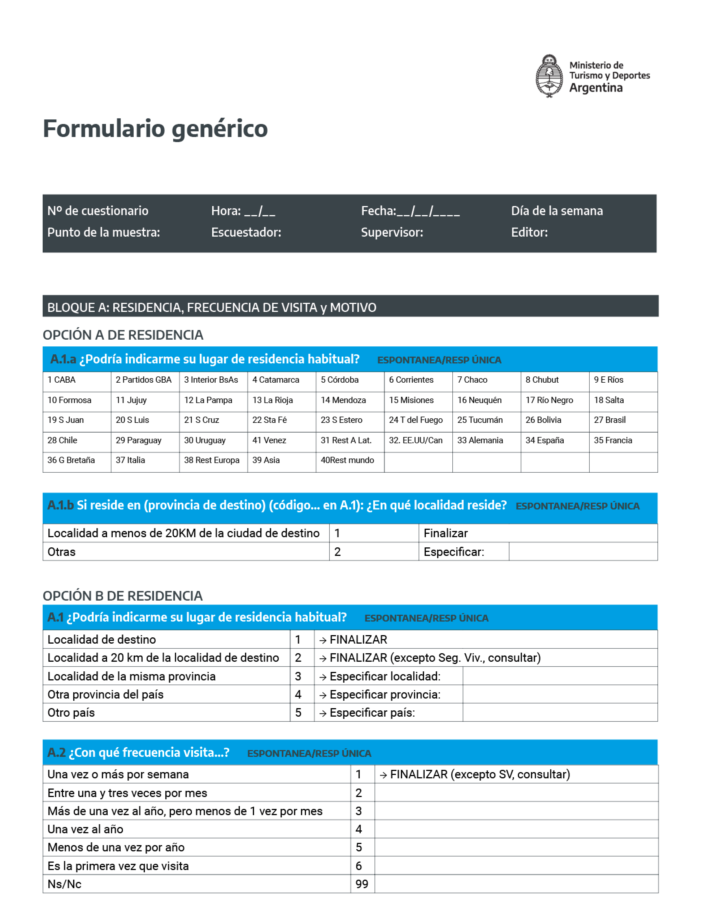
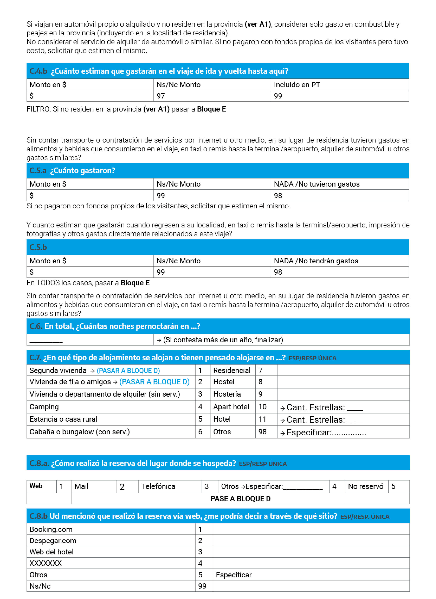
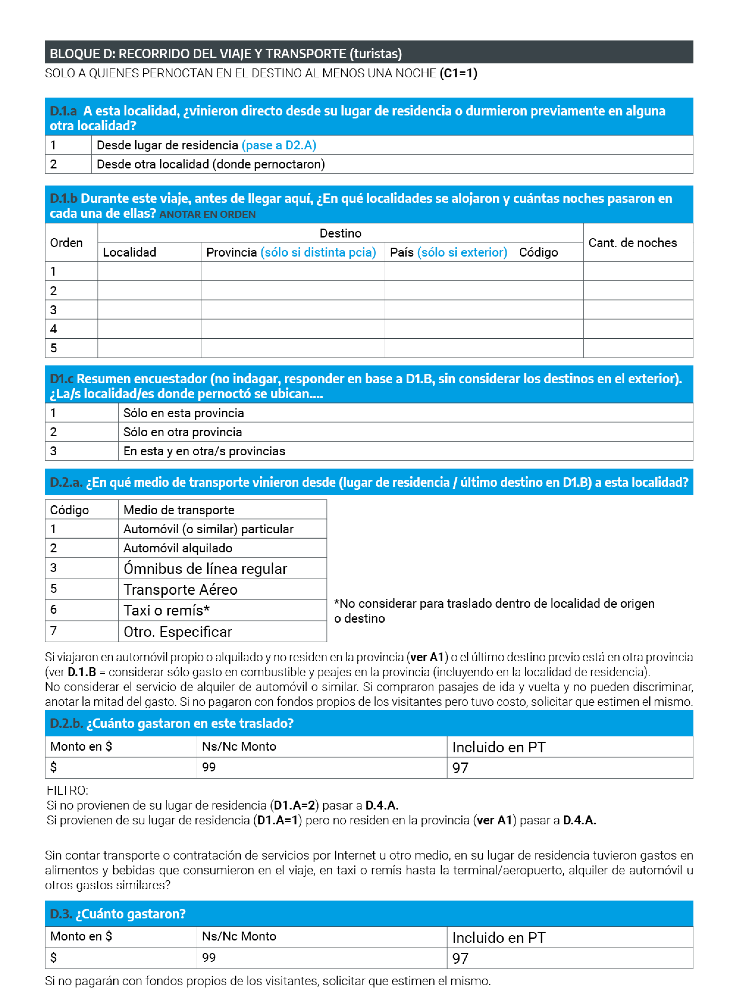
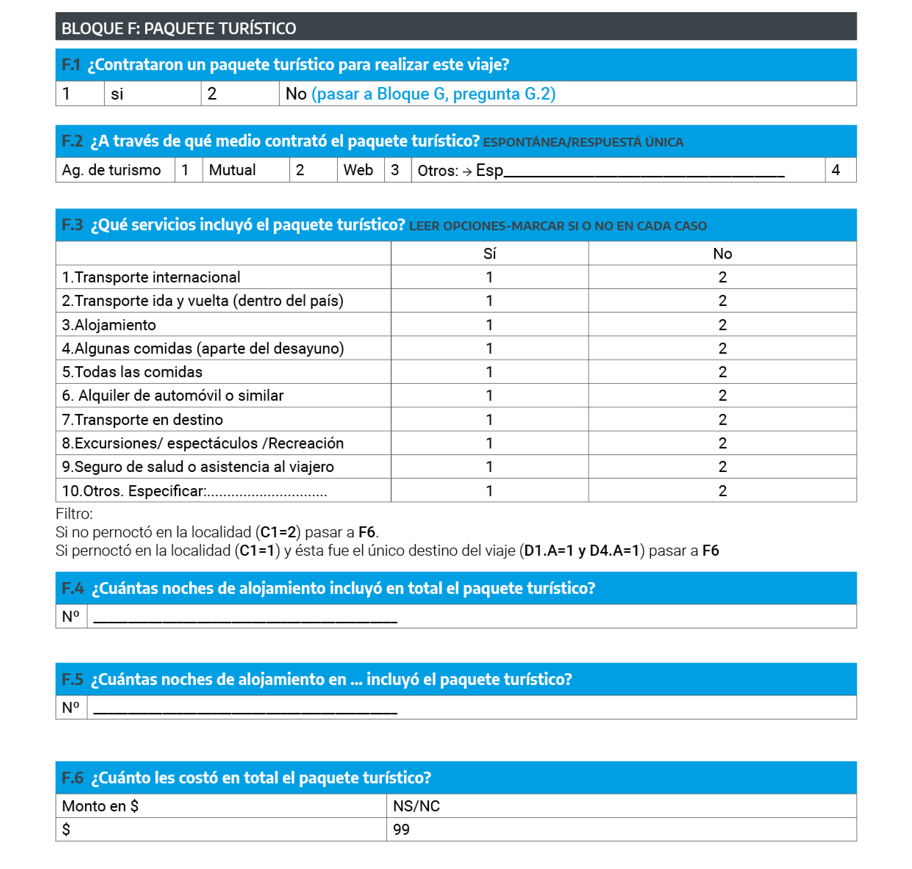
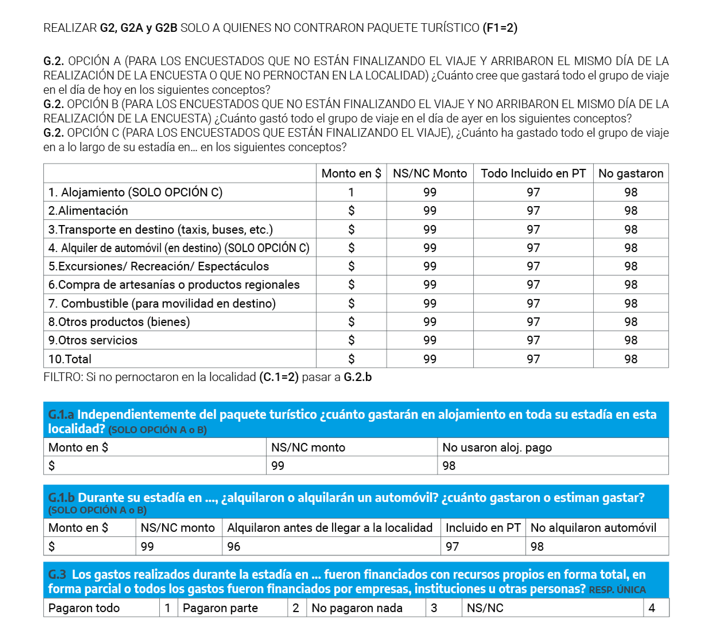
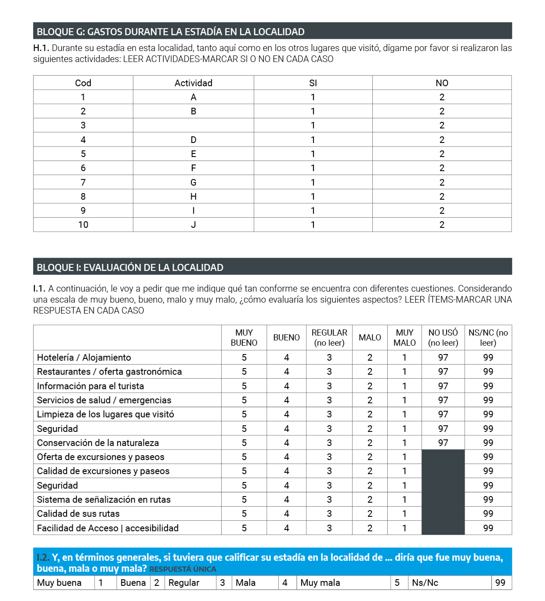
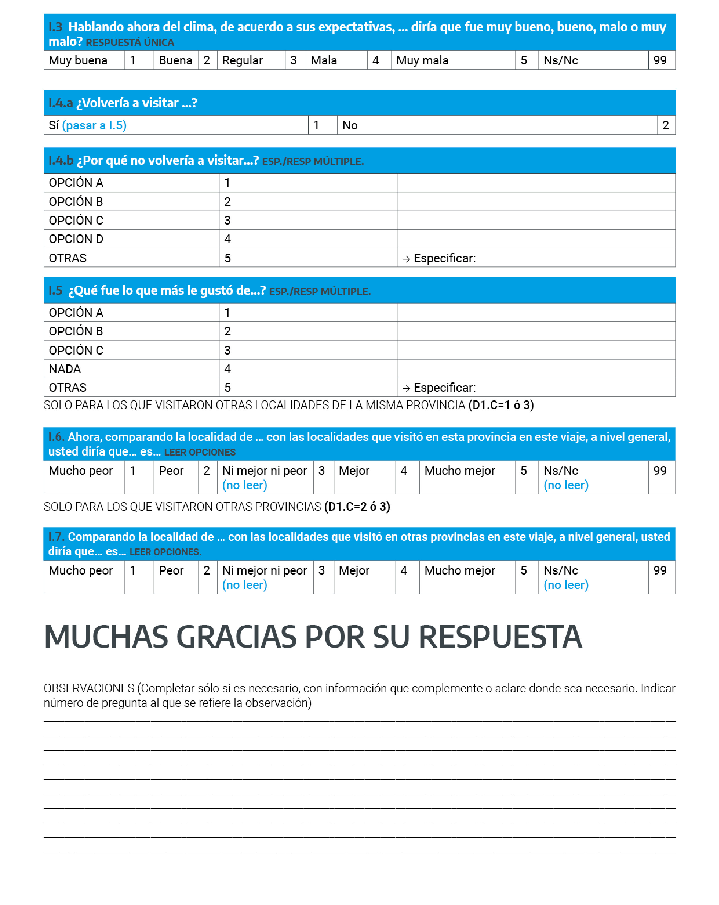
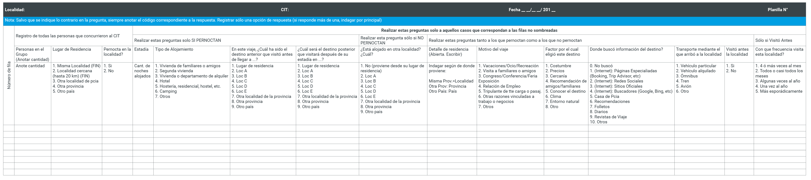

# **Anexos** {-}

**Anexo 1. Formulario modelo CIT**

```{r 001, echo=FALSE}

```

```{r 001, echo=FALSE}

```

```{r 001, echo=FALSE}
knitr::include_graphics('imagenes/graf03.png')
```

```{r 001, echo=FALSE}

```


```{r 001, echo=FALSE}

```

```{r 001, echo=FALSE}
knitr::include_graphics('imagenes/graf06.png')
```


```{r 001, echo=FALSE}
knitr::include_graphics('imagenes/graf07.png')
```

```{r 001, echo=FALSE}

```

```{r 001, echo=FALSE}
knitr::include_graphics('imagenes/graf09.png')
```

```{r 001, echo=FALSE}

```

```{r 001, echo=FALSE}

```

```{r 001, echo=FALSE}

```

**Anexo 2. Formulario modelo perfil**

::: {.note}
**Se considera VISITANTES a aquellas personas que no residen en la localidad  y se alojan allí (en cualquier tipo de alojamiento) o pasan al menos dos o tres horas en ella**. Además de los residentes en la localidad y de los no residentes que se quedan menos de dos horas, **se EXCLUYE** (no debe encuestarse) a quienes cumplen al menos una de las siguientes condiciones:
-Residen en una **localidad cercana (hasta 20 kilómetros)** -excepto si se aloja en Segunda Vivienda-
-Visitan la localidad **una o más veces a la semana** -excepto si se aloja en Segunda Vivienda-
-La duración de la **estadía será superior a un año**.
-Viajan para ser contratados por una empresa o una institución del destino o son tripulantes de transporte de carga o pasajeros.
 
El cuestionario aplica para **todos los integrantes del grupo de viaje** (personas que viajan juntas y comparten los gastos del viaje). 
Una persona de 18 años o más oficiará de informante de las características y los gastos de todo el grupo de viaje.

:::


```{r 002, echo=FALSE}

```


